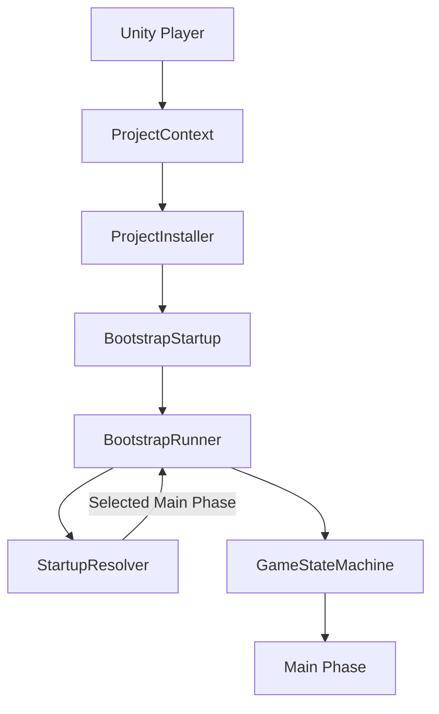
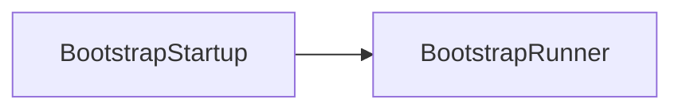
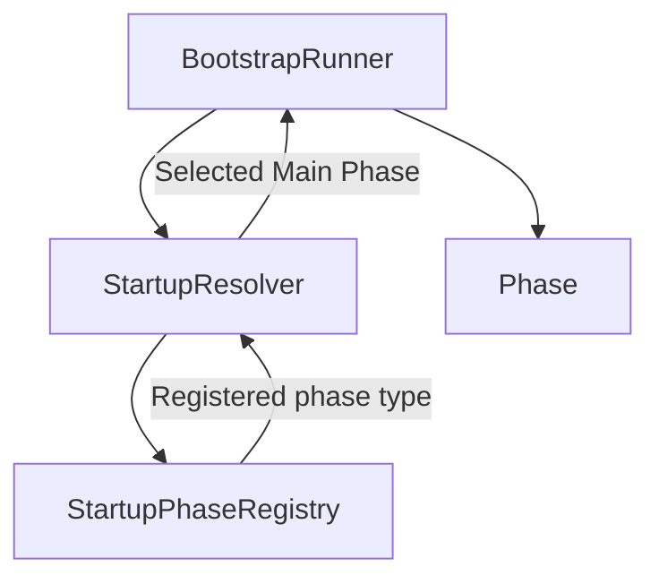
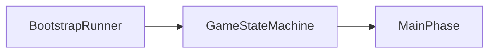
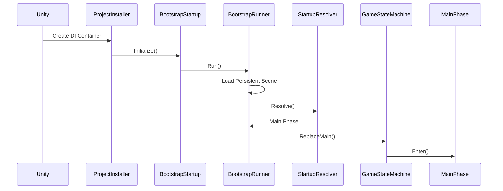

# Application Lifecycle

> Version: 1.0
> Last Updated: 13-07-2026

---

# Purpose

This document describes the complete application lifecycle—from the moment Unity starts until the first game phase is entered.

It is the first document every developer is recommended to read after reviewing `00_Glossary.md`.

The Application Lifecycle describes only the application startup process. It does not cover the internal implementation of gameplay mechanics.

---

# Goals

The primary goals of the application lifecycle are:

- create all global dependencies;
- prepare the environment;
- determine the initial game state;
- transfer control to the gameplay logic.

After the startup process is complete, the application is managed by the Game State Machine.

---

# High-Level Overview

After the game starts, control passes through several independent subsystems.



Each component performs only one task and, after completing it, passes control to the next component.

---

# Lifecycle Stages

The application lifecycle consists of seven stages.

```text
1. Unity Initialization

↓

2. Dependency Injection

↓

3. Bootstrap

↓

4. Persistent Scene

↓

5. Startup Resolution

↓

6. Game State Machine

↓

7. First Main Phase
```

Each stage is described in detail below.

---

# Stage 1 — Unity Initialization

At this stage, Unity starts the application and creates the initial scene.

The project also creates `ProjectContext`, which becomes the root Dependency Injection container.

No gameplay logic is executed at this stage.

---

# Stage 2 — Dependency Injection

After `ProjectContext` is created, `ProjectInstaller` is invoked.

Its responsibility is to register all global dependencies.

For example:

- GameStateMachine
- SceneLoader
- PhaseFactory
- StartupResolver
- BootstrapRunner
- BootstrapStartup

After registration is complete, the container is fully initialized and ready for use.

---

# Stage 3 — Bootstrap

After dependency registration is complete, Zenject invokes `BootstrapStartup`.

BootstrapStartup is the application's entry point.

Its only responsibility is to transfer control to `BootstrapRunner`.

After that, BootstrapStartup no longer participates in the application's execution.



---

# Stage 4 — Persistent Scene

The first action performed by BootstrapRunner is loading the following scene:

```text
SC_Persistent
```

This scene contains objects that exist throughout the entire lifetime of the application.

For example:

- global UI;
- services;
- loading screen;
- other persistent objects.

The Persistent Scene is never considered a gameplay scene.

---

# Stage 5 — Startup Resolution

Once the environment has been prepared, the application must determine which game phase should start first.

This responsibility is entirely delegated to the Startup subsystem.



StartupResolver makes its decision based on the current application state.

For example:

- launching a Build → MainMenu;
- starting from the Editor with a gameplay scene already open → the corresponding game phase.

Bootstrap knows nothing about these rules.

---

# Stage 6 — Game State Machine

After the initial phase has been determined, control is transferred to the Game State Machine.

The FSM becomes the primary coordinator of game modes.



From this point on, the GameStateMachine is responsible for transitions between game states.

Bootstrap has completed its work.

---

# Stage 7 — First Main Phase

The GameStateMachine activates the first Main Phase.

For example:

```text
MainMenuPhase
```

or

```text
ExplorationPhase
```

or

```text
BattlePhase
```

The Main Phase loads the corresponding game scene through SceneLoader.

After the `Enter()` method completes, the application is considered fully started.

---

# Lifecycle Timeline

The complete sequence is as follows.



After `Enter()` is called, the first game phase gains full control of the application.

---

# Responsibilities

| Component | Responsibility |
|------------|----------------|
| Unity | Start the application |
| ProjectInstaller | Register dependencies |
| BootstrapStartup | Start BootstrapRunner |
| BootstrapRunner | Coordinate the startup process |
| StartupResolver | Select the initial phase |
| StartupPhaseRegistry | Store Scene → Phase mappings |
| GameStateMachine | Manage game modes |
| Main Phase | Start a specific game mode |

---

# Design Principles

## Single Entry Point

Application startup always begins with BootstrapStartup.

There are no other entry points in the architecture.

---

## Separation of Responsibilities

Each component is responsible for only one task.

For example:

BootstrapStartup does not choose the initial phase.

StartupResolver does not load scenes.

GameStateMachine does not make application startup decisions.

---

## Explicit Flow

Each startup stage explicitly invokes the next one.

There are no hidden transitions between subsystems.

This makes the architecture easier to understand and debug.

---

## Dependency Injection

Services, phases, and coordinators are created by the Zenject container. Unity scene objects are created by Unity and receive registered dependencies through injection.

Components do not create each other directly.

This ensures loose coupling throughout the system.

---

# Common Mistakes

## ❌ Adding gameplay logic to Bootstrap

Bootstrap is responsible only for application startup.

All gameplay logic should reside inside game phases or Features.

---

## ❌ Using SceneManager directly

All scene operations must be performed exclusively through SceneLoader.

---

## ❌ Creating services with `new`

Regular C# services are created by the Dependency Injection container. Scene MonoBehaviours are created by Unity and receive registered services through `SceneContext` injection.

---

## ❌ Modifying Bootstrap when adding a new game scene

Bootstrap should not be modified when adding a new Main Phase.

Instead, register the new phase in StartupPhaseRegistry (if it should support launching from the Editor) and use GameStateMachine to transition to it.

---

# Extension Points

The application lifecycle can be extended without modifying the existing sequence.

For example:

- save system;
- Addressables loading;
- game version validation;
- authentication;
- analytics;
- cloud services.

Such extensions should be integrated into BootstrapRunner or separate services without violating the single responsibility principle of the existing components.

---

# Related Documents

- `00_Glossary.md`
- `01_Architecture.md`
- `03_DeveloperGuide.md`
- `ArchitectureAtlas/02_Bootstrap.md`
- `ArchitectureAtlas/03_Startup.md`
- `ArchitectureAtlas/04_GameStateMachine.md`
