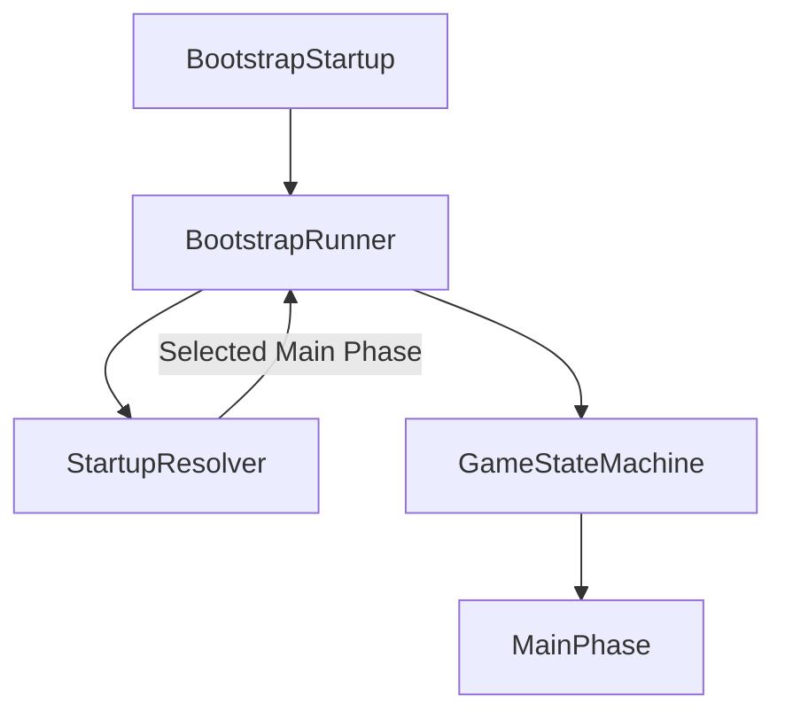
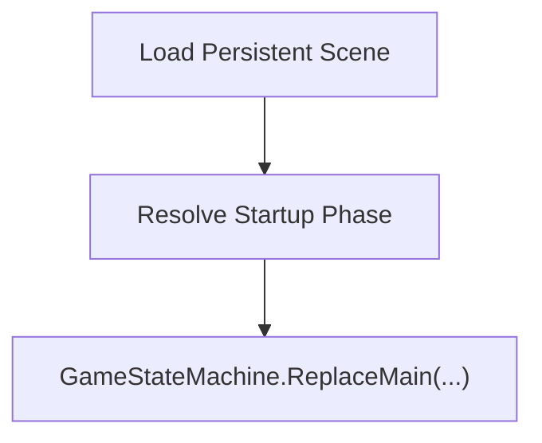
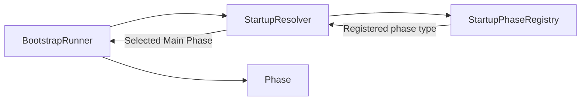
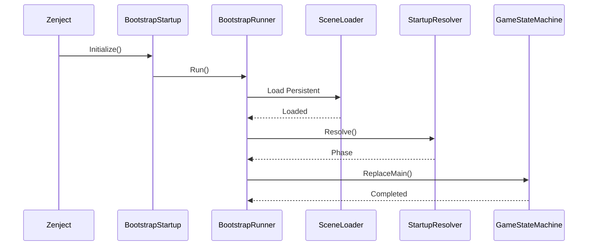
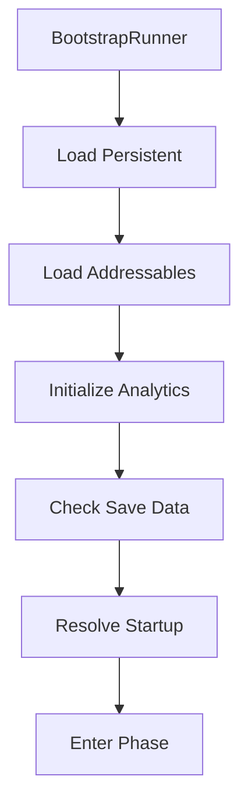

# Bootstrap

> Version: 1.0
> Last Updated: 13-07-2026

---

# Purpose

Bootstrap is the subsystem responsible for starting the application.

Its purpose is to prepare the environment for the game and transfer control to the first game phase.

Bootstrap **does not contain gameplay logic** and **does not make gameplay decisions**.

Once its work is complete, Bootstrap no longer participates in the application's lifecycle.

---

# Responsibilities

Bootstrap is responsible only for the following tasks:

- starting the initialization process;
- loading the Persistent Scene;
- preparing the environment;
- determining the initial game phase;
- transferring control to the Game State Machine.

---

Bootstrap is **not responsible** for:

- gameplay logic;
- loading save data;
- UI;
- transitions between game modes;
- gameplay Features.

After the game starts, control is fully transferred to the GameStateMachine.

---

# High-Level Flow



---

# Components

Bootstrap consists of two independent components.

```text
BootstrapStartup

BootstrapRunner
```

Each component has its own responsibility.

---

# BootstrapStartup

BootstrapStartup is the entry point of the Bootstrap subsystem.

Zenject automatically invokes it after all dependencies have been registered.

BootstrapStartup contains almost no logic.

Its responsibilities are:

- obtain the required dependencies through Dependency Injection;
- start BootstrapRunner;
- complete its execution.

After BootstrapRunner is started, the BootstrapStartup instance is no longer used.

---

# BootstrapRunner

BootstrapRunner is the coordinator of the application startup process.

This is where the main startup sequence is executed.

Typical lifecycle:



BootstrapRunner does not know which game scene should be opened.

It only performs the actions required to start the application.

---

# Startup Resolution

Determining the initial game phase is delegated to the Startup subsystem.

BootstrapRunner calls StartupResolver.



This allows the startup rules to change without modifying Bootstrap.

---

# Persistent Scene

The first action performed by BootstrapRunner is loading:

```text
SC_Persistent
```

The Persistent Scene exists throughout the entire lifetime of the application.

It contains objects that are never unloaded when switching game scenes.

For example:

- global UI;
- services;
- loading screen;
- audio system;
- managers.

Bootstrap never loads gameplay scenes directly.

---

# Bootstrap Sequence

The complete Bootstrap execution sequence.



After `ReplaceMain()` completes, Bootstrap is considered fully finished.

---

# Design Principles

## Single Responsibility

Bootstrap is responsible exclusively for application startup.

Any logic unrelated to startup should be located in other subsystems.

---

## Explicit Flow

The startup sequence should be explicit and easy to understand.

Each stage explicitly invokes the next one.

Bootstrap contains no hidden transitions.

---

## Dependency Injection

Bootstrap does not create dependencies itself.

All Bootstrap service dependencies are provided by the Zenject container. Bootstrap does not create Unity-owned objects manually.

---

## Separation of Concerns

Each Bootstrap component is responsible only for its own task.

BootstrapStartup starts BootstrapRunner.

BootstrapRunner executes the startup sequence.

StartupResolver determines the initial phase.

GameStateMachine starts the game phase.

---

# Extension Points

Bootstrap can be extended without modifying the existing logic.

For example:



New stages should be added to BootstrapRunner.

The other Bootstrap components should remain unchanged.

---

# Common Mistakes

## ❌ Adding gameplay logic

Bootstrap must not know anything about the game rules.

---

## ❌ Loading gameplay scenes

Bootstrap does not open gameplay scenes.

This is handled by the GameStateMachine through SceneGamePhase.

---

## ❌ Using SceneManager

Bootstrap uses only SceneLoader.

---

## ❌ Creating services with `new`

All services must be created through Dependency Injection.

---

## ❌ Adding a new Main Phase to Bootstrap

Bootstrap does not know about specific game phases.

Adding a new Main Phase should never require changes to BootstrapRunner.

---

# Future Evolution

As the project evolves, Bootstrap may be extended with additional stages such as:

- loading Addressables;
- initializing the save system;
- checking the game version;
- cloud authentication;
- loading user settings;
- analytics;
- DLC validation.

All such functionality should be integrated into BootstrapRunner without changing the Bootstrap architecture.

---

# Related Documents

- 01_ApplicationLifecycle.md
- 03_Startup.md
- 04_GameStateMachine.md
- 05_SceneManagement.md
- 06_DependencyInjection.md
