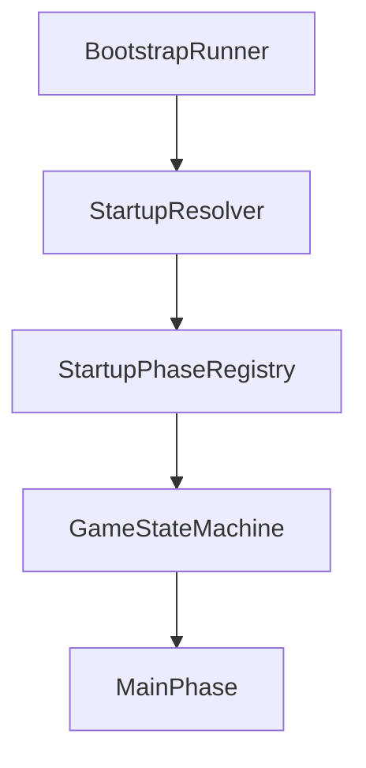
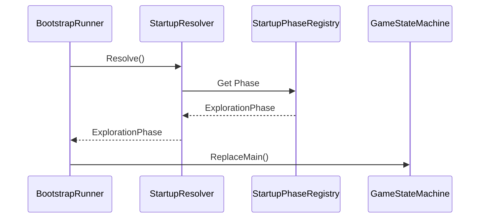

# Startup

> Version: 1.0
> Last Updated: 12-07-2026

---

# Purpose

Startup is the subsystem responsible for determining which game phase should be started after Bootstrap has completed.

Startup encapsulates all logic for selecting the initial Main Phase and completely separates it from the application startup process.

Bootstrap does not decide which game scene should be opened.

---

# Responsibilities

The Startup subsystem is responsible for:

- determining the initial Main Phase;
- supporting game startup from the Unity Editor;
- supporting startup in a built application (Build);
- mapping Unity Scenes to game phases.

Startup is not responsible for:

- loading scenes;
- switching game modes;
- executing gameplay logic.

After the initial phase has been selected, control is transferred to the GameStateMachine.

---

# High-Level Flow



---

# Components

The Startup subsystem consists of two main components.

```text
StartupResolver

StartupPhaseRegistry
```

---

# StartupResolver

StartupResolver contains the algorithm for determining the initial game phase.

It analyzes the current application state and selects the appropriate Main Phase.

The Resolver does not store the Scene ↔ Phase mapping.

That information is stored in StartupPhaseRegistry.

---

# StartupPhaseRegistry

StartupPhaseRegistry stores the mapping between Unity Scenes and game phases.

For example:

```text
SC_MainMenu

↓

MainMenuPhase
```

```text
SC_World

↓

ExplorationPhase
```

```text
SC_Battle

↓

BattlePhase
```

The Registry contains no decision-making logic.

It serves only as a data source.

---

# Startup Rules

The current architecture uses the following rules.

## Build

When a built version of the game starts, the application always begins with MainMenuPhase.

---

## Unity Editor

When the game is started from the Unity Editor, StartupResolver checks the active scene.

If the scene is registered in StartupPhaseRegistry, the corresponding Main Phase is started.

For example:

```text
SC_World

↓

ExplorationPhase
```

This allows individual gameplay scenes to be launched directly without having to go through the main menu every time.

---

# Sequence



---

# Design Principles

## Separation of Concerns

Bootstrap does not know the game startup rules.

All decisions are made inside Startup.

---

## Single Responsibility

StartupResolver makes decisions.

StartupPhaseRegistry stores data.

These responsibilities are kept separate.

---

## Extensibility

Adding a new Main Phase does not require modifying Bootstrap.

It is sufficient to register a new Scene → Phase mapping.

---

# Adding a New Main Phase

When creating a new Main Phase, you must:

1. Create a class that inherits from SceneGamePhase.
2. Add the corresponding game scene.
3. Register the Scene → Phase mapping in StartupPhaseRegistry (if the scene should be launchable directly from the Unity Editor).

After that, Startup will automatically be able to determine the new initial phase.

---

# Common Mistakes

## ❌ Adding conditions to Bootstrap

Bootstrap must not know which game phase will be started.

---

## ❌ Using SceneManager

Startup does not work directly with Unity scenes.

---

## ❌ Storing decision logic in the Registry

StartupPhaseRegistry stores data only.

All decisions are made by StartupResolver.

---

# Future Evolution

In the future, Startup may be extended with additional rules.

For example:

- continue the last game;
- load the most recent save;
- open a developer scene;
- run automated tests;
- launch a special debug mode.

Such changes should be made exclusively in StartupResolver without modifying the other components.

---

# Related Documents

- 01_ApplicationLifecycle.md
- 02_Bootstrap.md
- 04_GameStateMachine.md
- 05_SceneManagement.md