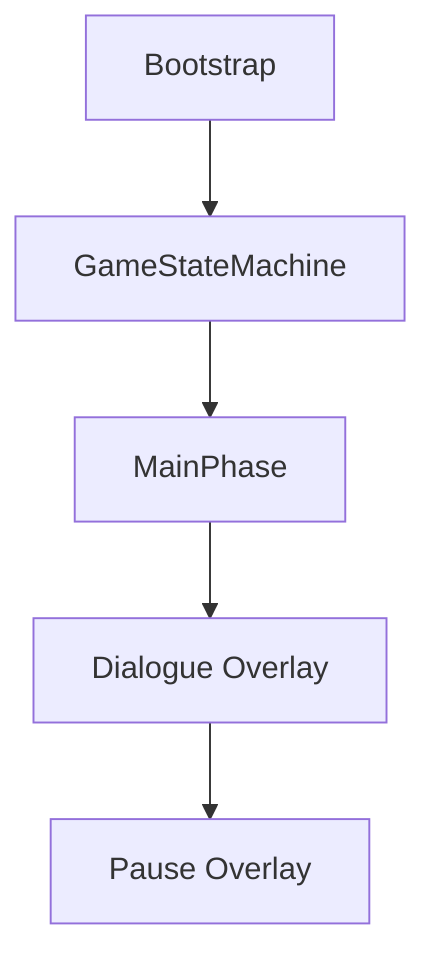
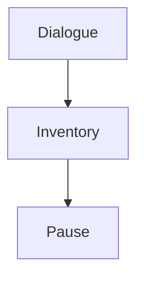
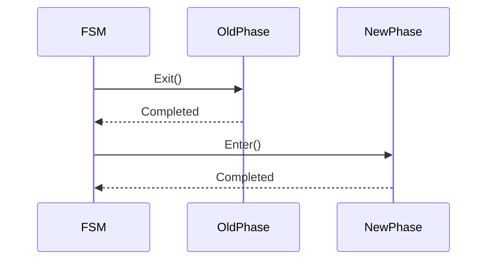
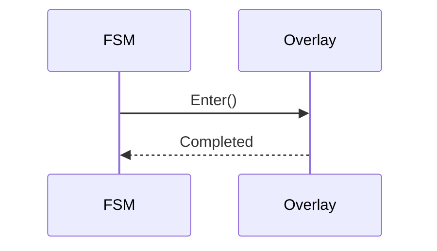
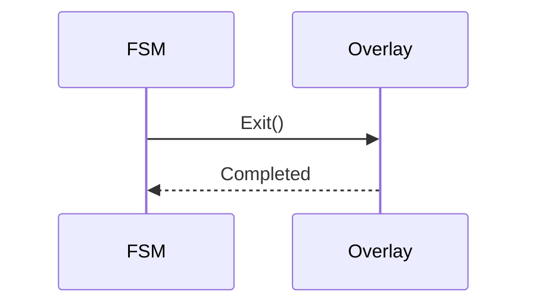
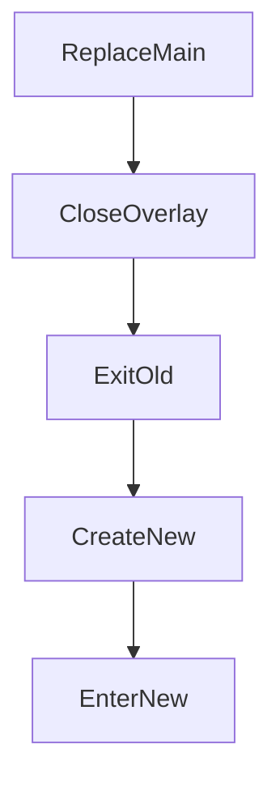
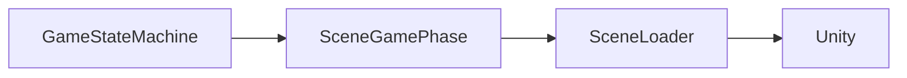

# Game State Machine

> Version: 1.0
> Last Updated: 13-07-2026

---

# Purpose

The Game State Machine (FSM) is the central coordinator of game modes.

Once Bootstrap has completed, the Game State Machine takes full control of the game's lifecycle.

The FSM is responsible exclusively for switching game phases.

It contains no gameplay logic and has no knowledge of the implementation details of individual game modes.

---

# Responsibilities

The Game State Machine is responsible for:

- storing the current Main Phase;
- switching between Main Phases;
- managing Overlay Phases;
- correctly invoking `Enter()` and `Exit()`;
- ensuring that only one Main Phase is active at a time.

The FSM is not responsible for:

- loading scenes;
- gameplay logic;
- UI;
- save data;
- gameplay Features.

---

# High-Level Overview



---

# Components

The Game State Machine consists of the following elements.

```text
GameStateMachine

↓

SceneGamePhase

↓

OverlayPhase
```

---

# Main Phase

A Main Phase represents the primary game mode.

Only one Main Phase can be active at any given time.

Examples:

- MainMenuPhase
- ExplorationPhase
- BattlePhase
- MinigamePhase

When switching Main Phases, the current phase always completes by calling `Exit()`.

After that, the new phase is started by calling `Enter()`.

---

# Overlay Phase

An Overlay Phase represents a temporary game mode.

An Overlay is displayed on top of the Main Phase.

The Main Phase continues to exist while the Overlay is active.

Examples:

- Pause
- Dialogue
- Inventory
- Settings
- Map

Overlays are stored in a stack.

---

# Overlay Stack

The Overlay stack follows the Last In – First Out (LIFO) principle.



The most recently opened Overlay is always the first one to be closed.

---

# Main Phase Lifecycle

Switching between Main Phases works as follows.



Two Main Phases can never exist simultaneously.

---

# Overlay Lifecycle

Opening an Overlay.



Closing an Overlay.



---

# Public API

The GameStateMachine provides several method groups for managing Main Phases and Overlay Phases.

---

## ReplaceMain() / ReplaceMainAsync()

Replaces the current Main Phase.

Sequence:

```text
Close All Overlays

↓

Exit Current Main

↓

Create New Main

↓

Enter New Main
```

Used for transitions between game modes.

For example:

```text
Main Menu

↓

Exploration

↓

Battle

↓

Minigame
```

---

## ReloadMainAsync()

Creates and loads a Main Phase again even when a phase of the same type is already active.

This method is used when context must be prepared before new scene objects are created. For example, Save System calls `ReloadMainAsync<ExplorationPhase>()`, loads the saved exploration scene, and applies the pending restore only after the new player has registered.

The asynchronous overload accepts a `CancellationToken`.

---

## PushOverlay()

Creates a new Overlay.

The new Overlay is pushed onto the top of the stack.

Used for:

- Pause;
- Dialogue;
- Inventory;
- Settings.

---

## PopOverlay()

Removes the top Overlay from the stack.

After it is removed, the previous Overlay or the Main Phase automatically becomes active.

---

## CloseAllOverlays()

Closes all Overlays.

Used before switching the Main Phase.

After execution, the Overlay stack is always empty.

---

# Transition Flow

A typical transition between game modes.



---

# Interaction With Scene Management

The FSM does not work directly with the Unity SceneManager.

All scene operations are performed inside SceneGamePhase.



---

# Design Principles

## One Active Main Phase

There is always exactly one active Main Phase in the system.

---

## Overlay Stack

Overlays do not replace the Main Phase.

They operate on top of it.

---

## Explicit Lifecycle

Every game phase must correctly implement:

```text
Enter()

Exit()
```

The FSM never skips these methods.

---

## Separation of Concerns

The FSM contains no gameplay rules.

Its only responsibility is coordinating the lifecycle of game modes.

---

# Current Main Phases

The current project uses the following Main Phases.

```text
MainMenuPhase

ExplorationPhase

BattlePhase
```

This list may be expanded in the future.

For example:

```text
CraftPhase

FishingPhase

PuzzlePhase

CutscenePhase
```

---

# Current Overlay Phases

The current project uses:

```text
PauseMenuPhase

DialoguePhase

SaveBrowserPhase

CheckpointSavePhase
```

The list may be extended in the future:

```text
InventoryPhase

MapPhase

SettingsPhase
```

---

# Common Mistakes

## ❌ Switching scenes directly

Transitions between game modes must always be performed through `ReplaceMain()`.

---

## ❌ Using SceneManager

The FSM never interacts directly with the Unity SceneManager.

---

## ❌ Putting gameplay logic inside the FSM

The FSM must not know about:

- battle rules;
- dialogue rules;
- inventory;
- quests.

---

## ❌ Creating Phases manually

All Phases must be created through PhaseFactory and Dependency Injection.

---

## ❌ Multiple Main Phases at the same time

This violates the project architecture.

There must always be only one Main Phase.

---

# Extension Points

The Game State Machine can be extended without changing its core principles.

For example:

- transition history;
- back navigation (Back Stack);
- temporary transition locking;
- global transitions;
- game mode transition animations;
- transition logging for debugging.

Such extensions must not modify the core lifecycle of Main Phases and Overlay Phases.

---

# Related Documents

- 01_ApplicationLifecycle.md
- 02_Bootstrap.md
- 03_Startup.md
- 05_SceneManagement.md
- 06_DependencyInjection.md
- 03_DeveloperGuide.md
