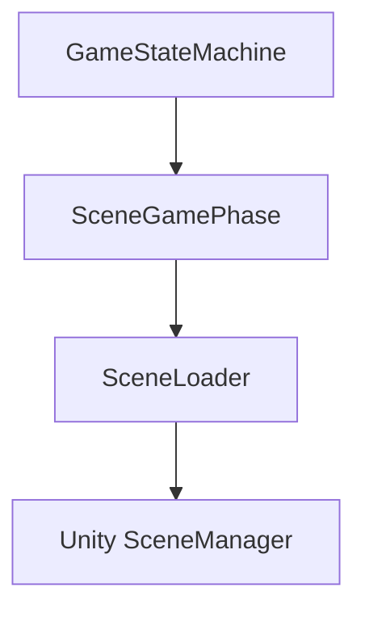
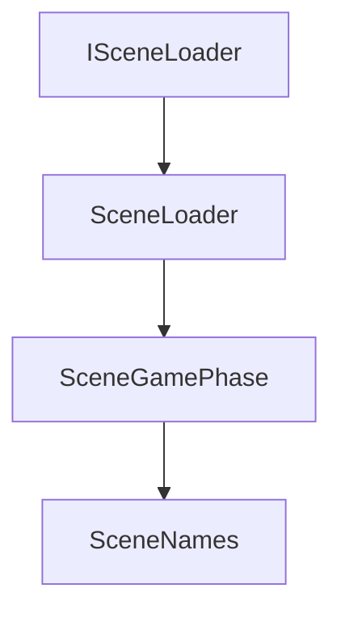
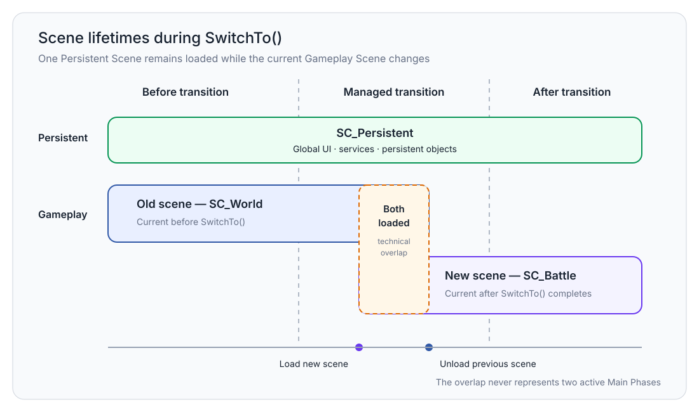
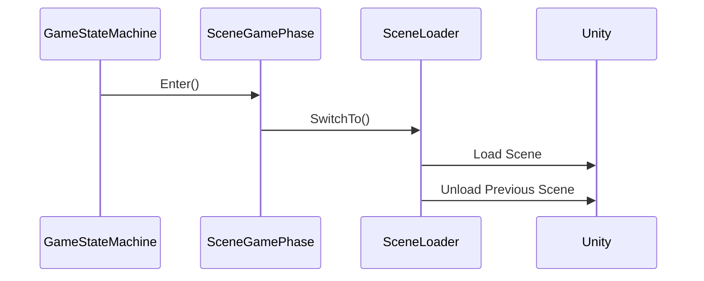
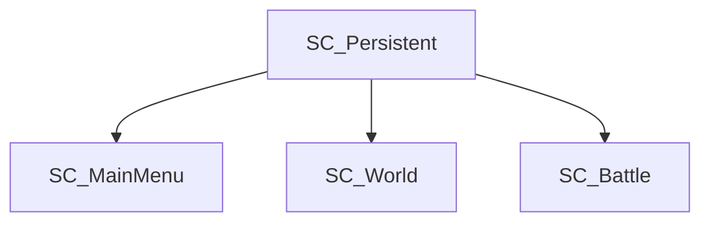

# Scene Management

> Version: 1.1
> Last Updated: 16-07-2026

---

# Purpose

Scene Management is the subsystem responsible for managing Unity game scenes.

Its purpose is to provide a unified mechanism for loading, unloading, and switching scenes while completely isolating the rest of the project from the Unity SceneManager.

No gameplay system should interact with scenes directly.

---

# Responsibilities

Scene Management is responsible for:

- loading gameplay scenes;
- unloading gameplay scenes;
- switching between gameplay scenes;
- storing information about the current gameplay scene;
- providing a single access point for scene operations.

Scene Management is not responsible for:

- selecting the gameplay scene;
- gameplay logic;
- transitions between game modes;
- the lifecycle of game phases.

---

# High-Level Overview



All scene operations go through SceneLoader.

---

# Components

The subsystem consists of the following components.



---

# ISceneLoader

ISceneLoader defines the contract for scene management.

It provides a unified interface for:

- switching scenes;
- loading scenes;
- unloading scenes;
- retrieving the current gameplay scene.

Using an interface hides the implementation details of SceneLoader from the rest of the subsystems.

---

# SceneLoader

SceneLoader is the only implementation of ISceneLoader.

It encapsulates all interaction with the Unity SceneManager.

All direct Unity SceneManager calls are located exclusively here.

---

# SceneGamePhase

SceneGamePhase connects the Game State Machine with Scene Management.

When a game phase is entered, the corresponding scene is automatically switched.


The GameStateMachine knows nothing about scenes.

---

# SceneNames

SceneNames contains the names of all gameplay scenes in the project.

Using constants eliminates string literals from gameplay code.

Example:

```text
SC_MainMenu

SC_World

SC_Battle

SC_Persistent
```

---

# Scene Types

The project uses two types of scenes.



## Persistent Scene

```text
SC_Persistent
```

Loaded once during Bootstrap.

It remains loaded until the application is closed.

Contains:

- global UI;
- services;
- persistent objects.

---

## Gameplay Scene

A gameplay scene corresponding to a specific Main Phase.

For example:

```text
SC_MainMenu

SC_World

SC_Battle
```

There is only one logically current Gameplay Scene at any given time. During a managed transition, the old and new scenes may briefly remain loaded at the same time.

---

# Scene Lifecycle

A typical gameplay scene transition sequence.



After `SwitchTo()` completes, the new gameplay scene becomes the current scene.

---

# Scene Transition

Gameplay scene transitions always follow the same sequence.


Bypassing this sequence is prohibited.

---

# Current Scene

SceneLoader stores information about the current gameplay scene.

This allows it to:

- avoid loading the same scene multiple times;
- correctly unload the previous scene;
- provide information about the current game mode.

---

# Design Principles

## Single Entry Point

All scene operations go through SceneLoader.

---

## Encapsulation

The rest of the project must not use the Unity SceneManager.

---

## One Gameplay Scene

In a stable state there is one logically current gameplay scene plus the Persistent Scene.

During `SwitchTo`, the new scene is loaded before the previous scene is unloaded. A short technical overlap of two loaded gameplay scenes is allowed only inside SceneLoader and does not mean that two Main Phases are active.

---

## Separation of Responsibilities

GameStateMachine is responsible for game modes.

Scene Management is responsible for scenes.

These responsibilities do not overlap.

---

# Current Scene Flow

The current architecture uses the following flow.



The Persistent Scene exists alongside any gameplay scene.

---

# Common Mistakes

## ❌ Using Unity SceneManager

Gameplay code must never interact directly with the SceneManager.

---

## ❌ Using string literals

Bad:

```csharp
SceneManager.LoadScene("World");
```

Good:

```csharp
await sceneLoader.SwitchTo(SceneNames.World);
```

---

## ❌ Loading scenes inside gameplay systems

Battle, Dialogue, Inventory, and other Features must not load scenes themselves.

Use the GameStateMachine for transitions.

---

## ❌ Multiple Current Gameplay Scenes

After a transition completes, SceneLoader must track only one current gameplay scene. Keeping multiple gameplay scenes loaded outside a managed transition is forbidden.

---

# Extension Points

The Scene Management subsystem can be extended with the following capabilities:

- loading screen;
- asynchronous scene preloading;
- animated transitions;
- Addressables;
- streaming;
- memory usage management.

All such changes should be implemented within Scene Management without modifying the other subsystems.

---

# Related Documents

- 01_ApplicationLifecycle.md
- 02_Bootstrap.md
- 03_Startup.md
- 04_GameStateMachine.md
- 06_DependencyInjection.md
