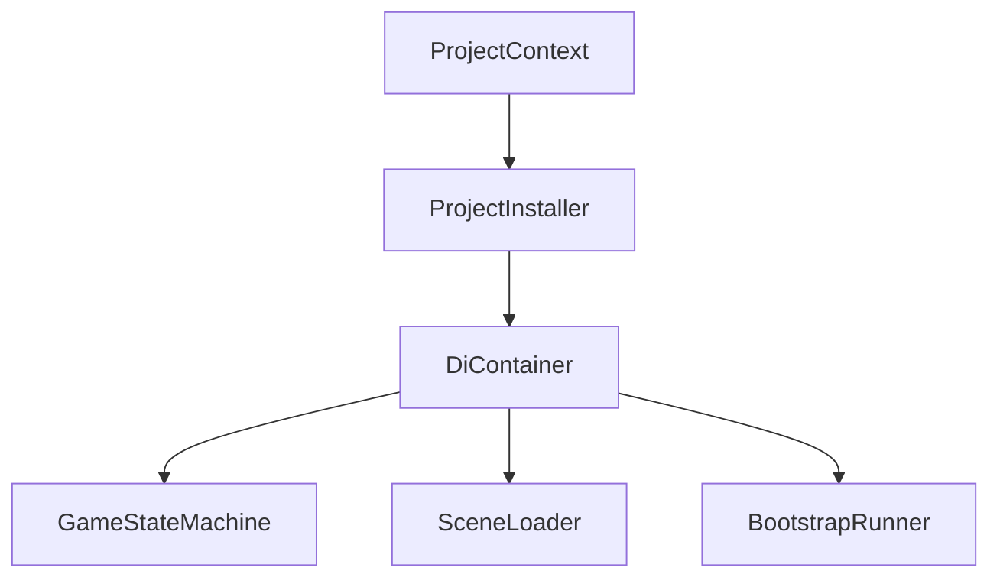
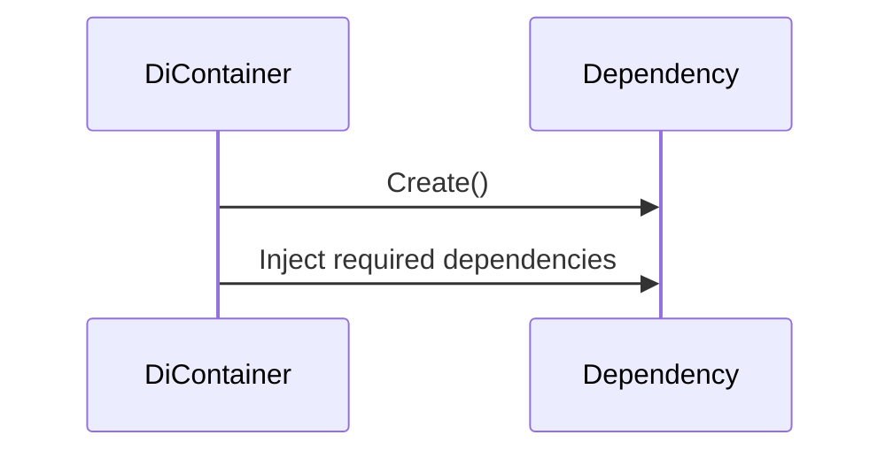
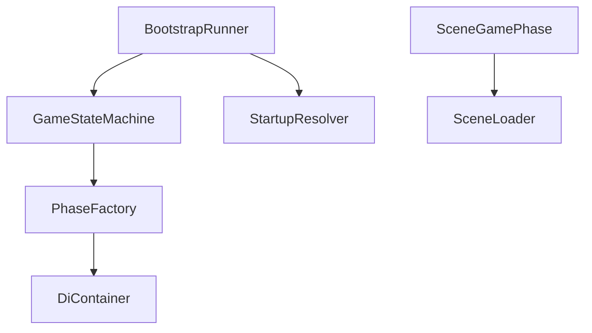
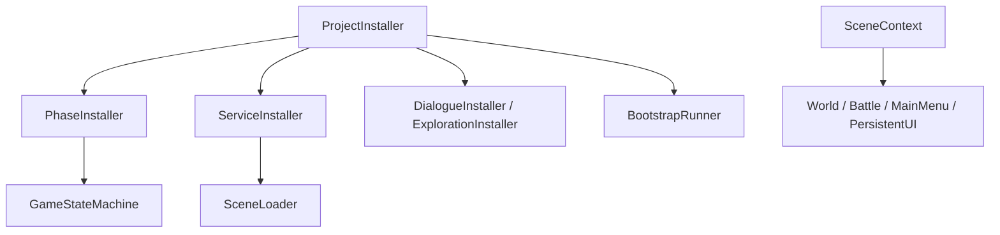

# Dependency Injection

> Version: 1.0
> Last Updated: 13-07-2026

---

# Purpose

Dependency Injection (DI) is the mechanism for creating and providing dependencies between application components.

In this project, Dependency Injection is used to:

- reduce coupling between subsystems;
- centralize object creation;
- simplify testing;
- ensure architectural extensibility.

The project uses **Zenject** as its DI container.

---

# Responsibilities

The Dependency Injection subsystem is responsible for:

- creating global objects;
- registering services;
- registering game phases;
- registering infrastructure components;
- providing dependencies through constructors or Unity-compatible method injection.

Dependency Injection is not responsible for:

- gameplay logic;
- the application startup sequence;
- scene management;
- game mode management.

---

# High-Level Overview



After registration, the container can create the regular C# service graph and inject dependencies into Unity-created objects.

---

# Components

The subsystem consists of the following components.

```text
ProjectContext

↓

ProjectInstaller

↓

Installers

↓

DiContainer

↓

Application
```

---

# ProjectContext

ProjectContext is the Composition Root of the project.

It is created by Unity when the application starts.

After ProjectContext is created, dependency registration begins.

---

# ProjectInstaller

ProjectInstaller is the main Installer of the project.

Its responsibility is to register all global dependencies.

For example:

- GameStateMachine
- SceneLoader
- PhaseFactory
- BootstrapRunner
- StartupResolver
- StartupPhaseRegistry

ProjectInstaller contains no gameplay logic.

---

# Installers

Installers are used to group registrations by responsibility.

For example:

```text
ProjectInstaller

↓

PhaseInstaller

↓

ServiceInstaller
```

Each Installer is responsible only for its own area.

---

# Auto Registration

The project uses automatic registration for certain types.

For example:

```text
GamePhase

↓

AutoBinder

↓

Container.Bind()
```

This eliminates the need to manually register every new phase.

---

# Object Creation

Regular C# services, phases, and coordinators are created by the Zenject container. Scene objects and `MonoBehaviour` components are created by Unity and then injected by the container.

A typical sequence looks like this.



Gameplay code does not use the container as a Service Locator and does not create services manually.

---

# Constructor Injection

The primary way to receive dependencies is through the constructor.

Example:

```csharp
public class BattlePhase : SceneGamePhase
{
    public BattlePhase(ISceneLoader sceneLoader)
        : base(sceneLoader)
    {
    }
}
```

The constructor explicitly shows which dependencies the class requires.

Unity-created `MonoBehaviour` components use method injection through `[Inject] Construct(...)`. Serialized fields store only scene or prefab references owned by the View or adapter itself.

---

# Lifetime

Most global services are registered with the `AsSingle()` lifetime inside the container.

For example:

```csharp
Container.Bind<ISceneLoader>()
    .To<SceneLoader>()
    .AsSingle();
```

This means that the container provides one instance within its context. It is not the gameplay Singleton pattern: the class has no static `Instance`, and access is available only through DI.

---

# Dependency Graph

After dependencies have been registered, an object graph is created.



Each object receives only the dependencies it actually requires.

---

# Composition Root

The Composition Root is the only architectural area where dependencies are wired together.

In the current project, the Composition Root consists of:

```text
ProjectContext

↓

ProjectInstaller

↓

Global Installers

SceneContext

↓

Scene MonoInstallers
```

All registrations live under `Application/Installers`. `ProjectContext` creates the global graph, while `SceneContext` adds dependencies and adapters for a specific scene.

---

# Design Principles

## Constructor Injection

All required dependencies of regular C# classes are provided through constructors.

This makes dependencies explicit.

---

## Explicit Dependencies

A class should receive only the dependencies it actually uses.

Injecting dependencies "just in case" is not allowed.

---

## No Manual Creation

Gameplay code must not create services manually.

Services, phases, and coordinators are provided by the container. DTOs and other value objects may be created explicitly with `new`.

---

## Composition Root

Dependency registration is centralized.

This makes it easy to see which systems exist in the project.

---

## Loose Coupling

At subsystem boundaries, classes depend on interfaces. A concrete type is allowed inside one subsystem when it has no replaceable implementation and does not create a reverse dependency.

For example:

```text
ISceneLoader

↓

SceneLoader
```

This allows implementations to be replaced in the future without changing gameplay code.

---

# Current Installers

The project currently uses the following Installers.

```text
ProjectInstaller

PhaseInstaller

ServiceInstaller

StartupRegistryInstaller

DialogueInstaller

ExplorationInstaller

BattleInstaller

WorldInstaller

MainMenuInstaller

PersistentUIInstaller
```

---

# Current Registration Flow



---

# Common Mistakes

## ❌ Creating objects with `new`

Bad:

```csharp
var loader = new SceneLoader();
```

Good:

```csharp
public BattlePhase(ISceneLoader sceneLoader)
{
}
```

---

## ❌ Using `Container.Resolve()`

Gameplay code should never access the container directly.

`Resolve()` is allowed only inside Composition Root-owned factories and adapters responsible for creating an object graph.

---

## ❌ Service Locator

The container must not be used as a global Service Locator.

Regular C# classes receive dependencies through constructors. Unity-created MonoBehaviours receive them through one explicit `[Inject] Construct(...)` method.

---

## ❌ Hidden dependencies

If a class uses a service, the dependency must be visible in its constructor or in the approved Unity method-injection point.

Runtime dependency lookups are not allowed.

---

## ❌ Registering dependencies in arbitrary places

All registrations must be performed through Installers.

---

# Extension Points

As the project grows, the Dependency Injection subsystem can be extended.

For example:

- Feature registration installers under `Application/Installers`;
- Scene MonoInstallers under `Application/Installers`;
- SignalBus;
- object factories;
- Memory Pools;
- Addressables Factories.

Such extensions should be integrated into the existing Installer system.

---

# Related Documents

- 01_ApplicationLifecycle.md
- 02_Bootstrap.md
- 03_Startup.md
- 04_GameStateMachine.md
- 05_SceneManagement.md
- 07_Features.md
- 04_CodeRules.md
