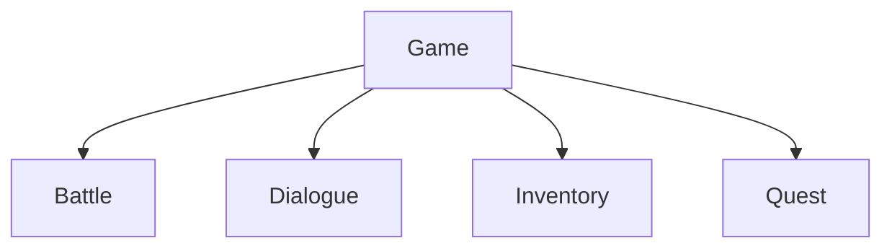

# Features

> Version: 1.0
> Last Updated: 2026-07-13

---

# Purpose

A Feature is an independent gameplay subsystem that implements a single complete gameplay mechanic.

The project architecture follows the **Feature First** principle.

Each gameplay mechanic is developed as a standalone Feature with minimal dependencies on the rest of the project.

---

# Responsibilities

A Feature is responsible for:

- implementing a single gameplay mechanic;
- managing its own state;
- interacting with other systems through public interfaces.

A Feature is **not** responsible for:

- application startup;
- scene management;
- game phase management;
- creating global services.

---

# Current Features

At the current stage of the project, the list of Features is still being formed.

Planned gameplay subsystems include:

```text
Battle

Dialogue

Inventory

Quest

NPC

Craft

Fishing

Minigames
```

As development progresses, each Feature will receive its own dedicated technical documentation in the Architecture Atlas.

---

# High-Level Overview



Each Feature is an independent part of the Game layer.

---

# General Structure

Typical Feature structure:

```text
Feature/

├── Controllers/
├── Models/
├── Views/
├── Services/
├── Configs/
├── Installers/
└── Runtime/
```

The structure may be adjusted if doing so makes the Feature simpler and easier to understand.

---

# Design Principles

## Single Responsibility

Each Feature implements exactly one gameplay mechanic.

---

## Independence

A Feature should be as independent as possible.

Communication between Features should occur through public interfaces or shared services.

---

## Encapsulation

The internal implementation of a Feature must not be accessed directly by other Features.

---

## Composition

Features should be built from small, focused components.

Composition is preferred over complex inheritance hierarchies.

---

## Scalability

A Feature should be easy to extend without modifying existing code.

---

# Communication

Features must not access each other's internal classes directly.

Allowed communication methods include:

- public interfaces;
- services;
- events (after the Event System is introduced).

---

# Lifecycle

A Feature's lifecycle is determined by the active Main Phase or Overlay Phase.

A Feature is created when entering the corresponding game mode and is disposed of when that mode ends.

---

# Future Documentation

As the project evolves, each Feature will receive its own Architecture Atlas document.

For example:

```text
BattleArchitecture.md

DialogueArchitecture.md

InventoryArchitecture.md

QuestArchitecture.md
```

These documents will describe:

- the Feature architecture;
- diagrams;
- lifecycle;
- component interactions;
- extension guidelines.

---

# Common Mistakes

## ❌ Depending on another Feature's internal implementation

Use only public interfaces.

---

## ❌ Mixing multiple gameplay mechanics

One Feature — one gameplay mechanic.

---

## ❌ Depending on the Unity API in business logic

Gameplay rules should remain as independent from Unity as possible.

---

# Related Documents

- 01_Architecture.md
- 02_ProjectStructure.md
- 03_DeveloperGuide.md
- 04_CodeRules.md
- 11_BattleArchitecture.md *(future)*
- 12_DialogueArchitecture.md *(future)*