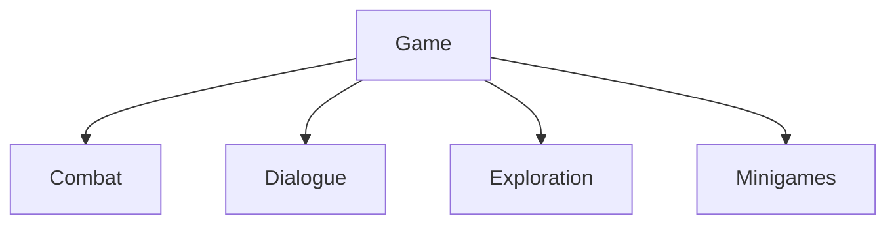

# Features

> Version: 1.0
> Last Updated: 13-07-2026

---

# Purpose

A Feature is an independent gameplay subsystem that implements a single complete gameplay mechanic.

The project architecture follows the **Feature First** principle.

Each gameplay mechanic is developed as a standalone Feature with minimal dependencies on the rest of the project.

---

# Responsibilities

A Feature is responsible for:

- implementing a single gameplay mechanic;
- managing its own state;
- interacting with other systems through public interfaces.

A Feature is **not** responsible for:

- application startup;
- scene management;
- game phase management;
- creating global services.

---

# Current Features

The current project implements:

```text
Combat

Dialogue

Exploration

Minigames
```

Planned independent Features:

```text

Inventory

Quest

NPC

Craft

Fishing
```

As development progresses, each Feature will receive its own dedicated technical documentation in the Architecture Atlas.

---

# High-Level Overview



Each Feature is an independent part of the Game layer.

---

# General Structure

Typical Feature structure:

```text
Feature/

├── Controllers/
├── Models/
├── Views/
├── Services/
├── Configs/
└── Runtime/
```

The structure may be adjusted if doing so makes the Feature simpler and easier to understand.

Feature-specific Views and MonoBehaviours may live inside the Feature as Unity adapters. A Zenject Installer lives under `Application/Installers`, keeping Game independent of the DI container.

---

# Design Principles

## Single Responsibility

Each Feature implements exactly one gameplay mechanic.

---

## Independence

A Feature should be as independent as possible.

Features communicate through public contracts, C# events, or an Application coordinator. One Feature does not inject another Feature's internal service directly.

---

## Encapsulation

The internal implementation of a Feature must not be accessed directly by other Features.

---

## Composition

Features should be built from small, focused components.

Composition is preferred over complex inheritance hierarchies.

---

## Scalability

A Feature should be easy to extend without modifying existing code.

---

# Communication

Features must not access each other's internal classes directly.

Allowed communication methods include:

- public interfaces;
- contracts from Game Shared;
- C# events;
- an Application coordinator.

---

# Lifecycle

The lifecycle of each Feature component is defined explicitly by its DI context. Runtime scene adapters live with their scene, phase-specific components live with their phase, and explicitly registered project services may live for the entire application.

---

# Future Documentation

As the project evolves, each Feature will receive its own Architecture Atlas document.

For example:

```text
CombatArchitecture.md

DialogueArchitecture.md

InventoryArchitecture.md

QuestArchitecture.md
```

These documents will describe:

- the Feature architecture;
- diagrams;
- lifecycle;
- component interactions;
- extension guidelines.

---

# Common Mistakes

## ❌ Depending on another Feature's internal implementation

Use shared contracts, C# events, or an Application coordinator.

---

## ❌ Mixing multiple gameplay mechanics

One Feature — one gameplay mechanic.

---

## ❌ Depending on the Unity API in business logic

Gameplay rules should remain as independent from Unity as possible.

---

# Related Documents

- 01_Architecture.md
- 02_ProjectStructure.md
- 03_DeveloperGuide.md
- 04_CodeRules.md
