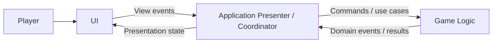
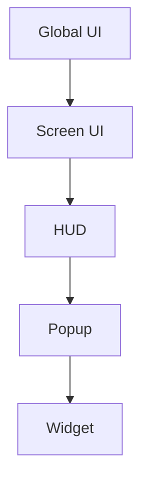
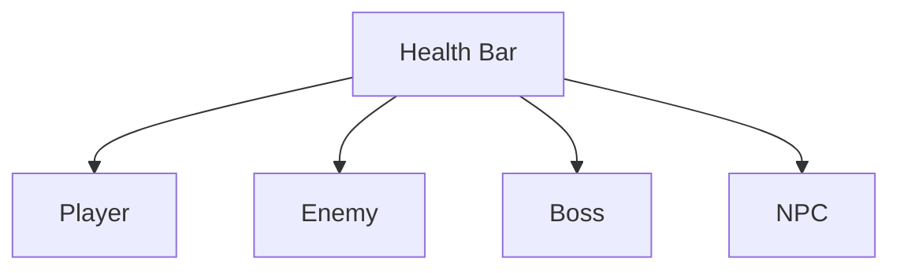

# UI

> Version: 1.0
> Last Updated: 13-07-2026

---

# Purpose

The UI (User Interface) is responsible for displaying information to the player and receiving user input.

The UI is a separate architectural layer of the project and does not contain gameplay business logic.

Its primary purpose is to present the current game state and forward player actions to the gameplay systems.

---

# Responsibilities

The UI is responsible for:

- displaying gameplay data;
- displaying game screens;
- displaying the HUD;
- displaying menus;
- receiving user input;
- forwarding player actions to the gameplay logic.

The UI is **not** responsible for:

- gameplay rules;
- executing saves and reading files;
- scene management;
- game phase management;
- gameplay calculations.

---

# High-Level Overview



The arrows show runtime flow, not reverse compile-time dependencies. UI is a passive boundary between the player and an Application presenter/coordinator. UI does not depend on a concrete Game Feature implementation, and Game does not depend on the Coordinator.

---

# UI Layers

UI is divided into several logical roles. A role does not necessarily require a separate physical folder.



---

## Global UI

Exists for the entire lifetime of the application.

Planned components include:

- Fade Screen;
- Loading Screen;
- Notifications;
- Global Popups;
- Debug UI.

The Global UI is located in the Persistent Scene.

---

## Screen UI

The interface for a specific game mode.

For example:

```text
Main Menu

Inventory

Battle

Settings
```

Each screen belongs to its corresponding Main Phase or Overlay Phase.

---

## HUD

Continuously displayed gameplay information.

For example:

- health;
- energy;
- minimap;
- current objective;
- hotkeys.

---

## Popup

Temporary windows displayed over the current interface.

For example:

- action confirmation;
- messages;
- warnings;
- item acquisition.

---

## Widget

The smallest independent UI element.

For example:

- HP Bar;
- Inventory Slot;
- Dialogue Option;
- Skill Icon.

Widgets should be as reusable as possible.

---

# General Structure

The current physical UI structure is organized by system:

```text
UI/

├── MainMenu/
├── PauseMenu/
├── CheckpointSave/
├── Common/
├── Services/
```

HUD, Popups, and Widgets may be added as new UI systems. An element belongs in `Common` only when it is shared by multiple UI systems.

---

# Design Principles

## UI Is Passive

The UI does not make gameplay decisions.

It displays information and emits user events. A presenter/coordinator or gameplay system decides what to do after an event.

---

## Separation of Responsibilities

The UI does not contain gameplay rules.

All gameplay logic belongs to the Game layer.

---

## Reusability

UI elements should be reusable.

For example:



---

## Data Driven

The UI should display data, not calculate it.

---

## Independence

Each screen should be as independent as possible.

---

# Communication

Communication between the UI and gameplay systems should occur through:

- Application presenters/coordinators;
- public presentation contracts;
- C# View events.

The UI must not modify gameplay objects directly.

---

# Current And Planned UI Systems

The current project implements:

```text
Main Menu

Dialogue UI

Battle UI

Pause Menu

Save Browser

Checkpoint Save Menu
```

The following systems are planned:

```text
HUD

Inventory UI

Settings

Loading Screen

Notification System
```

Larger UI systems may receive dedicated architecture documentation as they evolve.

---

# Common Mistakes

## ❌ Putting gameplay logic inside the UI

The UI must not calculate:

- damage;
- experience;
- character stats;
- quest progression.

---

## ❌ Large MonoBehaviours

UI components should be split into small, independent MonoBehaviours whenever possible.

---

## ❌ Tight coupling

The UI should not depend on the internal implementation of gameplay Features.

---

## ❌ Duplicating UI elements

Reusable elements should be implemented as Widgets.

---

# Future Evolution

After the base UI architecture is completed, separate documents will be created for individual UI systems:

```text
HUDArchitecture.md

DialogueUI.md

BattleUI.md

InventoryUI.md

PopupSystem.md
```

This document describes only the overall UI architecture.

---

# Related Documents

- 01_Architecture.md
- 02_ProjectStructure.md
- 03_DeveloperGuide.md
- 04_CodeRules.md
- 07_Features.md
