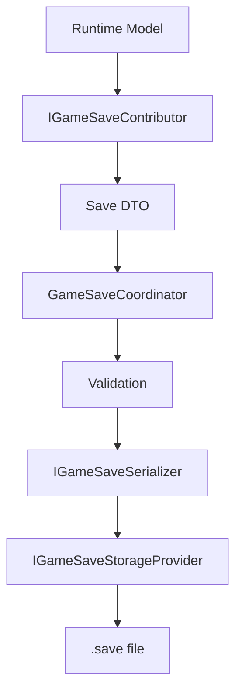
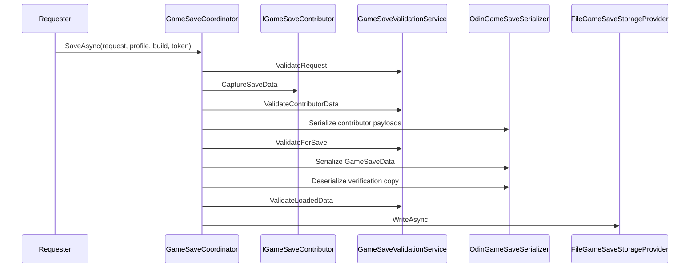
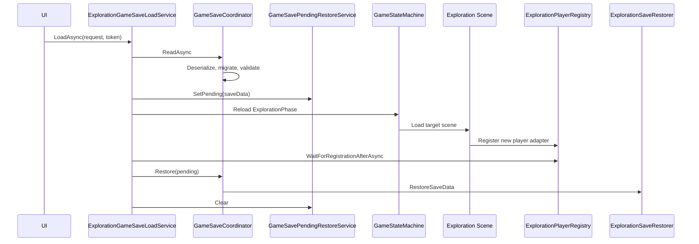

# Save System

> Version: 1.0
> Last Updated: 13-07-2026

---

# Purpose

Save System is responsible for creating, storing, reading, validating, migrating, and restoring snapshots of the game state.

The system separates the runtime model from the file format and Unity API. A Feature only exposes a Save DTO through a contributor and accepts a DTO through a restorer. Serialization and file access remain inside Infrastructure.

---

# Responsibilities

Save System is responsible for:

- collecting data from registered contributors;
- creating metadata and the root snapshot;
- validating DTOs and snapshots;
- serialization through Odin Serializer;
- safe file writes;
- reading slot lists and metadata;
- migrating older versions;
- passing loaded DTOs to registered restorers;
- coordinating restoration after an exploration scene transition.

Save System is not responsible for:

- making gameplay decisions inside a Feature;
- storing Unity runtime objects;
- controlling a Canvas directly;
- loading scenes directly from UI;
- choosing the visual representation of save entries.

---

# High-Level Overview



Required data direction:

```text
Runtime Model

↓

Mapper / Contributor

↓

Save DTO

↓

Serializer

↓

Storage Provider
```

Runtime models and scene objects are never serialized directly.

---

# Layers And Placement

Save System is a cross-cutting subsystem and does not belong entirely to a single architectural layer.

| Layer | Location | Responsibility |
|------|----------|----------------|
| Game Shared | `Game/Shared/SaveSystem` | Shared contracts, metadata, requests, and root DTOs |
| Game Feature | `Game/Features/Exploration/Scripts/Save` | Exploration DTO, contributor, restorer, and player abstractions |
| Infrastructure | `Infrastructure/SaveSystem` | Coordinator, validation, migration, Odin, and file storage |
| Application | `Application/Coordination` | Complete checkpoint save, catalog, and load transition use cases |
| Unity Adapters | `Application/Installers/FeatureAdapters/Exploration/Save` | Trigger and player Rigidbody2D adapter |
| UI | `UI/PauseMenu` and `UI/CheckpointSave` | Passive list and slot selection views |

A Feature does not know the file path. UI knows neither the path, the serializer, nor the scene name to load.

---

# Core Contracts

## IGameSaveContributor

A contributor converts the current runtime state of a Feature into a Save DTO.

It exposes:

- a stable `ContributorId`;
- the DTO type through `SaveDataType`;
- a snapshot through `CaptureSaveData()`.

`ContributorId` is the data key inside the file. Once saves are released, it cannot be changed without a migration.

---

## IGameSaveRestorer

A restorer receives its contributor DTO and applies it to the new runtime model.

The contributor and restorer must use the same `ContributorId` and `SaveDataType`.

---

## IGameSaveSerializer

The serialization contract does not depend on a specific library.

Current implementation:

```text
OdinGameSaveSerializer
```

It uses Odin Serializer in binary format. The separate interface allows the serializer to be replaced without changing the coordinator, contributors, or storage provider.

---

## IGameSaveStorageProvider

The Storage Provider can:

- write a slot;
- read a slot;
- list slots;
- check existence;
- delete a slot;
- read metadata without restoring the game.

Current implementation:

```text
FileGameSaveStorageProvider
```

---

## IGameSaveMigrationStep

A Migration Step converts one `GameSaveData` format into the next.

Each step explicitly defines:

- `SourceVersion`;
- `TargetVersion`;
- the migration function.

Exactly one next step must exist for every supported old version.

---

# Save Data Model

## GameSaveRequest

A request contains:

- `Kind`;
- `SlotId`;
- an optional `CheckpointId`.

`CheckpointId` describes a place in the world. `SlotId` identifies a file. These identifiers are not interchangeable.

---

## GameSaveKind

Three entry kinds are supported:

```text
Checkpoint
Auto
Manual
```

Checkpoint is used by the current gameplay flow. Auto and Manual names are already supported by the model and storage provider for future expansion.

---

## GameSaveMetadata

Metadata contains:

- format version;
- UTC timestamp;
- build number;
- profile ID;
- entry kind;
- slot ID.

Metadata is created centrally before the snapshot is assembled.

---

## GameSaveData

`GameSaveData` is the root file DTO.

It contains:

- `Metadata`;
- a collection of `GameSaveEntry` objects.

Each `GameSaveEntry` stores:

- a stable contributor ID;
- the serialized payload of a specific Feature.

This structure allows new Features to be added without expanding one monolithic DTO.

---

# Save Flow



Before writing, the coordinator performs a round-trip check: it serializes the root snapshot, reads it back, and validates it again. The slot and kind of the resulting snapshot must match the request.

Concurrent checkpoint writes are blocked by a `SemaphoreSlim` inside `ExplorationCheckpointSaveService`.

---

# Checkpoint Flow

A checkpoint is initiated through `ExplorationCheckpointTrigger`.

```text
Player Interaction

↓

ExplorationCheckpointTrigger

↓

CheckpointSaveRequestBroker

↓

CheckpointSaveMenuCoordinator

↓

ExplorationCheckpointSaveService

↓

GameSaveCoordinator
```

The trigger:

- stores a stable `checkpointId`;
- does not know the file format;
- does not know the full path;
- does not access the serializer or storage provider;
- uses the Unity object's lifecycle `CancellationToken`.

The current catalog contains checkpoint slots `checkpoint_0` ... `checkpoint_9`.

Automatic rotation first uses an empty or corrupted slot. When all slots are occupied, the oldest slot by UTC timestamp is replaced.

The explicit checkpoint slot selector preserves fixed slot ID order. The general load catalog uses storage provider order: valid entries from newest to oldest, followed by corrupted entries.

---

# Load Flow

Exploration saves are loaded only through `ExplorationGameSaveLoadService`.



The order is critical:

1. Read, migrate, and validate the file.
2. Store the snapshot as a pending restore.
3. Remember the current player registration version.
4. Replace the main phase and load the saved exploration scene.
5. Wait for the new player to register.
6. Apply DTOs to the new player.
7. Clear the pending restore.

The position is never applied to the old player before its scene is unloaded.

The pending restore is also cleared when the operation fails or is cancelled.

---

# Exploration Save Data

The first version of `ExplorationSaveData` contains:

- a stable exploration scene ID;
- checkpoint ID;
- player X position;
- player Y position.

The DTO contains no `Transform`, `Rigidbody2D`, or other Unity object.

`ExplorationSaveContributor` reads the position through `IPlayerPositionProvider`.

`ExplorationSaveRestorer` applies it through `IPlayerPositionRestorationTarget`.

Before moving the player, `ExplorationPlayerStateAdapter`:

- resets dash state;
- resets movement state;
- clears transient input;
- clears linear and angular velocity;
- moves the `Rigidbody2D`;
- synchronizes Physics2D.

---

# Scene Resolution

The file stores a stable `SceneId`, not a UI decision about a concrete scene.

`ExplorationSceneResolver` validates the ID and converts it to a scene name. Persistent, Main Menu, and Battle cannot be loaded as exploration saves.

The transition follows:

```text
ExplorationSceneTransitionService

↓

GameStateMachine.ReloadMainAsync<ExplorationPhase>

↓

SceneLoader
```

UI does not call `SceneManager` and does not know the scene name.

---

# File Storage

Files are stored under:

```text
Application.persistentDataPath/GameSaves
```

The full path is constructed only inside `FileGameSaveStorageProvider`.

File names use:

```text
<SlotId>.save
```

Only letters, digits, `_`, and `-` are allowed. Absolute paths, `..`, path separators, and IDs longer than 64 characters are rejected.

---

# Atomic Write

Writes are performed safely:

1. A unique temporary file is created.
2. Data is written and flushed to disk.
3. The new file atomically replaces the primary file.
4. A backup and rollback are used when necessary.
5. Temporary and backup files are removed after success.

If replacement fails, the existing primary file is restored from the backup.

All file operations are serialized through an internal `SemaphoreSlim` and run outside the main thread through UniTask.

---

# Validation

`GameSaveValidationService` validates:

- required request fields;
- safe `SlotId` values;
- metadata presence;
- current format version;
- UTC timestamp;
- build number and profile ID;
- unique contributor IDs;
- non-empty payloads;
- DTO type compatibility;
- absence of `UnityEngine.Object` throughout the DTO graph.

An empty or corrupted file is never restored. The catalog displays it as corrupted and non-loadable.

---

# Versioning And Migration

The current version is defined by:

```csharp
GameSaveData.CurrentFormatVersion
```

Read order:

```text
Read bytes

↓

Deserialize

↓

Migrate

↓

Validate current version

↓

Restore
```

When the format changes, an old DTO must not simply be overwritten. Instead:

1. Increment `CurrentFormatVersion`.
2. Add an `IGameSaveMigrationStep` implementation.
3. Register the migration step through an installer.
4. Add a test that loads the previous version.

Saves with an unknown future version are rejected.

---

# Catalog And UI

UI never reads the directory itself.

`ExplorationSaveCatalogService` converts storage slots into `GameSaveCatalogEntry` objects. Application coordinators pass ready view data to passive Views.

```text
SaveBrowserView

↓ user request

PauseMenuCoordinator or MainMenuSaveBrowserCoordinator

↓

ExplorationSaveCatalogService

↓

IGameSaveStorageProvider + GameSaveCoordinator
```

Application UI coordinators block repeated clicks while an asynchronous operation is running. On failure, the menu remains open and displays a safe error message.

---

# Dependency Injection

Global Save System components are registered in `ServiceInstaller`:

- serializer;
- storage provider;
- runtime metadata provider;
- validation;
- migration;
- coordinator;
- pending restore;
- checkpoint rotation.

Exploration components are registered in `ExplorationInstaller`:

- player registry;
- save context;
- contributor;
- restorer;
- scene transition;
- checkpoint save service;
- load service;
- catalog service.

Unity adapters are registered by their corresponding scene installers. No gameplay singleton is used.

---

# Adding Save Data To A Feature

To add new data:

1. Create a dedicated serializable Save DTO with no Unity references.
2. Create an `IGameSaveContributor` that maps the runtime model to the DTO.
3. Create an `IGameSaveRestorer` if the data must be restored.
4. Use the same stable contributor ID on both sides.
5. Register contributor and restorer through an installer.
6. Add unit tests for capture, serialization, and restoration.
7. Add a migration if an already released format changes.

The coordinator does not need to change.

---

# Error Handling And Cancellation

Save System uses typed `GameSaveException` variants for:

- validation;
- serialization;
- storage;
- corruption;
- unknown versions;
- migration.

An Application coordinator catches errors at the user-flow boundary and forwards them to the centralized logger or View as a safe message.

All long-running operations accept a `CancellationToken`. Triggers and UI bind the token to the Unity object's lifecycle. Cancellation must not leave a pending restore or restore into an unloaded scene.

---

# Tests

The main pure logic is covered by EditMode tests:

- metadata creation;
- request and DTO validation;
- serializer round trip;
- corrupted data;
- old-version migration;
- file write, read, overwrite, and delete;
- SlotId protection;
- slot sorting and rotation;
- Exploration contributor and restorer;
- checkpoint save service;
- catalog service.

When the scene load pipeline is extended, a PlayMode check should be added only when it does not depend on unstable Editor load ordering.

---

# Common Mistakes

## ❌ Serializing MonoBehaviour

Only DTOs are saved. `MonoBehaviour`, `Transform`, `GameObject`, `Component`, and other `UnityEngine.Object` types are forbidden.

---

## ❌ Accessing Files From A Feature Or UI

A Feature exposes a DTO. UI emits a request. Paths and file operations belong to the storage provider.

---

## ❌ Using PlayerPrefs For Game Saves

Save files are not stored in PlayerPrefs.

---

## ❌ Loading A Scene Directly From SaveBrowser

Loading goes through the Application load service, GameStateMachine, and SceneLoader.

---

## ❌ Restoring The Old Player

The restorer runs only after the target scene has loaded and the new player adapter has registered.

---

## ❌ Changing A Contributor ID

Contributor ID is part of the file format. Changing it requires a migration.

---

# Current Scope

The current version stores the exploration scene, checkpoint ID, and player position.

The model already supports `Checkpoint`, `Auto`, and `Manual`, but automatic creation of Auto/Manual saves is not part of the current runtime flow.

---

# Related Documents

- 01_ApplicationLifecycle.md
- 04_GameStateMachine.md
- 05_SceneManagement.md
- 06_DependencyInjection.md
- 07_Features.md
- 08_UI.md
- 13_ArchitectureOverview.md

---

# Summary

Save System is built around the explicit `Runtime Model → Contributor → Save DTO → Serializer → Storage Provider` chain.

`GameSaveCoordinator` centralizes the common pipeline, each Feature only maps its own data, Infrastructure isolates Odin and the file system, and Application coordinates scene transitions and restoration of the new runtime object.
