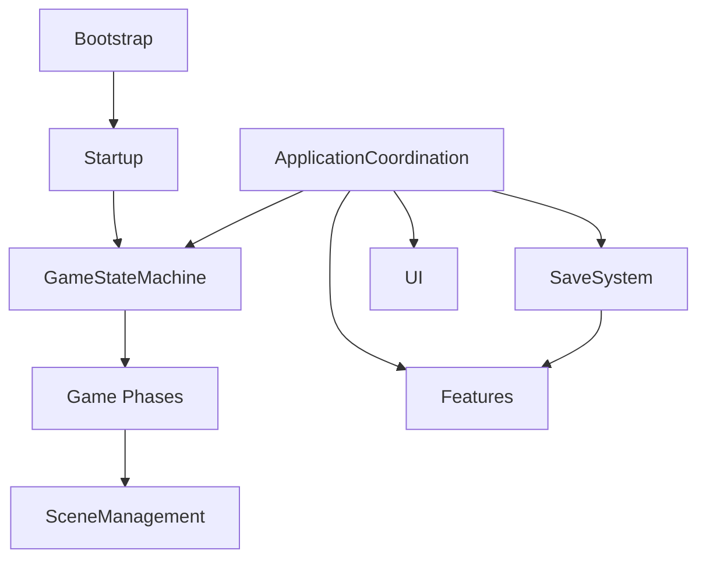
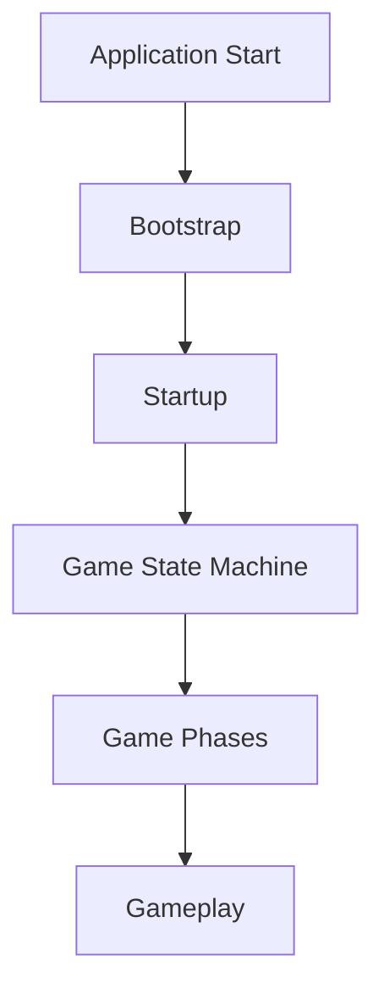
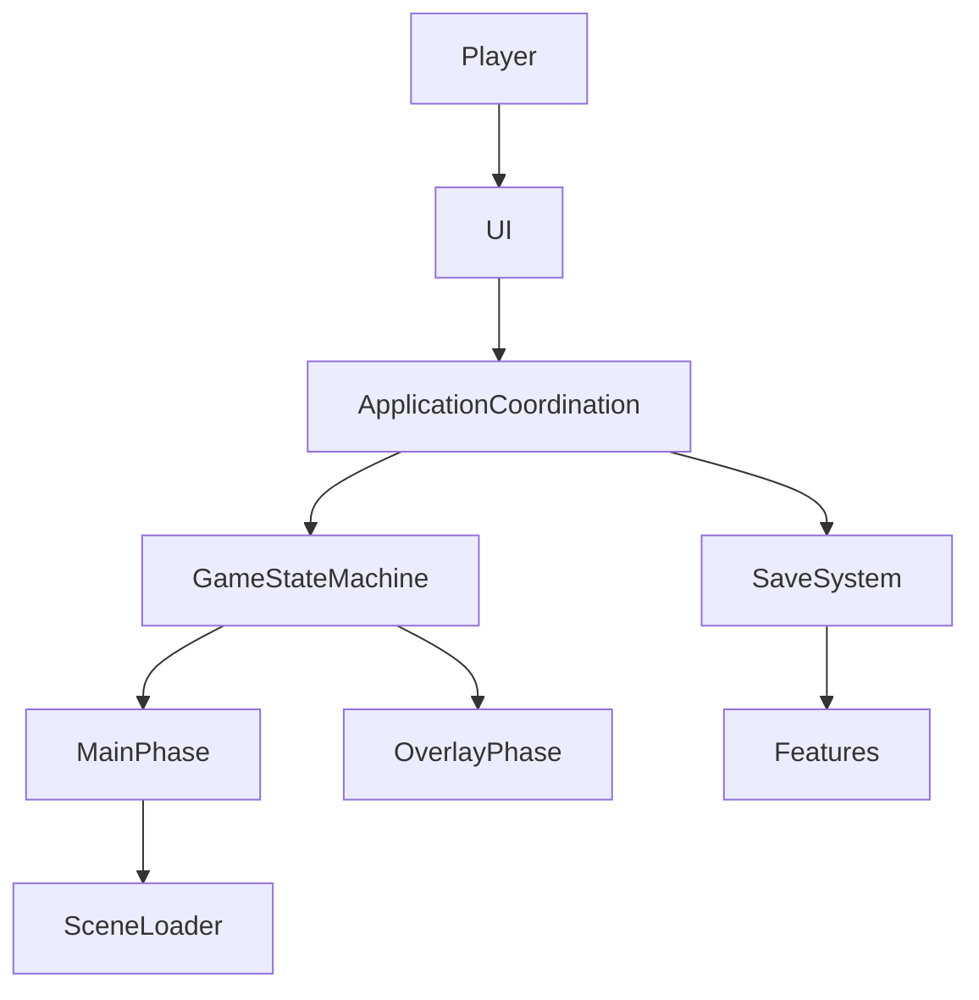
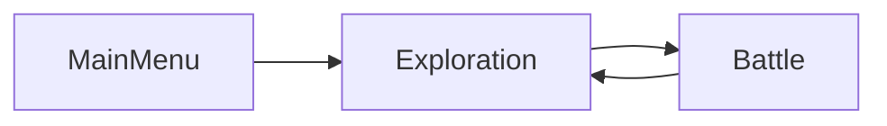
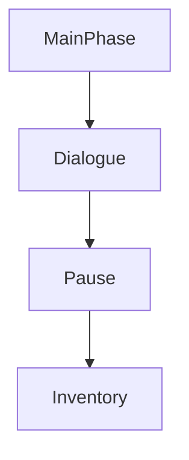
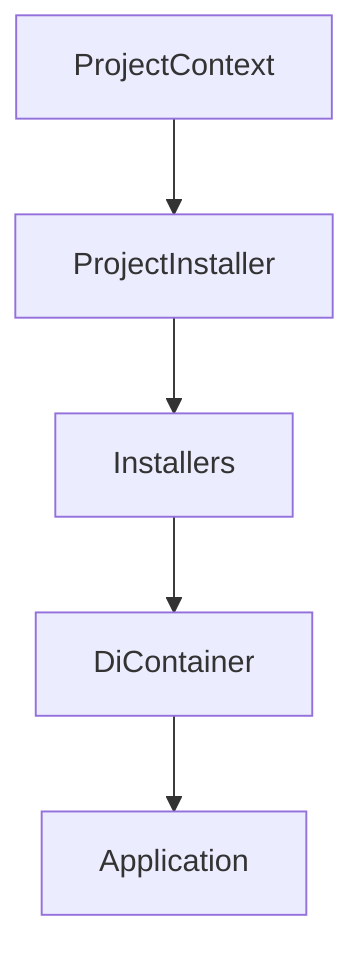
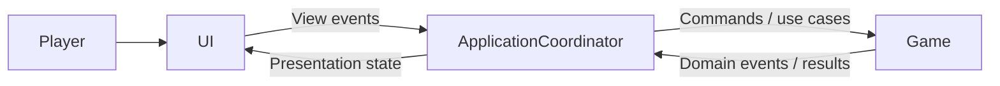
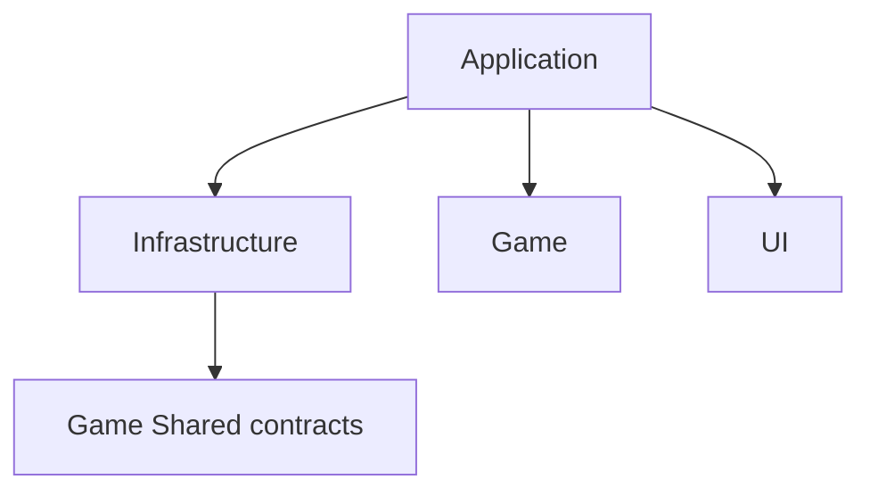

# Architecture Overview

> Version: 1.0
> Last Updated: 13-07-2026

---

# Purpose

The Architecture Overview illustrates how the project's core subsystems interact with each other.

This document does not describe the internal implementation of individual systems. Those details are covered in the corresponding **Architecture Atlas** documents.

---

# High-Level Architecture



---

# System Overview

The project consists of several primary architectural subsystems.

| System | Responsibility |
|----------|----------------|
| Bootstrap | Application startup |
| Startup | Determining the initial game phase |
| Game State Machine | Managing game modes |
| Scene Management | Loading and switching game scenes |
| Features | Gameplay logic |
| UI | Displaying information to the player |
| Save System | Saving and restoring game state |

Each subsystem has a clearly defined area of responsibility.

---

# Application Flow

After the application starts, control passes through several sequential stages.



Once Bootstrap is complete, control is fully transferred to the Game State Machine.

---

# Runtime Flow

During gameplay, control flows as follows.



---

# Layered Architecture

The project architecture is divided into four layers with different responsibilities.

```text
Application / Composition ──▶ Game
           │
           ├────────────────▶ Infrastructure ──▶ Game Shared contracts
           │
           └────────────────▶ UI
```

Game does not depend on the other layers. Application and Composition connect subsystems. Infrastructure and UI do not depend on Application and do not create cyclic asmdef references.

---

# Main Phase Lifecycle

Only one Main Phase can be active at any given time.



Transitions between game modes are always performed through the Game State Machine.

---

# Overlay Lifecycle

Overlay Phases operate on top of the active Main Phase.



Overlays are organized as a stack.

The most recently opened Overlay is always closed first.

---

# Scene Lifecycle

Scene Management completely encapsulates the Unity SceneManager.


Gameplay systems never access the SceneManager directly.

---

# Dependency Injection

Services, phases, and coordinators are created by the Zenject container. Unity scene objects are created by Unity and receive dependencies through injection.



Regular C# classes receive dependencies through constructors. Unity-created MonoBehaviours use method injection.

---

# Feature Architecture

Gameplay logic follows the **Feature First** architecture.

```text
Game

├── Combat

├── Dialogue

├── Exploration

└── Minigames
```

Each Feature is an independent gameplay subsystem.

---

# UI Architecture

The UI is separated from the gameplay logic.



The UI displays data and forwards player actions.

Gameplay decisions are made exclusively by the gameplay systems.

The arrows show runtime flow. At compile time, Game does not depend on ApplicationCoordinator, and UI does not depend on a concrete Game Feature implementation.

---

# Dependency Direction

Compile-time dependencies point toward stable contracts.



Game does not depend on Application, Infrastructure, UI, or Zenject. The architecture does not allow cyclic asmdef dependencies.

---

# Design Principles

The project is built around the following principles:

- Single Responsibility Principle
- Separation of Concerns
- Dependency Injection
- Feature First
- Composition over Inheritance
- Explicit Lifecycle
- Explicit Dependencies
- Open/Closed Principle

All new systems should follow these principles.

---

# Architecture Atlas

Each subsystem is documented in detail in its own Architecture Atlas document.

| Document | Description |
|----------|-------------|
| 01_ApplicationLifecycle | Complete application lifecycle |
| 02_Bootstrap | Application startup |
| 03_Startup | Initial phase selection |
| 04_GameStateMachine | Game mode management |
| 05_SceneManagement | Scene management |
| 06_DependencyInjection | Dependency Injection |
| 07_Features | Gameplay Feature architecture |
| 08_UI | User Interface architecture |
| 09_SaveSystem | Saving and restoring game state |

---

# Summary

The project architecture is built around small, independent subsystems.

Each subsystem has a single responsibility, communicates with other systems through well-defined interfaces, and can evolve independently.

This approach provides:

- low coupling between components;
- high extensibility;
- ease of maintenance;
- a predictable application lifecycle;
- the ability to scale the project without significant changes to the existing architecture.
