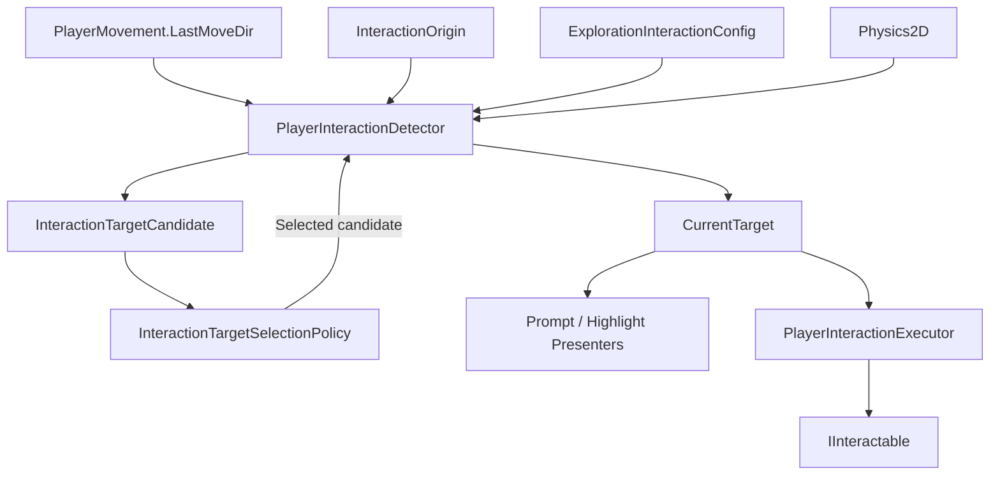
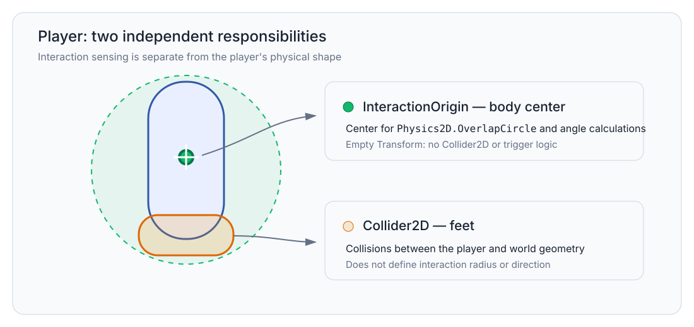
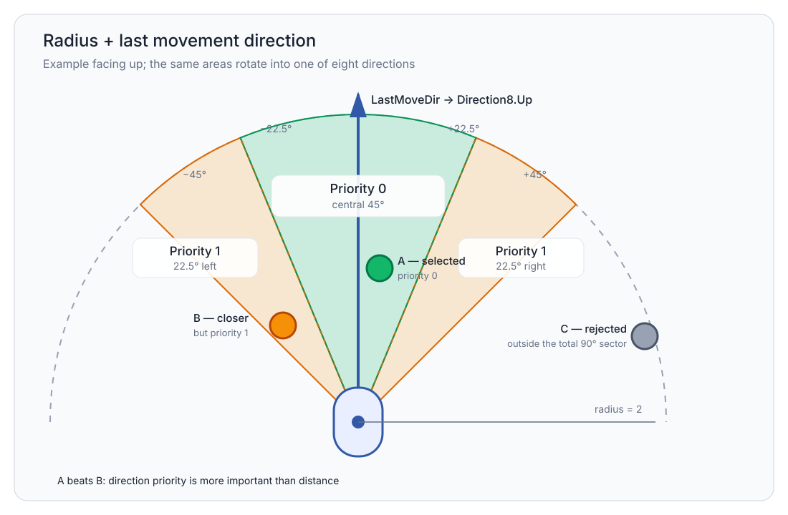
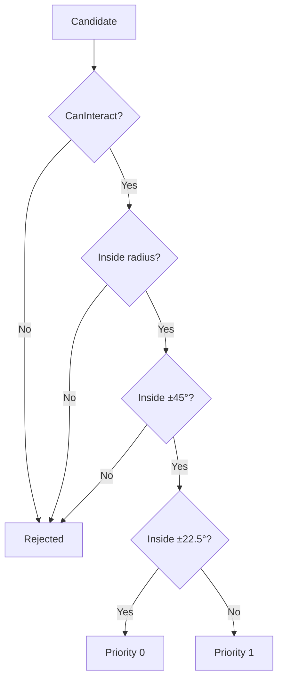
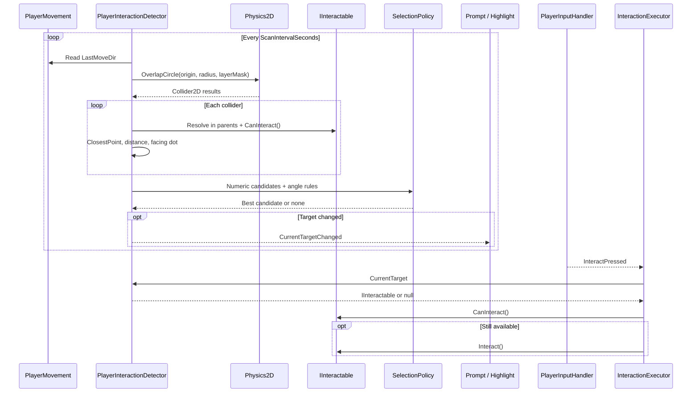
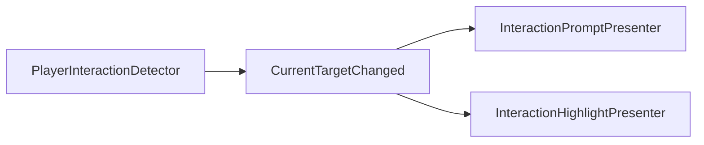

# Exploration Interaction

> Version: 1.2
> Last Updated: 16-07-2026

---

# Purpose

Exploration Interaction detects available targets near the player, selects one current target, and starts its interaction in response to player input.

The system combines:

- a radius around the center of the player's body;
- the last non-zero movement direction, quantized to one of eight directions;
- two angular priorities inside a total `90°` sector.

The player's physical collider is not used as an interaction sensor.

---

# Responsibilities

Exploration Interaction is responsible for:

- finding colliders on the interaction layer;
- converting detected colliders into candidates;
- rejecting unavailable targets and targets outside the interaction sector;
- ranking candidates deterministically;
- storing one current target;
- notifying the UI when the target changes;
- calling `IInteractable.Interact()` in response to player input.

Exploration Interaction is not responsible for:

- physical collisions between the player and the world;
- deciding whether a specific target is currently available;
- implementing door, NPC, save point, or pickup behavior;
- choosing prompt text or its visual styling;
- loading scenes, opening dialogues, or writing save files directly.

---

# High-Level Overview



`PlayerInteractionDetector` is a Unity adapter. It works with Transform, Rigidbody2D, Collider2D, and Physics2D.

`InteractionTargetSelectionPolicy` receives only numeric candidate data. It does not depend on the Unity API, scene content, UI, Input System, or the DI container.

---

# Spatial Model

The player has two independent areas of responsibility.



## InteractionOrigin

`InteractionOrigin` is an empty child Transform positioned at the center of the player's body.

It defines:

- the center of the search circle;
- the starting point of the vector to a target;
- the center of the editor gizmo.

`InteractionOrigin` has no Collider2D and no trigger logic. It creates no physical contacts.

The world position of the origin is calculated from the physical position of the `Rigidbody2D`. This prevents the search area from lagging behind the player when Rigidbody2D interpolation is enabled.

## Player Collider

The player's physical `Collider2D` remains at the feet and is responsible only for collisions with the world.

It does not define:

- the interaction radius;
- the interaction direction;
- the list of available targets.

---

# Direction Model

`PlayerMovement.LastMoveDir` stores the last non-zero movement direction. It points up until the player moves for the first time.

The direction is quantized to one of eight values in `45°` increments.

```text
            Up
             ↑
UpLeft   ↖       ↗   UpRight

Left     ←   •   →     Right

DownLeft ↙       ↘ DownRight
             ↓
           Down
```

Only the player's direction is quantized to eight directions.

The direction to a target remains exact. It is calculated from `InteractionOrigin` to the closest point on the target collider and is not rounded to one of the eight directions.

If the closest point coincides with the origin, the detector uses the center of the collider bounds. If that point also coincides with the origin, `LastMoveDir` is used.

---

# Selection Area

The current interaction area has a radius of `2` and a total angle of `90°`.



The area rotates with the selected eight-directional `LastMoveDir`.

| Priority | Offset From Player Direction | Area |
|----------|------------------------------|------|
| `0` | from `-22.5°` to `+22.5°` | central `45°` |
| `1` | from `-45°` to `-22.5°` and from `+22.5°` to `+45°` | `22.5°` on each side |
| Rejected | below `-45°` or above `+45°` | outside the total sector |

The `±22.5°` boundaries belong to priority `0`. The `±45°` boundaries are still accepted.

---

# Candidate Requirements

A collider becomes a candidate only when every condition is met:

1. The collider is returned by `Physics2D.OverlapCircle` on an allowed interaction layer.
2. A component implementing `IInteractable` exists on the collider or one of its parents.
3. `IInteractable.CanInteract()` returns `true`.
4. The closest point on the collider is inside the interaction radius.
5. The angle to the closest point on the collider does not exceed the maximum half-angle of `45°`.

The additional distance check based on `Collider2D.ClosestPoint()` prevents a collider shape from passing the filter only because of a coarse overlap result.

---

# Selection Rules

Candidates are compared in a strictly defined order.



Accepted candidates are ranked by:

1. Lower direction priority.
2. Lower squared distance to the closest point on the collider.
3. Lower collider instance ID when every other value is equal.

Priority is more important than distance. A target in the central sector always beats a target in either side strip, even when the side target is closer.

An instance ID remains stable for the lifetime of its collider and prevents the order of Physics2D results from changing the current selection.

---

# Runtime Flow

The detector recalculates the target at the interval specified by the config. The current interval is `0.05` seconds.



The second `CanInteract()` call in the executor protects against the target state changing between the latest scan and the player's input.

---

# Components And Responsibilities

| Component | Responsibility |
|-----------|----------------|
| `ExplorationInteractionConfig` | Radius, scan interval, layer mask, angles, and fallback prompt |
| `PlayerInteractionDetector` | Physics2D scan, candidate construction, and `CurrentTarget` storage |
| `InteractionTargetSelectionPolicy` | Pure deterministic candidate ranking |
| `Direction8Utility` | Converts a movement vector into one of eight directions |
| `PlayerInteractionExecutor` | Reads interaction input and invokes the current target |
| `InteractionPromptPresenter` | Displays a prompt for the already selected target |
| `InteractionHighlightPresenter` | Enables a highlight for the already selected target |
| `IInteractable` | Availability, prompt, and execution of a specific interaction |

---

# Configuration

The current values are stored in `SO_ExplorationInteractionConfig`.

| Field | Current Value | Meaning |
|-------|---------------|---------|
| `InteractionRadius` | `2` | Maximum distance from the origin to a collider |
| `ScanIntervalSeconds` | `0.05` | Current-target recalculation frequency |
| `InteractionLayerMask` | `Interaction` | Physics layer for interactive colliders |
| `DirectPriorityHalfAngleDegrees` | `22.5` | Half-angle of priority `0` |
| `InteractionHalfAngleDegrees` | `45` | Maximum accepted half-angle |
| `DefaultPromptText` | `Press E to interact` | Fallback used when the target prompt is empty |

These values must not be duplicated in the detector or presenters.

---

# Content Requirements

To add a new interactive target:

1. Add a `Collider2D` on the `Interaction` physics layer.
2. Place the `IInteractable` implementation on the same GameObject or one of the collider's parents.
3. Implement `CanInteract()`, `GetInteractionPrompt()`, and `Interact()`.
4. Ensure that the layer is included in `ExplorationInteractionConfig.InteractionLayerMask`.

The detector searches up the hierarchy from the detected collider for an `IInteractable`. It does not know the concrete target type.

---

# Presentation Flow

`CurrentTargetChanged` is published only when the target or its source collider changes.



Presenters do not perform Physics2D queries or rank targets. The UI displays the result but does not make the gameplay decision.

`PlayerInteractionExecutor` does not subscribe to `CurrentTargetChanged`. When input is received, it reads the current `CurrentTarget` directly from the detector.

---

# Debug Visualization

Editor-only visualization is enabled for all Collider2D components and for the player's interaction area.

Collider colors:

- cyan — a regular physical collider;
- orange — a collider on the `Interaction` layer;
- pink — a trigger collider.

`PlayerInteractionDetector.OnDrawGizmos()` displays:

- the current interaction radius and origin;
- the outer boundaries at `-45°` and `+45°`;
- the priority `0` boundaries at `-22.5°` and `+22.5°`;
- the current eight-directional facing vector;
- a line to the currently selected collider, when a target exists.

These gizmos are editor visualization only. They are not colliders or triggers and do not affect runtime physics or player builds.

---

# Design Principles

## Separate Physics And Interaction

The collider at the player's feet handles physics. `InteractionOrigin` at the center of the body defines the spatial interaction model.

## Deterministic Selection

The result is determined by priority, distance, and instance ID rather than by the order of colliders in the Physics2D buffer.

## Pure Selection Policy

Angular filtering and ranking live in a pure policy. The Unity adapter only gathers input data and applies the result.

## Passive Presentation

The prompt and highlight subscribe to the selected target but do not search for or select it.

## Contract-Based Extension

A new target type implements `IInteractable`. The detector, policy, and executor must not change for a door, NPC, checkpoint, or pickup.

---

# Testing

`InteractionTargetSelectionPolicy` is covered by EditMode tests that do not load `SC_World`.

The tests cover:

- priority `0` beating a closer priority `1` target;
- selection of the closest target inside one priority;
- rejection of a target outside the `90°` sector;
- the `22.5°` and `45°` boundaries;
- the instance ID tie-break;
- conversion of movement into all eight directions.

The tests do not lock the composition or placement of specific objects in `SC_World`.

---

# Common Mistakes

## ❌ Using The Player Collider As An Interaction Trigger

The search is centered on a separate `InteractionOrigin`. The collider at the feet remains part of the physics model.

## ❌ Quantizing The Direction To A Target Into Eight Sectors

Only `LastMoveDir` is quantized. The angle to a target is calculated from the exact vector.

## ❌ Choosing The Closest Target Before Direction Priority

Priority is compared first, followed by distance.

## ❌ Searching For Targets From The UI

The prompt and highlight use only `CurrentTargetChanged`.

## ❌ Adding A Detector Branch For A New Object Type

The new object must implement `IInteractable` and satisfy the content requirements.

---

# Related Documents

- `07_Features.md`
- `08_UI.md`
- `13_ArchitectureOverview.md`
- `../01_Architecture.md`
- `../04_CodeRules.md`
