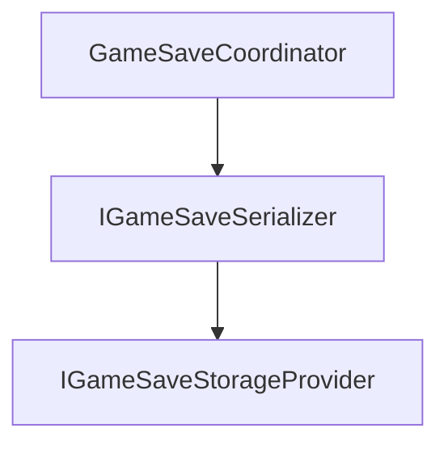
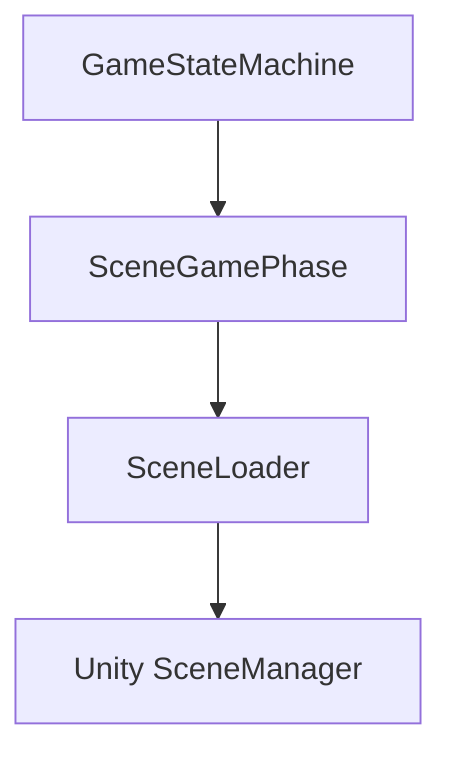

# Glossary

> Version: 1.0
> Last Updated: 13-07-2026

---

# Purpose

Данный документ определяет термины, используемые в проекте.

Все архитектурные документы, комментарии и обсуждения должны использовать определения, приведённые здесь.

Если один и тот же термин можно трактовать по-разному, правильным считается определение из этого документа.

---

# Architecture

## Application

Слой, управляющий жизненным циклом приложения.

Отвечает за:

- запуск игры;
- переключение игровых состояний;
- регистрацию зависимостей;
- координацию основных систем.

Application не содержит игровой логики.

---

## Infrastructure

Слой глобальных технических интеграций с Unity API, файловой системой и внешними библиотеками.

Примеры:

- SceneLoader
- GameSaveCoordinator
- AudioService
- InputService

Infrastructure предоставляет функциональность, но не содержит игровых правил.

---

## Game

Слой, содержащий всю игровую логику.

Любые игровые правила должны находиться здесь.

---

## UI

Слой отображения информации.

UI показывает данные пользователю, принимает ввод и отправляет события представления.

UI не содержит игровых правил.

---

# Bootstrap

Процесс запуска приложения.

Bootstrap начинается сразу после создания контейнера зависимостей и заканчивается запуском первой игровой фазы.

В проекте Bootstrap состоит из:

- BootstrapStartup
- BootstrapRunner

---

# BootstrapStartup

Точка входа Bootstrap.

Интегрируется с Zenject и запускает BootstrapRunner.

После завершения запуска больше не используется.

---

# BootstrapRunner

Координатор процесса запуска приложения.

Отвечает за:

- загрузку Persistent Scene;
- определение стартовой Phase;
- запуск GameStateMachine.

Не содержит игровой логики.

---

# Startup

Подсистема, определяющая стартовое состояние приложения.

Используется только при запуске игры.

Содержит:

- StartupResolver
- StartupPhaseRegistry

---

# StartupResolver

Определяет, какая игровая фаза должна быть запущена первой.

Например:

- MainMenu
- Exploration

---

# StartupPhaseRegistry

Хранит соответствие между сценами Unity и игровыми фазами.

Используется только StartupResolver.

---

# Game State Machine (FSM)

Главная система управления игровыми состояниями.

FSM отвечает только за переключение игровых фаз.

FSM не содержит игровой логики.

---

# Phase

Игровое состояние с жизненным циклом.

Любая Phase имеет два метода:

- Enter()
- Exit()

---

# Main Phase

Основной игровой режим.

В любой момент времени существует только одна активная Main Phase.

Примеры:

- Main Menu
- Exploration
- Combat
- Exploration
- Minigame

Main Phase обычно связана с игровой сценой.

---

# Overlay Phase

Временный игровой режим, работающий поверх Main Phase.

Overlay хранится в стеке.

Примеры:

- Pause
- Dialogue
- Inventory
- Settings

Overlay не заменяет Main Phase.

---

# SceneGamePhase

Разновидность Main Phase, связанная с Unity Scene.

При входе автоматически загружает соответствующую сцену через SceneLoader.

---

# Feature

Самостоятельная игровая подсистема.

Feature отвечает за одну игровую механику.

Примеры:

- Dialogue
- Battle
- Inventory
- Quest
- Craft
- Fishing

Feature должна быть максимально независимой.

---

# Service

Система, предоставляющая функциональность другим подсистемам.

Service не содержит игровых правил.

Примеры:

- AudioService
- InputService
- GamePauseService

---

# Coordinator

Класс, координирующий несколько компонентов в рамках одного application use case.

Например, GameSaveCoordinator управляет техническим pipeline сохранения, а PauseMenuCoordinator связывает UI с фазами и сервисами.

Coordinator не содержит View-логики и не обращается к глобальному состоянию через static Instance.

---

# Scene Service

Service, жизненный цикл которого связан с игровой сценой.

Создаётся при загрузке сцены и уничтожается при её выгрузке.

---

# Installer

Класс, регистрирующий зависимости в контейнере Zenject.

Installer не содержит бизнес-логики.

---

# Factory

Класс, создающий объекты через Dependency Injection.

Factory скрывает детали создания объектов.

---

# Dependency Injection (DI)

Способ передачи зависимостей объекту извне.

В проекте используется Zenject.

Объекты не должны самостоятельно создавать свои зависимости.

---

# Dependency

Объект, необходимый для работы другого объекта.

Например:



IGameSaveSerializer и IGameSaveStorageProvider являются зависимостями GameSaveCoordinator.

---

# Scene

Unity Scene.

Представляет набор объектов Unity.

В проекте все игровые сцены имеют префикс:

```
SC_
```

Например:

```
SC_MainMenu

SC_World

SC_Battle
```

---

# Persistent Scene

Специальная сцена, существующая на протяжении всей работы приложения.

Не выгружается при смене игровых сцен.

Используется для размещения:

- глобального UI;
- сервисов;
- загрузочных экранов;
- постоянных объектов.

---

# SceneLoader

Единственная система, имеющая право работать с Unity SceneManager.

Все игровые сцены загружаются исключительно через SceneLoader.

---

# Scene Transition

Переход между игровыми режимами.

Стандартная схема:



---

# Controller

Класс, управляющий поведением игровой системы.

Controller содержит игровую логику.

Не отвечает за отображение.

---

# View

Класс, отвечающий за отображение информации.

View не принимает игровых решений.

---

# Model

Класс, содержащий игровые данные.

Model не зависит от Unity.

---

# Config

Объект, содержащий настраиваемые параметры системы.

Обычно реализуется через ScriptableObject.

---

# Signal *(будущее)*

Сообщение о произошедшем событии.

Используется для связи между независимыми системами.

Пример:

```
PlayerDied

InventoryOpened

BattleStarted
```

---

# Save System

Подсистема сохранения и загрузки игрового состояния.

Игровые системы не работают напрямую с файлами.

Общий pipeline координирует GameSaveCoordinator.

Игровые Feature подключаются через Save DTO, contributor и restorer.

---

# Addressables *(будущее)*

Система загрузки ресурсов Unity.

После внедрения станет единственным способом загрузки игровых ресурсов.

---

# Composition Root

Точка приложения, в которой создаются и связываются все зависимости.

В текущем проекте Composition Root представлен `ProjectContext`, `SceneContext` и installer-ами из `Application/Installers`.

---

# Business Logic

Правила игры.

Например:

- расчёт урона;
- проверка победы;
- выполнение квестов;
- работа инвентаря.

Business Logic всегда располагается в слое Game.

---

# Unity Logic

Код, связанный исключительно с Unity.

Например:

- Awake()
- Start()
- Update()
- ссылки на компоненты;
- обработка событий Unity.

Такой код должен быть минимальным и по возможности лишь передавать управление бизнес-логике.

---

# Summary

Данный словарь является единым источником терминологии проекта.

При добавлении новых архитектурных понятий они должны быть сначала определены в этом документе, а затем использоваться во всей остальной документации.
