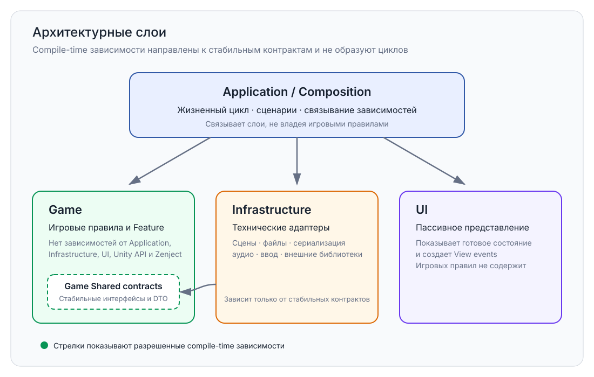

# Architecture

> Version: 1.1
> Last Updated: 16-07-2026

---

# Purpose

Данный документ описывает архитектуру проекта на высоком уровне.

Он отвечает на вопросы:

- Как устроен проект?
- Какие архитектурные принципы используются?
- Из каких слоев состоит проект?
- Как взаимодействуют подсистемы?

Подробное описание каждой подсистемы вынесено в **ArchitectureAtlas**.

---

# Philosophy

Проект строится вокруг нескольких ключевых принципов.

- Простота важнее сложности.
- Каждая система имеет одну ответственность.
- Подсистемы должны быть максимально независимыми.
- Игровая логика отделена от Unity API.
- Все зависимости создаются через Dependency Injection.
- Новая функциональность добавляется путем расширения, а не изменения существующего кода.

Главная цель архитектуры — сделать проект масштабируемым и поддерживаемым в долгосрочной перспективе.

---

# Architectural Layers

Проект разделен на четыре слоя с разными обязанностями.



Каждый слой имеет собственную область ответственности.

---

## Application

Управляет жизненным циклом приложения.

Отвечает за:

- запуск приложения;
- управление игровыми режимами;
- регистрацию зависимостей;
- координацию основных подсистем.

Application не содержит игровой логики.

---

## Infrastructure

Изолирует глобальные технические интеграции с Unity API и внешними библиотеками.

Примеры:

- Scene Management
- сериализация и файловое хранилище Save System
- Audio
- Input
- Addressables

Infrastructure предоставляет технические сервисы другим слоям. Feature-local View, UI View и scene adapter могут использовать Unity API вне Infrastructure, если они остаются узкими адаптерами и не содержат игровых правил.

Save System не принадлежит Infrastructure целиком. Это сквозная подсистема: общие контракты и DTO находятся в Game Shared, игровые mapper'ы находятся в соответствующей Feature, сценарии координируются в Application, а serializer и storage provider находятся в Infrastructure.

Подробное размещение описано в `ArchitectureAtlas/09_SaveSystem.md`.

---

## Game

Содержит игровые правила.

Любая игровая механика должна находиться здесь.

Например:

- Battle
- Dialogue
- Inventory
- Quest
- NPC
- Minigames

Game ничего не знает об устройстве Bootstrap или Dependency Injection.

---

## UI

Отвечает за отображение информации и преобразование пользовательского ввода в события представления.

UI:

- отображает данные;
- принимает пользовательский ввод;
- отправляет события другим системам.

UI не содержит игровых правил.

---

# Dependency Direction

Слои не образуют линейную цепочку. Зависимости направлены к стабильным контрактам и не должны создавать циклы.

```text
Application / Composition ──▶ Game
           │
           ├────────────────▶ Infrastructure ──▶ Game Shared contracts
           │
           └────────────────▶ UI
```

Основные правила:

- Game не зависит от Application, Infrastructure, UI или Zenject;
- Infrastructure реализует технические контракты и может зависеть от Game Shared;
- UI остается пассивным и не зависит от конкретной реализации игровых Feature;
- Application и Composition связывают слои и координируют пользовательские сценарии;
- циклические asmdef-зависимости запрещены.

---

# Features

Игровая логика организована по принципу Feature First.

Каждая игровая механика представляет самостоятельную Feature.

Например:

```text
Combat

Dialogue

Inventory

Quest

Craft

Fishing
```

Feature должна быть максимально независимой от остальных частей проекта.

---

# Dependency Injection

Сервисы, phases и coordinators создаются контейнером Zenject. Scene objects и MonoBehaviour создаются Unity и получают зависимости через injection.

Проект не использует статический Singleton pattern с глобальным `Instance`. Lifetime `AsSingle()` внутри DI context разрешен.

Обычные C# классы получают зависимости через конструктор. Для Unity-created MonoBehaviour допускается method injection.

Это уменьшает связанность между подсистемами и упрощает тестирование.

---

# Scene Management

Работа со сценами централизована.

Игровой код не должен использовать Unity SceneManager напрямую.

Все операции выполняются через SceneLoader.

---

# Scalability

Архитектура проекта должна позволять:

- добавлять новые игровые режимы;
- добавлять новые Feature;
- заменять реализации сервисов;
- расширять функциональность без изменения существующего кода.

Основной принцип развития проекта:

> **Open for Extension, Closed for Modification**

---

# Documentation

Документация проекта разделена на несколько уровней.

| Документ | Назначение |
|----------|------------|
| 00_Glossary | Терминология проекта |
| 01_Architecture | Общая архитектура |
| 02_ProjectStructure | Структура проекта |
| 03_DeveloperGuide | Руководство разработчика |
| 04_CodeRules | Правила написания кода |
| ArchitectureAtlas | Подробное описание архитектурных подсистем |

---

# Architecture Atlas

Подробная информация о каждой подсистеме находится в каталоге:

```text
Docs/
    ArchitectureAtlas/
```

Каждый документ Atlas описывает одну архитектурную подсистему.

Например:

```text
Application Lifecycle

Bootstrap

Startup

Game State Machine

Scene Management

Dependency Injection

Save System
```

Atlas является основным источником технической документации проекта.

---

# Summary

Архитектура проекта построена вокруг следующих принципов:

- Четкое разделение ответственности.
- Независимые архитектурные слои.
- Feature First.
- Dependency Injection.
- Централизованное управление инфраструктурой.
- Масштабируемость через расширение.
- Подробная техническая документация каждой подсистемы в **ArchitectureAtlas**.
