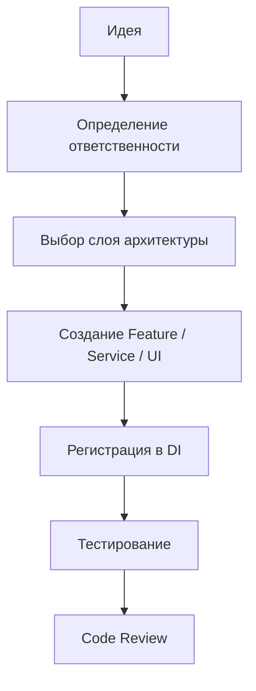
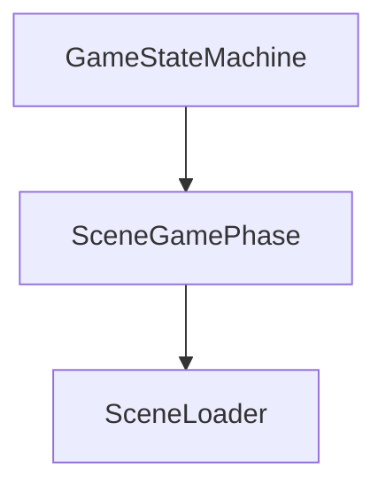
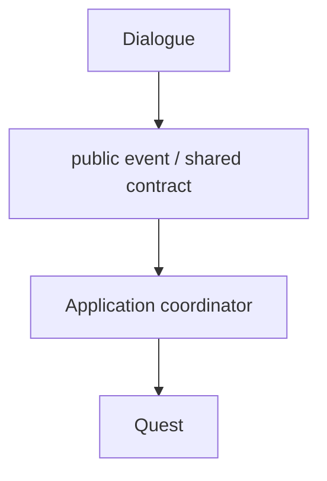
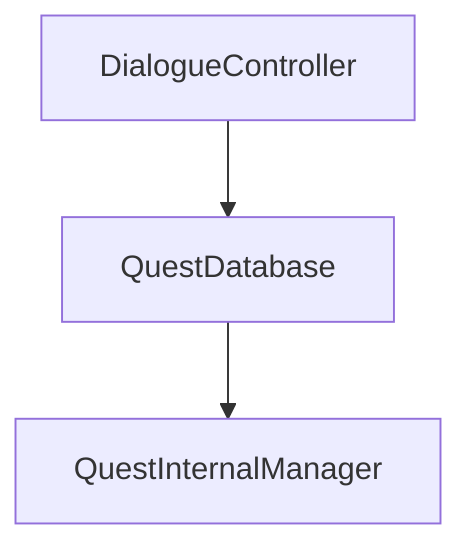
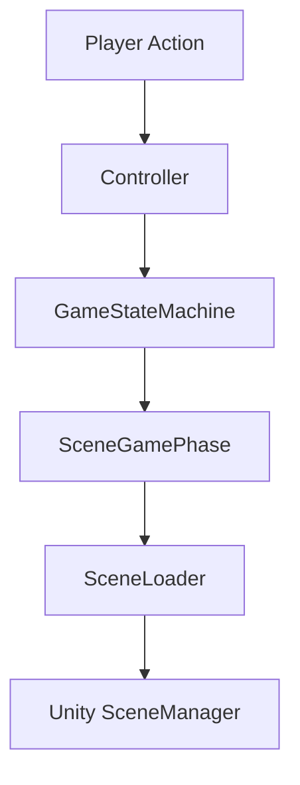
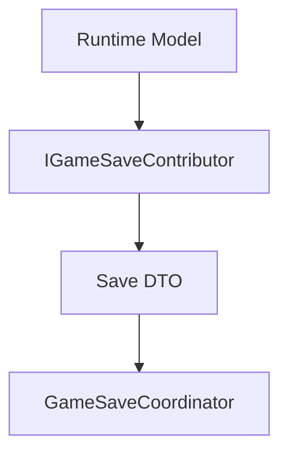

# Developer Guide

> Version: 1.0
> Last Updated: 13-07-2026

---

# Purpose

Данный документ описывает принятый процесс разработки внутри проекта.

Он отвечает на вопрос:

> **Как правильно добавить новую функциональность, не нарушая архитектуру проекта?**

Перед началом разработки рекомендуется ознакомиться с:

- `01_Architecture.md`
- `02_ProjectStructure.md`

---

# Development Workflow

Практически любая новая задача проходит следующие этапы.



Перед написанием кода необходимо определить:

- Что создается?
- Кто будет использовать систему?
- В каком слое она должна находиться?

---

# Adding a New Main Phase

Main Phase представляет собой полноценный игровой режим.

Примеры:

- Main Menu
- Exploration
- Battle
- Minigame

---

## Шаг 1

Создать новую игровую сцену.

Например:

```
SC_Snake
```

Все игровые сцены должны иметь префикс:

```
SC_
```

---

## Шаг 2

Добавить имя сцены в `SceneNames`.

Пример:

```csharp
public const string Snake = "SC_Snake";
```

---

## Шаг 3

Создать новую фазу.

```csharp
public class SnakePhase : SceneGamePhase
{
    protected override string SceneName => SceneNames.Snake;

    public SnakePhase(ISceneLoader loader)
        : base(loader)
    {
    }
}
```

---

## Шаг 4

Фаза будет автамотически зарегестрирована благодоря 

```csharp
public override void InstallBindings()
    {
        AutoBinder.BindDerivedTypes<GamePhase>(Container);
    }
```

---

## Шаг 5

Открывать новую сцену только через GameStateMachine.

Правильно:

```csharp
await gameStateMachine.ReplaceMain<SnakePhase>();
```

Неправильно:

```csharp
SceneManager.LoadScene(...);
```

---

# Adding an Overlay Phase

Overlay используется для временных игровых состояний.

Например:

- Dialogue
- Inventory
- Pause
- Settings

---

Создать новую фазу.

```csharp
public class PausePhase : OverlayPhase
{
}
```

Открытие:

```csharp
await gameStateMachine.PushOverlay<PausePhase>();
```

Закрытие:

```csharp
await gameStateMachine.PopOverlay();
```

Overlay никогда не загружает игровые сцены.

---

# Adding a New Feature

Каждая самостоятельная игровая механика создается как отдельная Feature. Изменение уже существующей механики остается внутри ее Feature.

Пример:

```
Fishing

Craft

Dialogue

Quest

Inventory
```

Рекомендуемая структура Feature:

```
Fishing
│
├── Controllers
├── Models
├── Views
├── Configs
└── Prefabs
```

Feature должна быть максимально независимой.

---

# Adding a Service

Service создается тогда, когда функциональность должна использоваться несколькими системами.

Примеры:

- AudioService
- GamePauseService
- InputService

Создать сервис.

```csharp
public class AudioService
{
}
```

Зарегистрировать в Installer.

```csharp
Container.Bind<AudioService>()
    .AsSingle();
```

Использовать через Dependency Injection.

---

# Adding UI

UI является пассивным представлением: отображает данные и преобразует пользовательский ввод в события.

UI может:

- показать данные;
- скрыть данные;
- отправить событие.

UI не должен изменять игровое состояние.

Например:

```
InventoryView

DialogueWindow

PauseWindow
```

---

# Adding Configs

Все настраиваемые параметры должны находиться в Config.

Например:

```
EnemyConfig

DialogueConfig

BalanceConfig
```

Предпочтительно использовать ScriptableObject.

---

# Adding Installers

Каждая независимая Feature должна иметь отдельную регистрацию в Composition Root.

Например:

```
DialogueInstaller

BattleInstaller

QuestInstaller
```

Installer отвечает только за регистрацию зависимостей.

Любая игровая логика внутри Installer запрещена.

Feature Installer располагается в `Application/Installers`, а не внутри Game Feature. Благодаря этому Game не зависит от Zenject.

---

# Working with Scenes

Все игровые сцены загружаются только через SceneLoader.

Никогда не использовать SceneManager напрямую.

Правильно:



---

# Working with Dependency Injection

Обычные C# сервисы, phases и coordinators получают обязательные зависимости через конструктор.

Правильно:

```csharp
public BattleController(
    BattleService battleService,
    AudioService audioService)
{
}
```

Неправильно:

```csharp
var audio = new AudioService();
```

Для `MonoBehaviour` и других объектов, созданных Unity, допускается method injection через `[Inject] Construct(...)`. Сериализованные ссылки используются только для scene/prefab references, которые принадлежат самому View или adapter.

---

# Working with MonoBehaviour

MonoBehaviour должен содержать только код, связанный с Unity.

Например:

- ссылки на компоненты;
- обработку событий Unity;
- передачу управления другим системам.

Игровая логика должна находиться в обычных C# классах.

Feature-local MonoBehaviour может находиться внутри Feature, пассивный UI-компонент — в UI, а межслойный scene adapter — в `Application/Installers/FeatureAdapters`.

---

# Working with Features

Feature не должна обращаться напрямую к внутренним классам другой Feature.

Правильно:



Неправильно:



Общение между Feature происходит через shared contracts, C# события и Application coordinators.

---

# Scene Transition Flow

Правильная последовательность перехода между игровыми режимами.



Любое отклонение от этой схемы требует отдельного архитектурного обсуждения.

---

# Adding Save Support

Каждая Feature, данные которой должны сохраняться, предоставляет отдельный Save DTO и contributor.

Если данные нужно восстанавливать, Feature также предоставляет restorer с тем же стабильным contributor ID.

Правильная последовательность:



DTO не содержит `MonoBehaviour`, `Transform`, `GameObject`, `Component` или другие ссылки на `UnityEngine.Object`.

Contributor и restorer регистрируются через соответствующий installer. Игровые системы и UI не работают с serializer, файлами или полным путем напрямую.

Полный pipeline и правила миграции описаны в `ArchitectureAtlas/09_SaveSystem.md`.

---

# Common Mistakes

## ❌ Создание сервисов через new

Всегда использовать Dependency Injection.

---

## ❌ Использование SceneManager

Всегда использовать SceneLoader.

---

## ❌ Большие MonoBehaviour

MonoBehaviour не должен содержать игровую логику.

---

## ❌ Feature зависит от Feature

Использовать shared contracts, C# события или Application coordinator.

---

## ❌ Дублирование логики

Если чистый код используется несколькими Feature, его следует вынести в Game Shared. Infrastructure используется только для технических интеграций с Unity, файловой системой или внешними библиотеками.

---

# Pull Request Checklist

Перед созданием Pull Request необходимо проверить:

- Архитектура не нарушена.
- Код соответствует Code Rules.
- Все зависимости зарегистрированы.
- Новые классы находятся в правильных директориях.
- Отсутствует дублирование логики.
- Не используется SceneManager напрямую.
- Не используется new для сервисов.
- Все публичные классы имеют понятные названия.
- Проект успешно собирается.
- Добавлена документация (если архитектура изменилась).

---

# Summary

При разработке новой функциональности необходимо придерживаться следующих правил:

- Каждая новая самостоятельная игровая механика создается как отдельная Feature.
- Игровые режимы реализуются через Main Phase или Overlay Phase.
- Все сцены загружаются только через SceneLoader.
- Сервисы, phases и coordinators создаются и связываются через Dependency Injection.
- UI отображает данные и отправляет события, но не принимает игровые решения.
- MonoBehaviour содержит только Unity-специфичный код.
- Любая новая архитектурная идея должна соответствовать принципам, описанным в `01_Architecture.md`.
