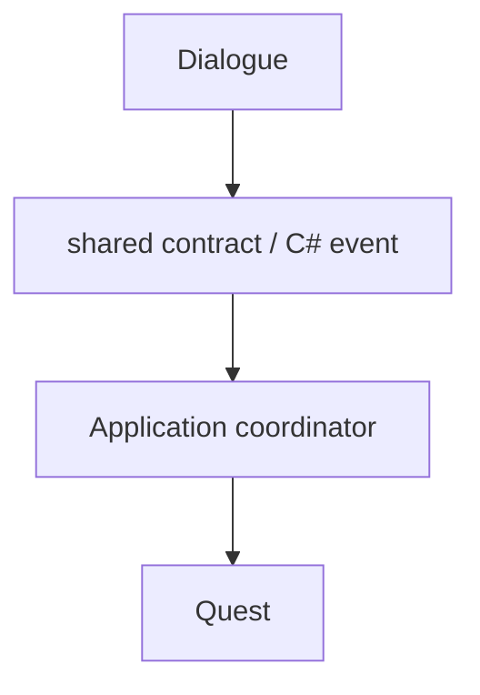
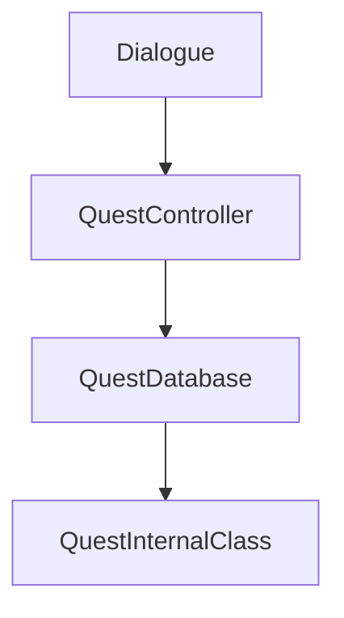

# Code Rules

> Version: 1.0
> Last Updated: 13-07-2026

---

# Purpose

Данный документ определяет обязательные правила разработки проекта.

Все разработчики обязаны придерживаться данных правил.

Если существует необходимость нарушить правило, это решение должно быть предварительно согласовано и задокументировано.

При возникновении противоречий данный документ имеет приоритет над личными предпочтениями разработчика.

---

# General Principles

При написании кода необходимо руководствоваться следующими принципами:

- Простота важнее сложности.
- Явный код лучше неявного.
- Композиция предпочтительнее наследования.
- Каждая система должна иметь одну ответственность.
- Код должен быть понятен без дополнительных комментариев.

---

# Architecture Rules

## Responsibility

Каждый класс должен иметь одну ответственность.

Если класс выполняет две независимые задачи — он должен быть разделён.

---

## Dependencies

Зависимости должны быть направлены к стабильным контрактам и не образовывать циклы.

```
Application / Composition → Game

Application / Composition → Infrastructure → Game Shared

Application / Composition → UI
```

Game не знает об Application, Infrastructure, UI и Zenject. UI не обращается к внутренним классам Feature. Infrastructure не зависит от Application или UI.

---

## Dependency Injection

### ✔ Разрешено

Использовать Dependency Injection.

```csharp
public ExplorationSaveCatalogService(
    IGameSaveStorageProvider storageProvider,
    GameSaveCoordinator saveCoordinator)
{
}
```

---

### ❌ Запрещено

Создавать сервисы самостоятельно.

```csharp
new FileGameSaveStorageProvider(...);

new GameSaveCoordinator(...);
```

---

# Scene Management

### ✔ Разрешено

Использовать SceneLoader.

```csharp
await sceneLoader.SwitchTo(...);
```

---

### ❌ Запрещено

Использовать Unity SceneManager напрямую.

```csharp
SceneManager.LoadScene(...);

SceneManager.UnloadScene(...);
```

Прямой доступ к SceneManager разрешён только реализации SceneLoader в Infrastructure.

---

# Game State Machine

Переход между игровыми режимами осуществляется только через FSM.

### ✔ Разрешено

```csharp
await gameStateMachine.ReplaceMain<BattlePhase>();
```

---

### ❌ Запрещено

Самостоятельно переключать игровые сцены.

---

# Features

Каждая игровая система должна быть независимой.

### ✔ Разрешено



---

### ❌ Запрещено



Использовать внутренние классы и services других Feature запрещено.

---

# MonoBehaviour

MonoBehaviour используется исключительно для интеграции с Unity.

Он может:

- получать ссылки;
- получать события Unity;
- передавать управление другим системам.

MonoBehaviour может находиться в UI, внутри Feature или среди Application FeatureAdapters, если он является узким Unity-адаптером. Сам факт использования Unity API не требует переносить View или scene adapter в Infrastructure.

---

### ❌ Запрещено

Хранить игровую бизнес-логику внутри MonoBehaviour.

---

# Update()

Update должен использоваться только при объективной необходимости.

Предпочтительно использовать:

- события;
- UniTask;
- таймеры;

---

### ❌ Запрещено

Создавать Update "на всякий случай".

---

# Coroutines

В проекте предпочтительно использовать UniTask.

Coroutine допускается только тогда, когда UniTask не предоставляет эквивалентного решения.

---

# Async Code

Любой асинхронный код должен использовать UniTask.

Использование Task допускается только при работе с библиотеками .NET.

---

# Exceptions

Исключения не должны использоваться для управления логикой приложения.

Исключение означает действительно исключительную ситуацию.

---

# Logging

Для логирования использовать Unity Debug.Log только:

- во время разработки;
- при диагностике ошибок.

Перед релизом лишнее логирование должно быть удалено.

---

# Comments

Комментарии объясняют **почему**, а не **что**.

### Хорошо

```csharp
// Используется отдельный таймер,
// чтобы синхронизировать бой с сервером.
```

---

### Плохо

```csharp
// Увеличиваем HP
hp++;
```

Код должен быть самодокументируемым.

---

# Naming

Используются следующие соглашения.

## Classes

```
PlayerController

DialogueManager

QuestService
```

---

## Interfaces

```
IAudioService

ISceneLoader

IGameSaveSerializer
```

---

## Domain-Role Naming

Имя отражает реальную роль класса.

```text
InputService

GameSaveCoordinator

SceneLoader

PhaseFactory

PauseMenuView
```

Суффикс `Service` используется только для Service. Coordinator, Loader, Factory и View не переименовываются в Service.

---

## Factories

Всегда имеют суффикс:

```
Factory
```

---

## Installers

Всегда имеют суффикс:

```
Installer
```

---

## Phases

Всегда имеют суффикс:

```
Phase
```

---

## Configs

Всегда имеют суффикс:

```
Config
```

---

## Scenes

Все игровые сцены имеют префикс:

```
SC_
```

Пример:

```
SC_MainMenu

SC_World

SC_Battle
```

---

# Folder Rules

Новый класс должен размещаться согласно своей ответственности.

| Ответственность | Папка |
|----------------|--------|
| Управление приложением | Application |
| Глобальная техническая интеграция с Unity или внешней библиотекой | Infrastructure |
| Игровая логика | Game |
| Пассивное представление и UI-события | UI |
| Unity-адаптер конкретной Feature | Feature или Application/Installers/FeatureAdapters |

---

# Code Style

## Methods

Метод должен выполнять одну задачу.

Если метод невозможно быстро объяснить одним предложением — его следует разделить.

---

## Classes

Большие классы должны быть разделены на несколько небольших.

---

## Fields

Использовать `readonly` везде, где это возможно.

---

## Magic Numbers

Запрещено использовать необъяснимые числовые литералы.

Плохо:

```csharp
speed = 7.5f;
```

Хорошо:

```csharp
speed = movementConfig.DefaultSpeed;
```

---

# ScriptableObjects

Используются только для хранения данных.

ScriptableObject не должен содержать игровую бизнес-логику.

---

# Resources

Папка Resources не используется.

Все ресурсы должны загружаться через принятую в проекте систему загрузки (например, Addressables после их внедрения).

---

# Reflection

Reflection допускается только внутри Infrastructure.

---

# Singletons

Статический Singleton pattern с глобальным `Instance` запрещён.

Все глобальные зависимости предоставляются через Dependency Injection.

Регистрация `AsSingle()` задаёт lifetime внутри DI context и разрешена.

---

# Static Classes

Static допускается только для:

- констант;
- утилит без состояния;
- расширений.

---

# Events

Подписка на события всегда сопровождается корректной отпиской.

Любая подписка должна иметь очевидное место освобождения ресурсов.

---

# Save System

Игровые системы не работают напрямую с файлами.

Общий pipeline сохранения проходит через GameSaveCoordinator.

Сериализуются только Save DTO без ссылок на UnityEngine.Object.

---

# Pull Requests

Перед созданием Pull Request необходимо проверить:

- Код соответствует Architecture.
- Код соответствует Project Structure.
- Код соответствует Developer Guide.
- Код соответствует настоящему документу.
- Добавлены необходимые тесты (если применимо).
- Проект успешно компилируется.
- Не осталось временного кода.
- Не осталось Debug.Log.
- Не осталось TODO без описания задачи.

---

# Forbidden

В проекте запрещается:

- использовать `new` для сервисов;
- использовать статический Singleton pattern;
- использовать `SceneManager` напрямую;
- использовать `FindObjectOfType`;
- использовать `GameObject.Find`;
- использовать `Resources.Load`;
- хранить игровую логику в MonoBehaviour;
- напрямую изменять состояние других Feature;
- нарушать слои архитектуры.

---

# Final Rule

При написании любого нового класса необходимо ответить на три вопроса:

1. Кто будет использовать этот класс?
2. За что он отвечает?
3. Можно ли понять его назначение по названию?

Если ответ хотя бы на один вопрос отрицательный — архитектурное решение требует пересмотра.

---

# Summary

Код проекта должен быть:

- простым;
- читаемым;
- расширяемым;
- тестируемым;
- независимым;
- соответствующим архитектуре проекта.

Главная цель правил — обеспечить долгосрочную поддерживаемость проекта и единый стиль разработки независимо от количества участников команды.
