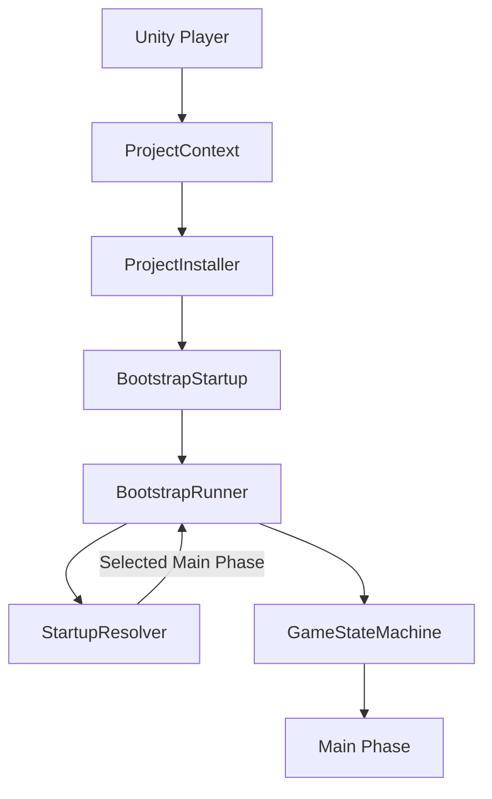
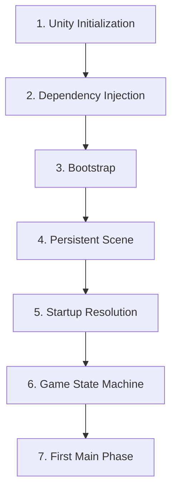
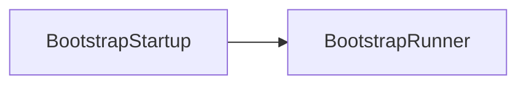
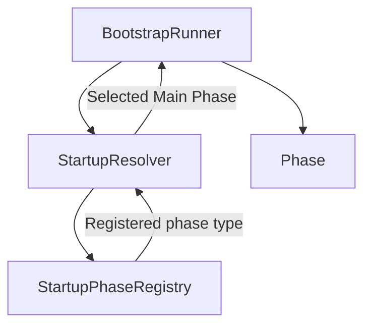
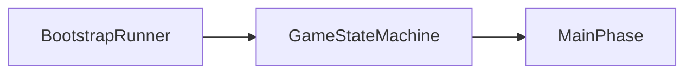
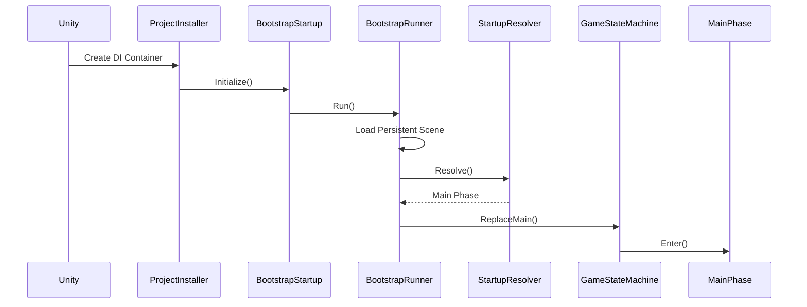

# Application Lifecycle

> Version: 1.0
> Last Updated: 13-07-2026

---

# Purpose

Данный документ описывает полный жизненный цикл приложения — от момента запуска Unity до входа в первую игровую фазу.

Это первый документ, который рекомендуется прочитать каждому разработчику после ознакомления с `00_Glossary.md`.

Application Lifecycle описывает только процесс запуска приложения. Он не рассматривает внутреннюю реализацию игровых механик.

---

# Goals

Основная цель жизненного цикла приложения:

- создать все глобальные зависимости;
- подготовить окружение;
- определить стартовое состояние игры;
- передать управление игровой логике.

После завершения процесса запуска дальнейшая работа приложения выполняется системой игровых фаз (Game State Machine).

---

# High-Level Overview

После запуска игры управление проходит через несколько независимых подсистем.



Каждый компонент выполняет только одну задачу и после завершения своей работы передаёт управление следующему компоненту.

---

# Lifecycle Stages

Жизненный цикл приложения состоит из семи этапов.




Каждый этап подробно описан ниже.

---

# Stage 1 — Unity Initialization

На данном этапе Unity запускает приложение и создаёт начальную сцену.

В проекте также создаётся `ProjectContext`, который становится корневым контейнером Dependency Injection.

На этом этапе игровая логика ещё не выполняется.

---

# Stage 2 — Dependency Injection

После создания `ProjectContext` вызывается `ProjectInstaller`.

Его задача — зарегистрировать все глобальные зависимости.

Например:

- GameStateMachine
- SceneLoader
- PhaseFactory
- StartupResolver
- BootstrapRunner
- BootstrapStartup

После завершения регистрации контейнер полностью готов к работе.

---

# Stage 3 — Bootstrap

После завершения регистрации зависимостей Zenject вызывает `BootstrapStartup`.

BootstrapStartup является точкой входа приложения.

Его единственная задача — передать управление `BootstrapRunner`.

После этого BootstrapStartup больше не участвует в работе приложения.



---

# Stage 4 — Persistent Scene

Первым действием BootstrapRunner является загрузка сцены:

```
SC_Persistent
```

Эта сцена содержит объекты, существующие на протяжении всей работы приложения.

Например:

- глобальный UI;
- сервисы;
- загрузочный экран;
- другие постоянные объекты.

Persistent Scene никогда не считается игровой сценой.

---

# Stage 5 — Startup Resolution

После подготовки окружения необходимо определить, какая игровая фаза должна быть запущена первой.

Эта задача полностью делегируется подсистеме Startup.



StartupResolver принимает решение на основании текущего состояния приложения.

Например:

- запуск Build → MainMenu;
- запуск из Editor с открытой игровой сценой → соответствующая игровая фаза.

Bootstrap ничего не знает об этих правилах.

---

# Stage 6 — Game State Machine

После определения стартовой фазы управление передаётся Game State Machine (Finite-State Machine, FSM).

FSM становится главным координатором игровых режимов.



С этого момента именно GameStateMachine отвечает за переходы между игровыми состояниями.

Bootstrap завершает свою работу.

---

# Stage 7 — First Game Phase

GameStateMachine активирует первую Main Phase.

Например:

```
MainMenuPhase
```

или

```
ExplorationPhase
```

или

```
BattlePhase
```

Main Phase самостоятельно загружает соответствующую игровую сцену через SceneLoader.

После завершения метода `Enter()` приложение считается полностью запущенным.

---

# Lifecycle Timeline

Полная последовательность выглядит следующим образом.



После вызова `Enter()` первая игровая фаза получает полный контроль над приложением.

---

# Responsibilities

| Component | Responsibility |
|------------|----------------|
| Unity | Запуск приложения |
| ProjectInstaller | Регистрация зависимостей |
| BootstrapStartup | Запуск BootstrapRunner |
| BootstrapRunner | Координация процесса запуска |
| StartupResolver | Выбор стартовой фазы |
| StartupPhaseRegistry | Хранение соответствий Scene → Phase |
| GameStateMachine | Управление игровыми режимами |
| Main Phase | Запуск конкретного режима игры |

---

# Design Principles

## Single Entry Point

Запуск приложения всегда начинается с BootstrapStartup.

Других точек входа в архитектуре не существует.

---

## Separation of Responsibilities

Каждый компонент отвечает только за одну задачу.

Например:

BootstrapStartup не выбирает стартовую фазу.

StartupResolver не загружает сцены.

GameStateMachine не принимает решений о запуске приложения.

---

## Explicit Flow

Каждый следующий этап запуска вызывается явно.

Отсутствуют скрытые переходы между подсистемами.

Это упрощает понимание архитектуры и отладку.

---

## Dependency Injection

Сервисы, phases и coordinators создаются контейнером Zenject. Unity scene objects создаются Unity и получают зарегистрированные зависимости через injection.

Компоненты не создают друг друга самостоятельно.

Это обеспечивает слабую связанность системы.

---

# Common Mistakes

## ❌ Добавление игровой логики в Bootstrap

Bootstrap отвечает только за запуск приложения.

Любая игровая логика должна находиться внутри игровых фаз или Feature.

---

## ❌ Использование SceneManager напрямую

Все операции со сценами выполняются исключительно через SceneLoader.

---

## ❌ Создание сервисов через `new`

Обычные C#-сервисы создаются контейнером Dependency Injection. Scene `MonoBehaviour` создаются Unity и получают зарегистрированные сервисы через `SceneContext` injection.

---

## ❌ Изменение Bootstrap при добавлении новой игровой сцены

При добавлении новой Main Phase Bootstrap изменяться не должен.

Необходимо зарегистрировать новую фазу в StartupPhaseRegistry (если она должна поддерживать запуск из Editor) и использовать GameStateMachine для перехода к ней.

---

# Extension Points

Жизненный цикл приложения может быть расширен без изменения существующей последовательности.

Например:

- система сохранений;
- загрузка Addressables;
- проверка версии игры;
- авторизация;
- аналитика;
- облачные сервисы.

Такие расширения должны интегрироваться в BootstrapRunner или отдельные сервисы, не нарушая принцип единственной ответственности существующих компонентов.

---

# Related Documents

- `00_Glossary.md`
- `01_Architecture.md`
- `03_DeveloperGuide.md`
- `ArchitectureAtlas/02_Bootstrap.md`
- `ArchitectureAtlas/03_Startup.md`
- `ArchitectureAtlas/04_GameStateMachine.md`
