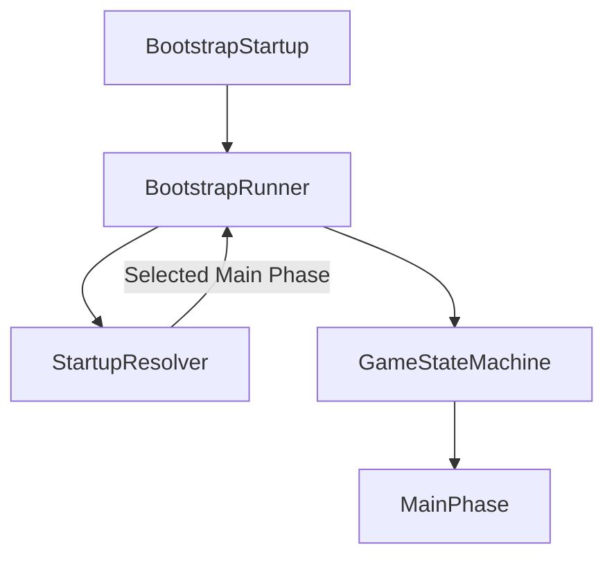
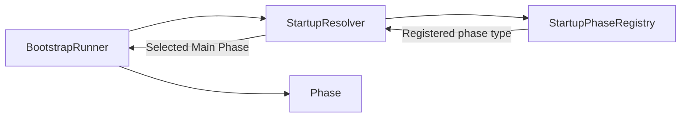
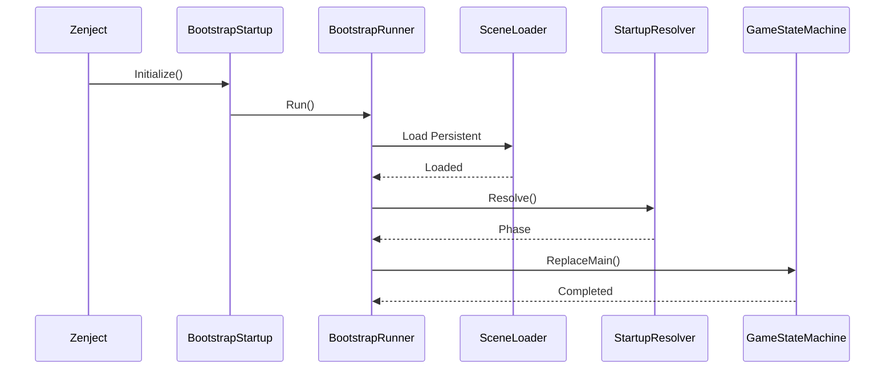

# Bootstrap

> Version: 1.0
> Last Updated: 13-07-2026

---

# Purpose

Bootstrap — это подсистема, отвечающая за запуск приложения.

Её задача — подготовить окружение для работы игры и передать управление первой игровой фазе.

Bootstrap **не содержит игровой логики** и **не принимает игровых решений**.

После завершения своей работы Bootstrap больше не участвует в жизненном цикле приложения.

---

# Responsibilities

Bootstrap отвечает только за следующие задачи:

- запуск процесса инициализации;
- загрузку Persistent Scene;
- подготовку окружения;
- определение первой игровой фазы;
- передачу управления Game State Machine.

---

Bootstrap **не отвечает** за:

- игровую логику;
- загрузку сохранений;
- UI;
- переходы между игровыми режимами;
- работу игровых Feature.

После запуска игры управление полностью переходит GameStateMachine.

---

# High-Level Flow



---

# Components

Bootstrap состоит из двух независимых компонентов.

```
BootstrapStartup

BootstrapRunner
```

Каждый компонент имеет собственную ответственность.

---

# BootstrapStartup

BootstrapStartup является точкой входа подсистемы Bootstrap.

Zenject автоматически вызывает его после завершения регистрации всех зависимостей.

BootstrapStartup практически не содержит логики.

Его задача:

- получить необходимые зависимости через Dependency Injection;
- запустить BootstrapRunner;
- завершить свою работу.

После вызова BootstrapRunner экземпляр BootstrapStartup больше не используется.

---

# BootstrapRunner

BootstrapRunner является координатором процесса запуска приложения.

Именно здесь выполняется основная последовательность запуска.

Типичный жизненный цикл:

```
Load Persistent Scene

↓

Resolve Startup Phase

↓

GameStateMachine.ReplaceMain(...)
```

BootstrapRunner не знает, какая игровая сцена должна быть открыта.

Он только выполняет действия, необходимые для запуска.

---

# Startup Resolution

Определение стартовой игровой фазы делегируется подсистеме Startup.

BootstrapRunner обращается к StartupResolver.



Это позволяет изменять правила запуска без изменения Bootstrap.

---

# Persistent Scene

Первым действием BootstrapRunner является загрузка:

```
SC_Persistent
```

Persistent Scene существует на протяжении всей работы приложения.

Она содержит объекты, которые никогда не выгружаются при смене игровых сцен.

Например:

- глобальный UI;
- сервисы;
- загрузочный экран;
- аудиосистему;
- менеджеры.

Bootstrap никогда не загружает игровые сцены напрямую.

---

# Bootstrap Sequence

Полная последовательность работы Bootstrap.



После завершения ReplaceMain() Bootstrap считается полностью завершённым.

---

# Design Principles

## Single Responsibility

Bootstrap отвечает исключительно за запуск приложения.

Любая логика, не относящаяся к запуску, должна располагаться в других подсистемах.

---

## Explicit Flow

Последовательность запуска должна быть очевидной.

Каждый этап явно вызывает следующий.

В Bootstrap отсутствуют скрытые переходы.

---

## Dependency Injection

Bootstrap не создаёт зависимости самостоятельно.

Все сервисные зависимости Bootstrap предоставляются контейнером Zenject. Unity-owned объекты не создаются Bootstrap вручную.

---

## Separation of Concerns

Каждый компонент Bootstrap отвечает только за собственную задачу.

BootstrapStartup запускает BootstrapRunner.

BootstrapRunner выполняет последовательность запуска.

StartupResolver принимает решение о стартовой фазе.

GameStateMachine запускает игровую фазу.

---

# Extension Points

Bootstrap может быть расширен без изменения существующей логики.

Например:

```
BootstrapRunner

↓

Load Persistent

↓

Load Addressables

↓

Initialize Analytics

↓

Check Save Data

↓

Resolve Startup

↓

Enter Phase
```

Новые этапы должны добавляться в BootstrapRunner.

Остальные компоненты Bootstrap изменяться не должны.

---

# Common Mistakes

## ❌ Добавление игровой логики

Bootstrap не должен знать о правилах игры.

---

## ❌ Загрузка игровых сцен

Bootstrap не открывает игровые сцены.

Это делает GameStateMachine через SceneGamePhase.

---

## ❌ Использование SceneManager

Bootstrap использует только SceneLoader.

---

## ❌ Создание сервисов через new

Все сервисы должны создаваться через Dependency Injection.

---

## ❌ Добавление новой Main Phase в Bootstrap

Bootstrap не знает о существовании конкретных игровых фаз.

Добавление новой Main Phase не должно требовать изменения BootstrapRunner.

---

# Future Evolution

По мере развития проекта Bootstrap может быть дополнен следующими этапами:

- загрузка Addressables;
- инициализация системы сохранений;
- проверка версии игры;
- облачная авторизация;
- загрузка пользовательских настроек;
- аналитика;
- проверка DLC.

Все подобные задачи должны интегрироваться в BootstrapRunner без изменения архитектуры Bootstrap.

---

# Related Documents

- 01_ApplicationLifecycle.md
- 03_Startup.md
- 04_GameStateMachine.md
- 05_SceneManagement.md
- 06_DependencyInjection.md
