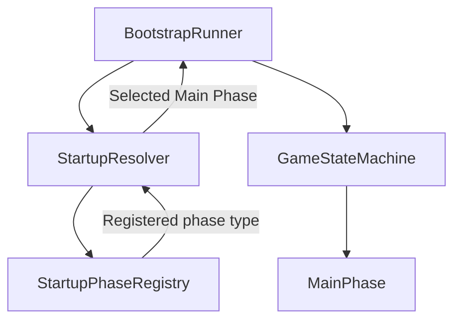
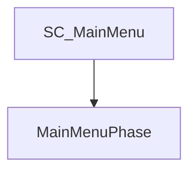
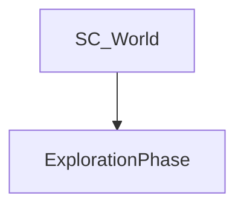
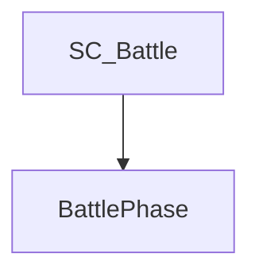
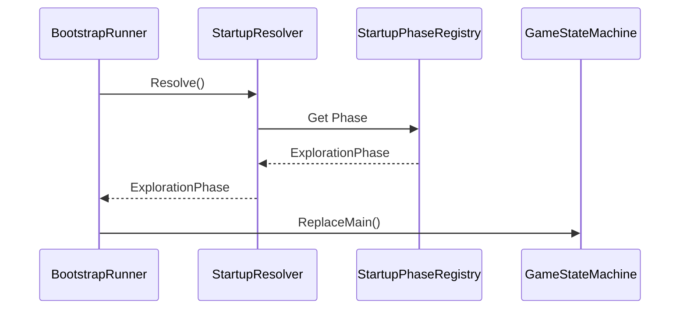

# Startup

> Version: 1.0
> Last Updated: 13-07-2026

---

# Purpose

Startup — это подсистема, определяющая, какая игровая фаза должна быть запущена после завершения Bootstrap.

Startup инкапсулирует всю логику выбора первой Main Phase и полностью отделяет ее от процесса запуска приложения.

Bootstrap не принимает решений о том, какую игровую сцену необходимо открыть.

---

# Responsibilities

Подсистема Startup отвечает за:

- определение стартовой Main Phase;
- поддержку запуска игры из Unity Editor;
- поддержку запуска готовой сборки (Build);
- сопоставление Unity Scene с игровыми фазами.

Startup не отвечает за:

- загрузку сцен;
- переключение игровых режимов;
- выполнение игровой логики.

После выбора стартовой фазы управление передается GameStateMachine.

---

# High-Level Flow



---

# Components

Подсистема Startup состоит из двух основных компонентов.

```
StartupResolver

StartupPhaseRegistry
```

---

# StartupResolver

StartupResolver содержит алгоритм определения стартовой игровой фазы.

Он анализирует текущее состояние приложения и выбирает соответствующую Main Phase.

Resolver не хранит информацию о соответствии Scene ↔ Phase.

Для этого используется StartupPhaseRegistry.

---

# StartupPhaseRegistry

StartupPhaseRegistry хранит соответствие между сценами Unity и игровыми фазами.

Например:







Registry не содержит логики выбора.

Он является только источником данных.

---

# Startup Rules

В текущей архитектуре используются следующие правила.

## Build

При запуске готовой сборки приложение всегда начинает работу с MainMenuPhase.

---

## Unity Editor

При запуске игры из Unity Editor StartupResolver проверяет активную сцену.

Если сцена зарегистрирована в StartupPhaseRegistry, запускается соответствующая Main Phase.

Например:


Это позволяет запускать отдельные игровые сцены напрямую без необходимости каждый раз проходить главное меню.

---

# Sequence



---

# Design Principles

## Separation of Concerns

Bootstrap не знает правил запуска игры.

Все решения находятся внутри Startup.

---

## Single Responsibility

StartupResolver принимает решения.

StartupPhaseRegistry хранит данные.

Эти обязанности не смешиваются.

---

## Extensibility

Добавление новой Main Phase не требует изменения Bootstrap.

Достаточно зарегистрировать новую пару Scene → Phase.

---

# Adding a New Main Phase

При создании новой Main Phase необходимо:

1. Создать класс, наследующий SceneGamePhase.
2. Добавить игровую сцену.
3. Зарегистрировать соответствие Scene → Phase в StartupPhaseRegistry (если сцена должна запускаться напрямую из Unity Editor).

После этого Startup автоматически сможет определить новую стартовую фазу.

---

# Common Mistakes

## ❌ Добавление условий в Bootstrap

Bootstrap не должен знать, какая игровая фаза будет запущена.

---

## ❌ Использование SceneManager

Startup не работает напрямую со сценами Unity.

---

## ❌ Хранение логики выбора в Registry

StartupPhaseRegistry хранит только данные.

Любые решения принимает StartupResolver.

---

# Future Evolution

В будущем Startup может быть расширен дополнительными правилами.

Например:

- продолжить последнюю игру;
- загрузить последнее сохранение;
- открыть сцену разработчика;
- выполнить автоматические тесты;
- открыть специальный режим отладки.

Правило выбора стартового сценария добавляется в StartupResolver. Фактическую загрузку сохранения и переключение сцен он делегирует Application-сервисам и GameStateMachine, поэтому Startup не обращается к файлам или SceneManager напрямую.

---

# Related Documents

- 01_ApplicationLifecycle.md
- 02_Bootstrap.md
- 04_GameStateMachine.md
- 05_SceneManagement.md
