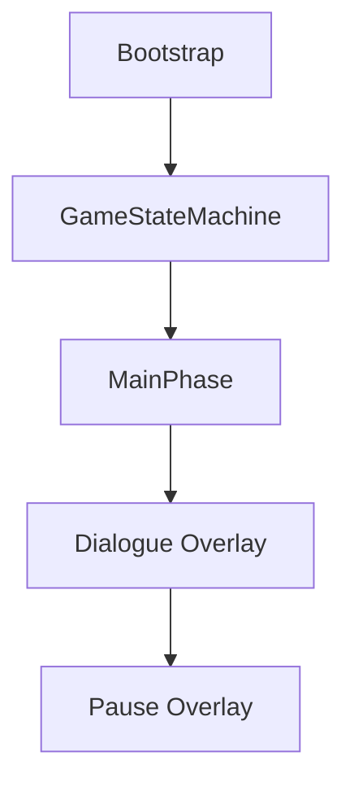
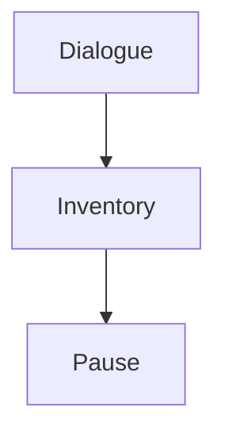
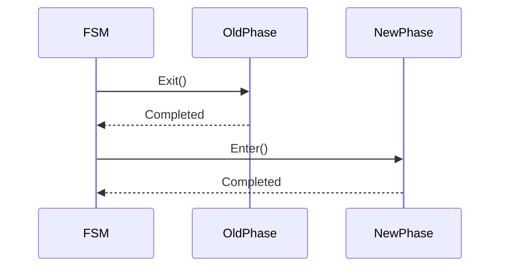
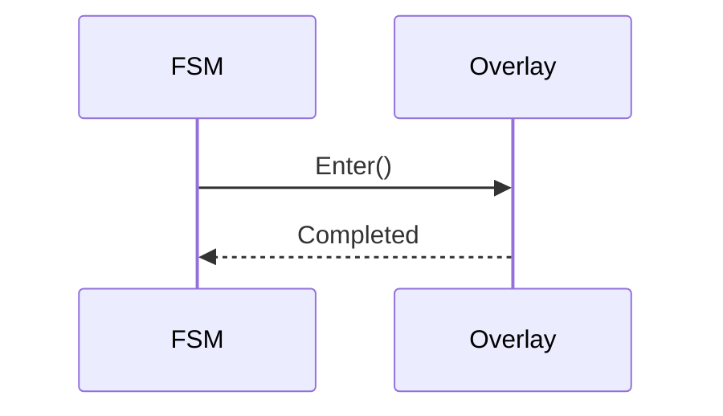
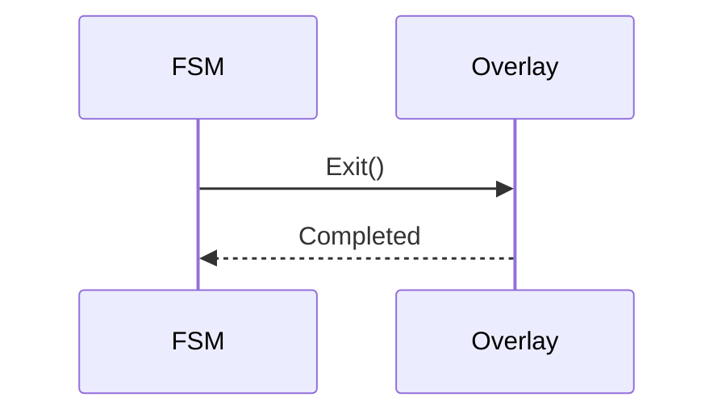
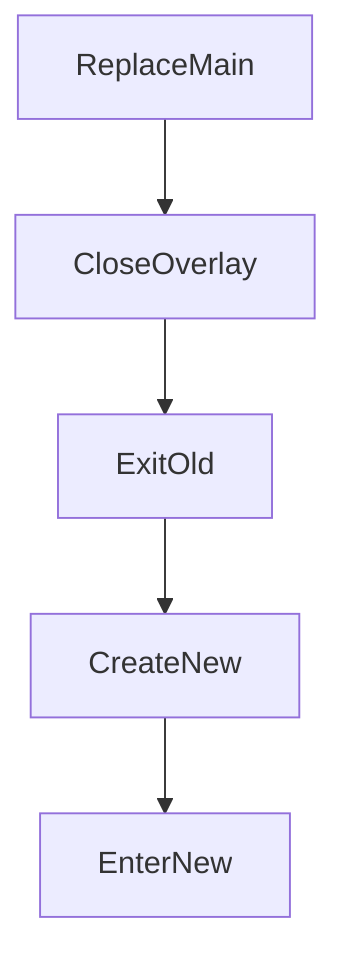
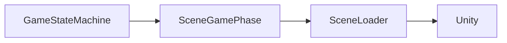

# Game State Machine

> Version: 1.0
> Last Updated: 12-07-2026

---

# Purpose

Game State Machine (FSM) является центральным координатором игровых режимов.

После завершения Bootstrap именно Game State Machine получает полный контроль над жизненным циклом игры.

FSM отвечает исключительно за переключение игровых фаз.

Она не содержит игровой логики и не знает особенностей отдельных игровых режимов.

---

# Responsibilities

Game State Machine отвечает за:

- хранение текущей Main Phase;
- переключение между Main Phase;
- управление Overlay Phase;
- корректный вызов Enter() и Exit();
- обеспечение единственного активного Main Phase.

FSM не отвечает за:

- загрузку сцен;
- игровую логику;
- UI;
- сохранения;
- работу игровых Feature.

---

# High-Level Overview



---

# Components

Game State Machine состоит из следующих элементов.

```
GameStateMachine

↓

SceneGamePhase

↓

OverlayPhase
```

---

# Main Phase

Main Phase представляет основной игровой режим.

В любой момент времени существует только одна активная Main Phase.

Примеры:

- MainMenuPhase
- ExplorationPhase
- BattlePhase
- MinigamePhase

При смене Main Phase предыдущая фаза всегда завершает работу через Exit().

После этого новая фаза вызывается через Enter().

---

# Overlay Phase

Overlay Phase представляет временный игровой режим.

Overlay отображается поверх Main Phase.

Main Phase при этом продолжает существовать.

Примеры:

- Pause
- Dialogue
- Inventory
- Settings
- Map

Overlay хранятся в стеке.

---

# Overlay Stack

Стек Overlay работает по принципу Last In — First Out (LIFO).



Последний открытый Overlay закрывается первым.

---

# Main Phase Lifecycle

Переключение между Main Phase происходит следующим образом.



Одновременно две Main Phase существовать не могут.

---

# Overlay Lifecycle

Открытие Overlay.



Закрытие Overlay.



---

# Public API

GameStateMachine предоставляет четыре основных метода.

---

## ReplaceMain()

Заменяет текущую Main Phase.

Последовательность:

```
Close All Overlay

↓

Exit Current Main

↓

Create New Main

↓

Enter New Main
```

Используется для переходов между игровыми режимами.

Например:

```
Main Menu

↓

Exploration

↓

Battle

↓

Minigame
```

---

## PushOverlay()

Создаёт новый Overlay.

Новый Overlay помещается на вершину стека.

Используется для:

- Pause;
- Dialogue;
- Inventory;
- Settings.

---

## PopOverlay()

Удаляет верхний Overlay из стека.

После удаления автоматически становится активным предыдущий Overlay или Main Phase.

---

## CloseAllOverlays()

Закрывает все Overlay.

Используется перед переключением Main Phase.

После выполнения стек Overlay всегда пуст.

---

# Transition Flow

Типичный переход между игровыми режимами.



---

# Interaction With Scene Management

FSM не работает напрямую с Unity SceneManager.

Все операции со сценами выполняются внутри SceneGamePhase.



---

# Design Principles

## One Active Main Phase

В системе всегда существует только одна активная Main Phase.

---

## Overlay Stack

Overlay не заменяют Main Phase.

Они работают поверх неё.

---

## Explicit Lifecycle

Каждая игровая фаза обязана корректно реализовать:

```
Enter()

Exit()
```

FSM никогда не пропускает эти методы.

---

## Separation of Concerns

FSM не содержит игровых правил.

Она только координирует жизненный цикл игровых режимов.

---

# Current Main Phases

В текущем проекте используются следующие Main Phase.

```
MainMenuPhase

ExplorationPhase

BattlePhase
```

В дальнейшем список может быть расширен.

Например:

```
CraftPhase

FishingPhase

PuzzlePhase

CutscenePhase
```

---

# Current Overlay Phases

В настоящий момент Overlay Phase используются как базовый тип.

Планируемые реализации:

```
PauseOverlay

DialogueOverlay

InventoryOverlay

MapOverlay

SettingsOverlay
```

---

# Common Mistakes

## ❌ Переключение сцен напрямую

Переходы между игровыми режимами всегда выполняются через ReplaceMain().

---

## ❌ Использование SceneManager

FSM никогда не обращается к Unity SceneManager.

---

## ❌ Игровая логика внутри FSM

FSM не должна знать:

- правила боя;
- правила диалогов;
- инвентарь;
- квесты.

---

## ❌ Самостоятельное создание Phase

Все Phase создаются через PhaseFactory и Dependency Injection.

---

## ❌ Несколько Main Phase одновременно

Это нарушает архитектуру проекта.

Main Phase всегда только одна.

---

# Extension Points

Game State Machine может быть расширена без изменения её основных принципов.

Например:

- история переходов;
- переход назад (Back Stack);
- временная блокировка переходов;
- глобальные переходы;
- анимации смены игровых режимов;
- журнал переходов для отладки.

Такие расширения не должны изменять основной жизненный цикл Main Phase и Overlay Phase.

---

# Related Documents

- 01_ApplicationLifecycle.md
- 02_Bootstrap.md
- 03_Startup.md
- 05_SceneManagement.md
- 06_DependencyInjection.md
- 03_DeveloperGuide.md