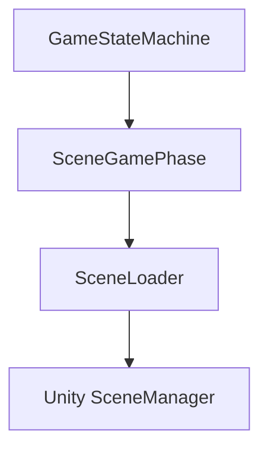
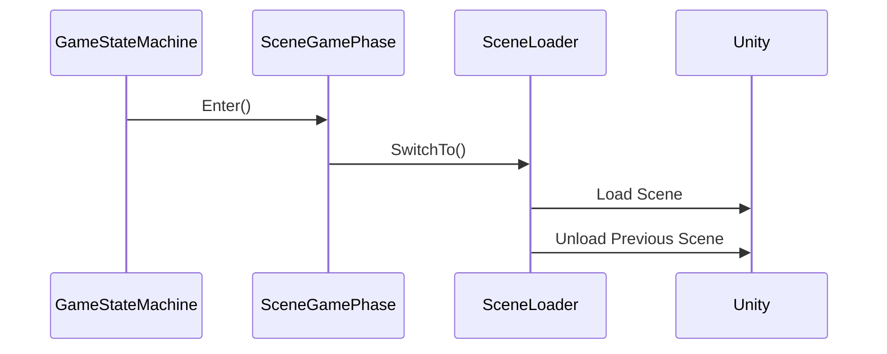
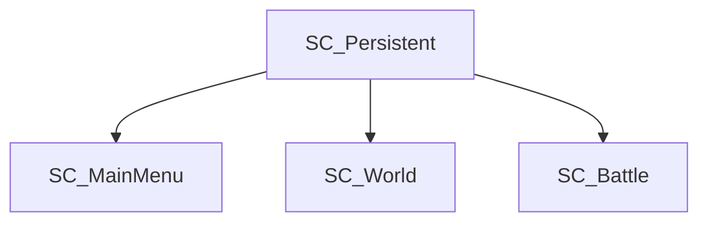

# Scene Management

> Version: 1.0
> Last Updated: 12-07-2026

---

# Purpose

Scene Management — это подсистема, отвечающая за управление игровыми сценами Unity.

Её задача — предоставить единый механизм загрузки, выгрузки и переключения сцен, полностью изолировав остальную часть проекта от Unity SceneManager.

Никакая игровая система не должна работать со сценами напрямую.

---

# Responsibilities

Scene Management отвечает за:

- загрузку игровых сцен;
- выгрузку игровых сцен;
- переключение между игровыми сценами;
- хранение информации о текущей игровой сцене;
- предоставление единой точки доступа для работы со сценами.

Scene Management не отвечает за:

- выбор игровой сцены;
- игровую логику;
- переходы между игровыми режимами;
- жизненный цикл игровых фаз.

---

# High-Level Overview



Все операции со сценами проходят через SceneLoader.

---

# Components

Подсистема состоит из следующих компонентов.

```
ISceneLoader

↓

SceneLoader

↓

SceneGamePhase

↓

SceneNames
```

---

# ISceneLoader

ISceneLoader определяет контракт управления сценами.

Он предоставляет единый интерфейс для:

- переключения сцен;
- загрузки сцен;
- выгрузки сцен;
- получения текущей игровой сцены.

Использование интерфейса позволяет скрыть реализацию SceneLoader от остальных подсистем.

---

# SceneLoader

SceneLoader является единственной реализацией ISceneLoader.

Он инкапсулирует работу с Unity SceneManager.

Все вызовы Unity API находятся только здесь.

---

# SceneGamePhase

SceneGamePhase связывает Game State Machine и Scene Management.

При входе в игровую фазу автоматически выполняется переключение сцены.


GameStateMachine не знает ничего о сценах.

---

# SceneNames

SceneNames содержит имена всех игровых сцен проекта.

Использование констант исключает появление строковых литералов в игровом коде.

Пример:

```
SC_MainMenu

SC_World

SC_Battle

SC_Persistent
```

---

# Scene Types

В проекте используются два типа сцен.

## Persistent Scene

```
SC_Persistent
```

Загружается один раз во время Bootstrap.

Не выгружается до завершения работы приложения.

Содержит:

- глобальный UI;
- сервисы;
- постоянные объекты.

---

## Gameplay Scene

Игровая сцена, соответствующая конкретной Main Phase.

Например:

```
SC_MainMenu

SC_World

SC_Battle
```

В любой момент времени активна только одна Gameplay Scene.

---

# Scene Lifecycle

Типичная последовательность переключения игровых сцен.



После завершения SwitchTo новая игровая сцена становится текущей.

---

# Scene Transition

Переключение игровых сцен всегда происходит одинаково.

```
GameStateMachine

↓

SceneGamePhase

↓

SceneLoader

↓

Unity SceneManager
```

Обход этой последовательности запрещён.

---

# Current Scene

SceneLoader хранит информацию о текущей игровой сцене.

Это позволяет:

- избежать повторной загрузки одной и той же сцены;
- корректно выгружать предыдущую сцену;
- получать информацию о текущем игровом режиме.

---

# Design Principles

## Single Entry Point

Все операции со сценами проходят через SceneLoader.

---

## Encapsulation

Остальная часть проекта не должна использовать Unity SceneManager.

---

## One Gameplay Scene

Одновременно может быть загружена только одна игровая сцена.

Исключением является Persistent Scene.

---

## Separation of Responsibilities

GameStateMachine отвечает за игровые режимы.

Scene Management отвечает за сцены.

Эти обязанности не пересекаются.

---

# Current Scene Flow

В текущей архитектуре используется следующая схема.



Persistent Scene существует одновременно с любой игровой сценой.

---

# Common Mistakes

## ❌ Использование Unity SceneManager

Игровой код никогда не обращается напрямую к SceneManager.

---

## ❌ Использование строк

Плохо:

```csharp
SceneManager.LoadScene("World");
```

Хорошо:

```csharp
await sceneLoader.SwitchTo(SceneNames.World);
```

---

## ❌ Загрузка сцен внутри игровых систем

Battle, Dialogue, Inventory и другие Feature не должны самостоятельно загружать сцены.

Для перехода используется GameStateMachine.

---

## ❌ Несколько Gameplay Scene

В проекте допускается только одна активная игровая сцена.

---

# Extension Points

Подсистема Scene Management может быть расширена следующими возможностями:

- экран загрузки;
- асинхронная предварительная загрузка сцен;
- переходы с анимацией;
- Addressables;
- потоковая загрузка (Streaming);
- контроль использования памяти.

Все подобные изменения должны выполняться внутри Scene Management без изменения остальных подсистем.

---

# Related Documents

- 01_ApplicationLifecycle.md
- 02_Bootstrap.md
- 03_Startup.md
- 04_GameStateMachine.md
- 06_DependencyInjection.md