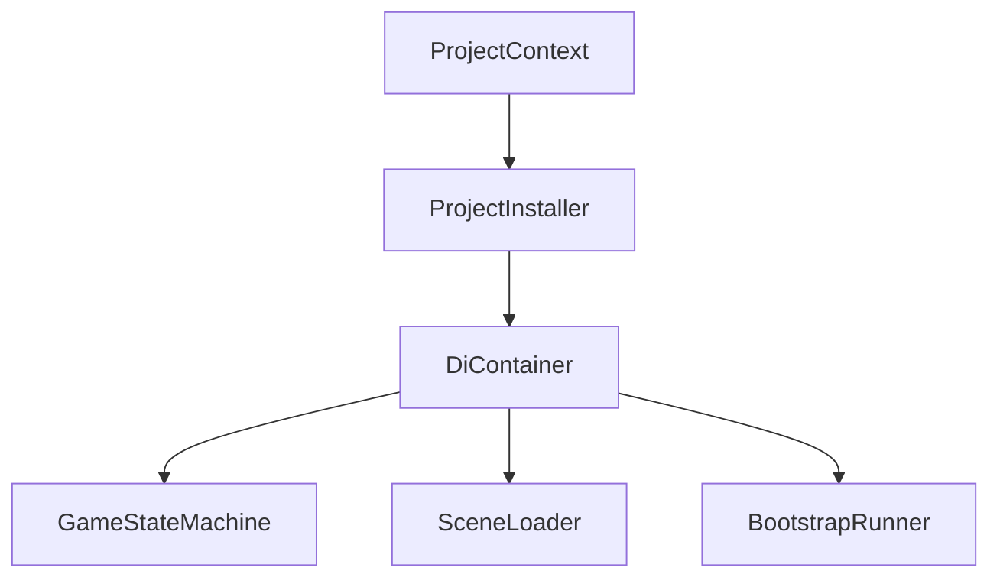
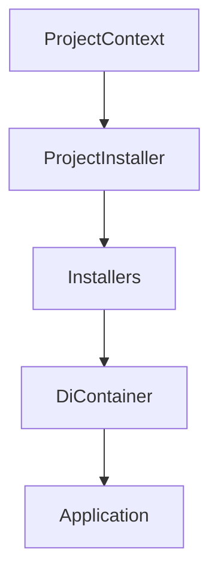
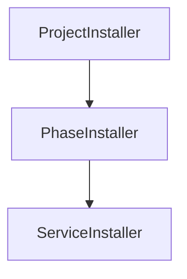
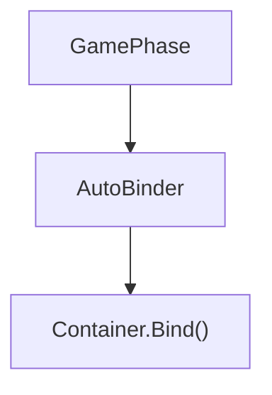
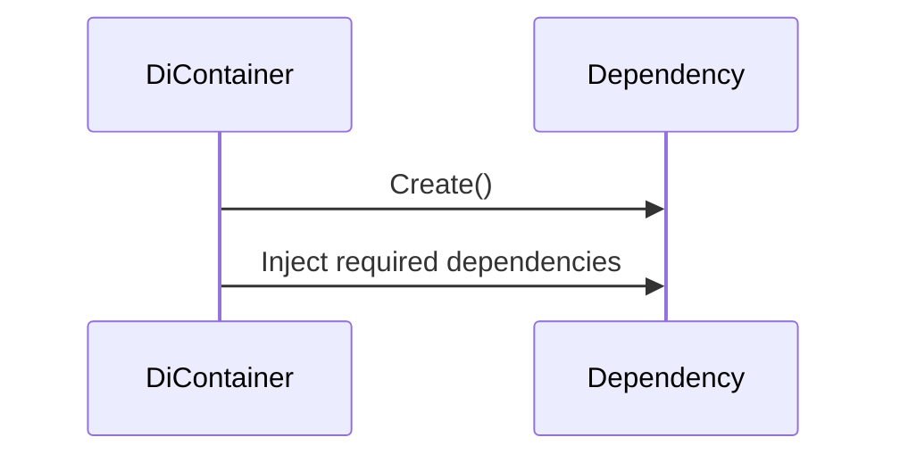
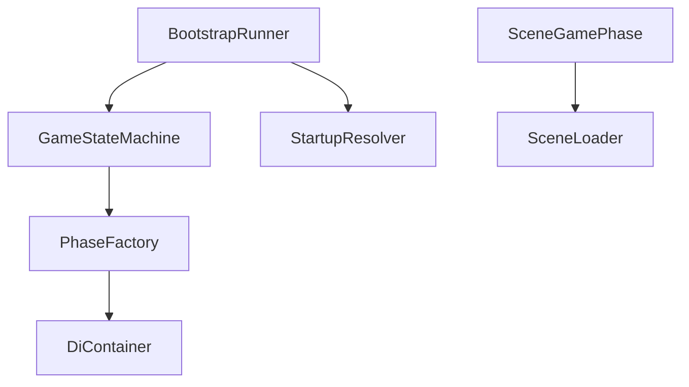
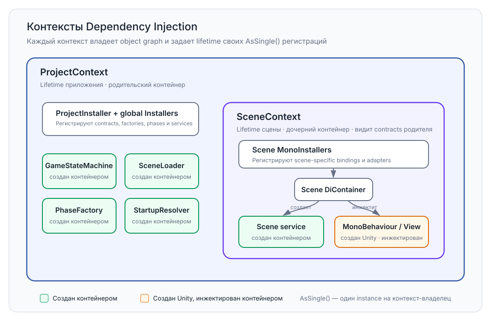
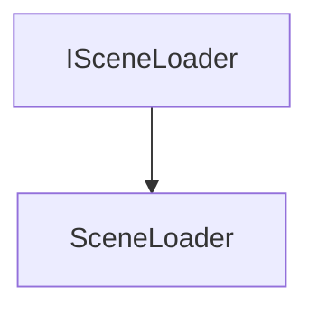
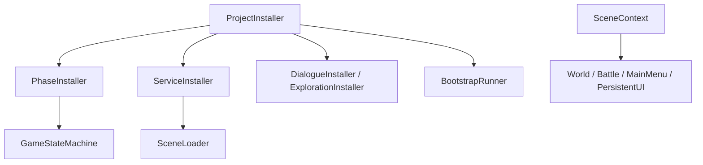

# Dependency Injection

> Version: 1.1
> Last Updated: 16-07-2026

---

# Purpose

Dependency Injection (DI) — это механизм создания и передачи зависимостей между компонентами приложения.

В проекте Dependency Injection используется для:

- уменьшения связанности между подсистемами;
- централизованного создания объектов;
- упрощения тестирования;
- обеспечения расширяемости архитектуры.

В качестве DI-контейнера используется **Zenject**.

---

# Responsibilities

Подсистема Dependency Injection отвечает за:

- создание глобальных объектов;
- регистрацию сервисов;
- регистрацию игровых фаз;
- регистрацию инфраструктурных компонентов;
- предоставление зависимостей через конструкторы или Unity-compatible method injection.

Dependency Injection не отвечает за:

- игровую логику;
- порядок запуска приложения;
- управление сценами;
- управление игровыми режимами.

---

# High-Level Overview



После завершения регистрации контейнер может создать graph обычных C# сервисов и внедрить зависимости в Unity-created объекты.

---

# Components

Подсистема состоит из следующих компонентов.



---

# ProjectContext

ProjectContext является Composition Root проекта.

Он создается Unity при запуске приложения.

После создания ProjectContext начинается регистрация всех зависимостей.

---

# ProjectInstaller

ProjectInstaller является главным Installer проекта.

Его задача — зарегистрировать все глобальные зависимости.

Например:

- GameStateMachine
- SceneLoader
- PhaseFactory
- BootstrapRunner
- StartupResolver
- StartupPhaseRegistry

ProjectInstaller не содержит игровой логики.

---

# Installers

Installers используются для группировки регистраций по назначению.

Например:



Каждый Installer отвечает только за свою область.

---

# Auto Registration

В проекте используется автоматическая регистрация некоторых типов.

Например:



Это позволяет избежать ручной регистрации каждой новой фазы.

---

# Object Creation

Обычные C# сервисы, phases и coordinators создаются контейнером Zenject. Scene objects и `MonoBehaviour` создаются Unity, после чего контейнер внедряет в них зависимости.

Типичная последовательность выглядит следующим образом.



Игровой код не использует контейнер как Service Locator и не создает сервисы самостоятельно.

---

# Constructor Injection

Основной способ получения зависимостей — конструктор.

Пример:

```csharp
public class BattlePhase : SceneGamePhase
{
    public BattlePhase(ISceneLoader sceneLoader)
        : base(sceneLoader)
    {
    }
}
```

Конструктор явно показывает, какие зависимости необходимы классу.

Для Unity-created `MonoBehaviour` используется method injection через `[Inject] Construct(...)`. Serialized fields хранят только scene/prefab references, принадлежащие самому View или adapter.

---

# Lifetime

Большинство глобальных сервисов регистрируются с lifetime `AsSingle()` внутри контейнера.

Например:

```csharp
Container.Bind<ISceneLoader>()
    .To<SceneLoader>()
    .AsSingle();
```

Это означает, что контейнер предоставляет один экземпляр объекта в пределах своего context. Это не gameplay Singleton pattern: у класса нет статического `Instance`, и доступ к нему выполняется только через DI.

---

# Dependency Graph

После регистрации зависимостей формируется граф объектов.



Каждый объект получает только необходимые ему зависимости.

---

# Composition Root

Composition Root — единственная архитектурная область, где происходит связывание зависимостей.

В текущем проекте Composition Root состоит из:



Все регистрации находятся в `Application/Installers`. `ProjectContext` создает глобальный graph, а `SceneContext` добавляет зависимости и adapters конкретной сцены.

---

# Design Principles

## Constructor Injection

Все обязательные зависимости обычных C# классов передаются через конструктор.

Это делает зависимости явными.

---

## Explicit Dependencies

Класс должен получать только те зависимости, которые действительно использует.

Не допускается внедрение "на будущее".

---

## No Manual Creation

Игровой код не создает сервисы самостоятельно.

Сервисы, phases и coordinators предоставляет контейнер. DTO и другие value objects могут создаваться явно через `new`.

---

## Composition Root

Регистрация зависимостей выполняется централизованно.

Это позволяет быстро увидеть, какие системы существуют в проекте.

---

## Loose Coupling

На границах подсистем классы зависят от интерфейсов. Внутри одной подсистемы допускается конкретный тип, если у него нет сменяемой реализации и это не создает обратную зависимость.

Например:



В дальнейшем реализацию можно заменить без изменения игрового кода.

---

# Current Installers

На текущий момент используются следующие Installer.

```
ProjectInstaller

PhaseInstaller

ServiceInstaller

StartupRegistryInstaller

DialogueInstaller

ExplorationInstaller

BattleInstaller

WorldInstaller

MainMenuInstaller

PersistentUIInstaller
```

---

# Current Registration Flow



---

# Common Mistakes

## ❌ Создание объектов через new

Плохо:

```csharp
var loader = new SceneLoader();
```

Правильно:

```csharp
public BattlePhase(ISceneLoader sceneLoader)
{
}
```

---

## ❌ Использование Container.Resolve()

Игровой код не должен самостоятельно обращаться к контейнеру.

Resolve допускается только внутри принадлежащих Composition Root фабрик и адаптеров, которые отвечают за создание object graph.

---

## ❌ Service Locator

Контейнер не должен использоваться как глобальный Service Locator.

Обычные C#-классы получают зависимости через конструктор. Созданные Unity MonoBehaviour получают их через один явный метод `[Inject] Construct(...)`.

---

## ❌ Скрытые зависимости

Если класс использует сервис, зависимость должна быть видна в конструкторе или в разрешенной Unity method injection точке.

Не допускается поиск зависимостей во время выполнения.

---

## ❌ Регистрация в случайных местах

Все регистрации должны выполняться через Installer.

---

# Extension Points

По мере роста проекта подсистема Dependency Injection может быть расширена.

Например:

- Feature registration installer в `Application/Installers`;
- Scene MonoInstaller в `Application/Installers`;
- SignalBus;
- фабрики объектов;
- Memory Pool;
- Addressables Factory.

Такие расширения должны интегрироваться в существующую систему Installers.

---

# Related Documents

- 01_ApplicationLifecycle.md
- 02_Bootstrap.md
- 03_Startup.md
- 04_GameStateMachine.md
- 05_SceneManagement.md
- 07_Features.md
- 04_CodeRules.md
