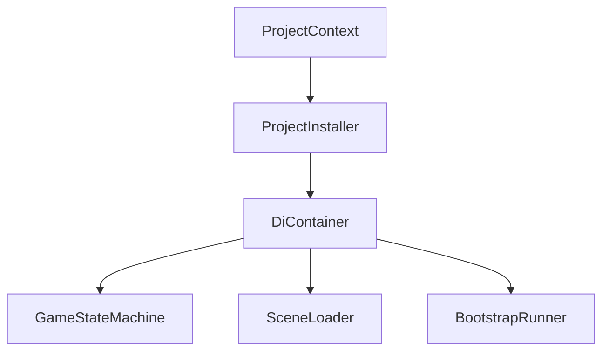
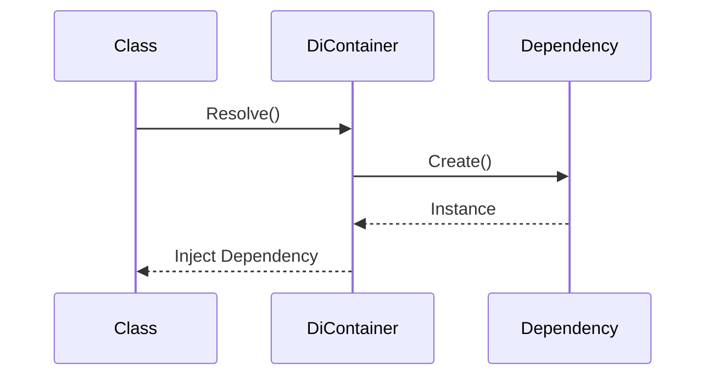
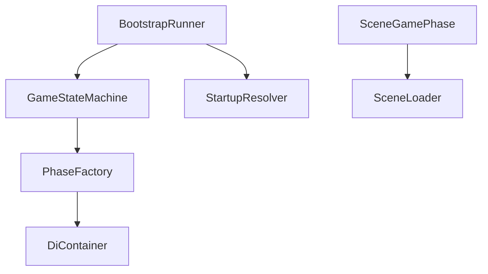
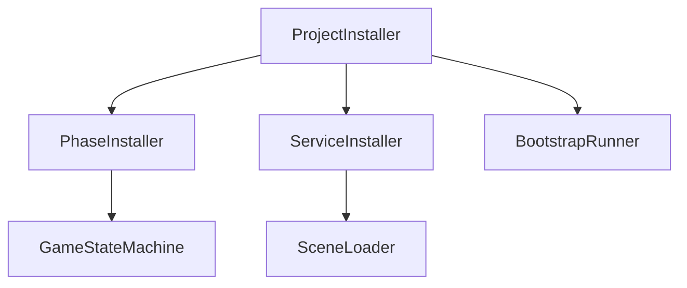

# Dependency Injection

> Version: 1.0
> Last Updated: 12-07-2026

---

# Purpose

Dependency Injection (DI) — это механизм создания и передачи зависимостей между компонентами приложения.

В проекте Dependency Injection используется для:

- уменьшения связанности между подсистемами;
- централизованного создания объектов;
- упрощения тестирования;
- обеспечения расширяемости архитектуры.

В качестве DI-контейнера используется **Zenject**.

---

# Responsibilities

Подсистема Dependency Injection отвечает за:

- создание глобальных объектов;
- регистрацию сервисов;
- регистрацию игровых фаз;
- регистрацию инфраструктурных компонентов;
- предоставление зависимостей через конструкторы.

Dependency Injection не отвечает за:

- игровую логику;
- порядок запуска приложения;
- управление сценами;
- управление игровыми режимами.

---

# High-Level Overview



После завершения регистрации все объекты создаются контейнером автоматически.

---

# Components

Подсистема состоит из следующих компонентов.

```
ProjectContext

↓

ProjectInstaller

↓

Installers

↓

DiContainer

↓

Application
```

---

# ProjectContext

ProjectContext является Composition Root проекта.

Он создаётся Unity при запуске приложения.

После создания ProjectContext начинается регистрация всех зависимостей.

---

# ProjectInstaller

ProjectInstaller является главным Installer проекта.

Его задача — зарегистрировать все глобальные зависимости.

Например:

- GameStateMachine
- SceneLoader
- PhaseFactory
- BootstrapRunner
- StartupResolver
- StartupPhaseRegistry

ProjectInstaller не содержит игровой логики.

---

# Installers

Installers используются для группировки регистраций по назначению.

Например:

```
ProjectInstaller

↓

PhaseInstaller

↓

ServiceInstaller
```

Каждый Installer отвечает только за свою область.

---

# Auto Registration

В проекте используется автоматическая регистрация некоторых типов.

Например:

```
GamePhase

↓

AutoBinder

↓

Container.Bind()
```

Это позволяет избежать ручной регистрации каждой новой фазы.

---

# Object Creation

Все объекты создаются контейнером Zenject.

Типичная последовательность выглядит следующим образом.



Разработчик не создаёт зависимости самостоятельно.

---

# Constructor Injection

Основной способ получения зависимостей — конструктор.

Пример:

```csharp
public class BattlePhase : SceneGamePhase
{
    public BattlePhase(ISceneLoader sceneLoader)
        : base(sceneLoader)
    {
    }
}
```

Конструктор явно показывает, какие зависимости необходимы классу.

---

# Lifetime

Большинство глобальных сервисов регистрируются как Singleton внутри контейнера.

Например:

```csharp
Container.Bind<ISceneLoader>()
    .To<SceneLoader>()
    .AsSingle();
```

Это означает, что в течение работы приложения существует один экземпляр объекта.

---

# Dependency Graph

После регистрации зависимостей формируется граф объектов.



Каждый объект получает только необходимые ему зависимости.

---

# Composition Root

Composition Root — единственное место, где происходит связывание зависимостей.

В текущем проекте Composition Root состоит из:

```
ProjectContext

↓

ProjectInstaller

↓

Installers
```

Все регистрации должны выполняться именно здесь.

---

# Design Principles

## Constructor Injection

Все обязательные зависимости передаются через конструктор.

Это делает зависимости явными.

---

## Explicit Dependencies

Класс должен получать только те зависимости, которые действительно использует.

Не допускается внедрение "на будущее".

---

## No Manual Creation

Игровой код не создаёт сервисы самостоятельно.

Все объекты предоставляет контейнер.

---

## Composition Root

Регистрация зависимостей выполняется централизованно.

Это позволяет быстро увидеть, какие системы существуют в проекте.

---

## Loose Coupling

Классы должны зависеть от интерфейсов, а не от конкретных реализаций.

Например:

```
ISceneLoader

↓

SceneLoader
```

В дальнейшем реализацию можно заменить без изменения игрового кода.

---

# Current Installers

На текущий момент используются следующие Installer.

```
ProjectInstaller

PhaseInstaller

ServiceInstaller
```

В дальнейшем список может быть расширен.

Например:

```
BattleInstaller

UIInstaller

SaveInstaller

AudioInstaller
```

---

# Current Registration Flow



---

# Common Mistakes

## ❌ Создание объектов через new

Плохо:

```csharp
var loader = new SceneLoader();
```

Правильно:

```csharp
public BattlePhase(ISceneLoader sceneLoader)
{
}
```

---

## ❌ Использование Container.Resolve()

Игровой код не должен самостоятельно обращаться к контейнеру.

Resolve допускается только внутри инфраструктурных компонентов (например, Factory).

---

## ❌ Service Locator

Контейнер не должен использоваться как глобальный Service Locator.

Зависимости должны быть явно переданы через конструктор.

---

## ❌ Скрытые зависимости

Если класс использует сервис, он должен получить его через конструктор.

Не допускается поиск зависимостей во время выполнения.

---

## ❌ Регистрация в случайных местах

Все регистрации должны выполняться через Installer.

---

# Extension Points

По мере роста проекта подсистема Dependency Injection может быть расширена.

Например:

- Feature Installer;
- Scene Installer;
- SignalBus;
- фабрики объектов;
- Memory Pool;
- Addressables Factory.

Такие расширения должны интегрироваться в существующую систему Installers.

---

# Related Documents

- 01_ApplicationLifecycle.md
- 02_Bootstrap.md
- 03_Startup.md
- 04_GameStateMachine.md
- 05_SceneManagement.md
- 07_Features.md
- 04_CodeRules.md