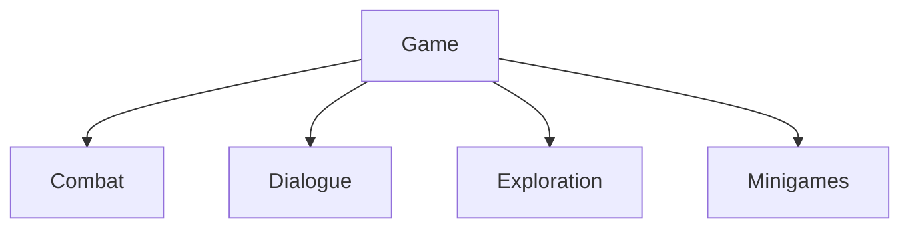

# Features

> Version: 1.0
> Last Updated: 13-07-2026

---

# Purpose

Feature — это независимая игровая подсистема, реализующая одну законченную игровую механику.

Архитектура проекта построена по принципу **Feature First**.

Каждая игровая механика разрабатывается как самостоятельная Feature с минимальными зависимостями от остальных частей проекта.

---

# Responsibilities

Feature отвечает за:

- реализацию одной игровой механики;
- управление собственным состоянием;
- взаимодействие с другими системами через публичные интерфейсы.

Feature не отвечает за:

- запуск приложения;
- управление сценами;
- управление игровыми фазами;
- создание глобальных сервисов.

---

# Current Features

В текущем проекте реализованы:

```
Combat

Dialogue

Exploration

Minigames
```

Планируемые самостоятельные Feature:

```

Inventory

Quest

NPC

Craft

Fishing
```

По мере разработки каждая Feature получит собственную техническую документацию в ArchitectureAtlas.

---

# High-Level Overview



Каждая Feature является самостоятельной частью игрового слоя.

---

# General Structure

Типовая структура Feature.

```text
Feature/

├── Controllers/
├── Models/
├── Views/
├── Services/
├── Configs/
└── Runtime/
```

Допускается изменение структуры, если это делает Feature проще и понятнее.

Feature-specific View и MonoBehaviour могут находиться внутри Feature как Unity adapters. Zenject Installer находится в `Application/Installers`, поэтому Game не зависит от DI-контейнера.

---

# Design Principles

## Single Responsibility

Каждая Feature реализует одну игровую механику.

---

## Independence

Feature должна быть максимально независимой.

Связь между Feature осуществляется через публичные contracts, C# события или Application coordinator. Одна Feature не внедряет внутренний service другой Feature напрямую.

---

## Encapsulation

Внутренняя реализация Feature не должна использоваться другими Feature напрямую.

---

## Composition

Feature строятся из небольших компонентов.

Предпочтительна композиция вместо сложной иерархии наследования.

---

## Scalability

Feature должна легко расширяться без изменения существующего кода.

---

# Communication

Feature не должны обращаться к внутренним классам друг друга.

Допустимые способы взаимодействия:

- публичные интерфейсы;
- contracts из Game Shared;
- C# события;
- Application coordinator.

---

# Lifecycle

Жизненный цикл каждого компонента Feature задаётся явно через DI context. Runtime scene adapters живут вместе со сценой, phase-specific компоненты — вместе с фазой, а явно зарегистрированные project services могут жить всё приложение.

---

# Future Documentation

По мере разработки проекта каждая Feature получит собственный документ ArchitectureAtlas.

Например:

```
CombatArchitecture.md

DialogueArchitecture.md

InventoryArchitecture.md

QuestArchitecture.md
```

Эти документы будут содержать:

- архитектуру Feature;
- диаграммы;
- жизненный цикл;
- взаимодействие компонентов;
- правила расширения.

---

# Common Mistakes

## ❌ Зависимость от внутренней реализации другой Feature

Использовать shared contracts, C# события или Application coordinator.

---

## ❌ Смешивание нескольких механик

Одна Feature — одна игровая механика.

---

## ❌ Зависимость от Unity API в бизнес-логике

Игровые правила должны быть максимально независимы от Unity.

---

# Related Documents

- 01_Architecture.md
- 02_ProjectStructure.md
- 03_DeveloperGuide.md
- 04_CodeRules.md
