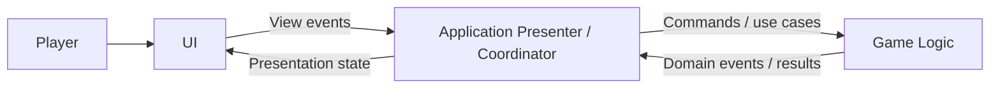
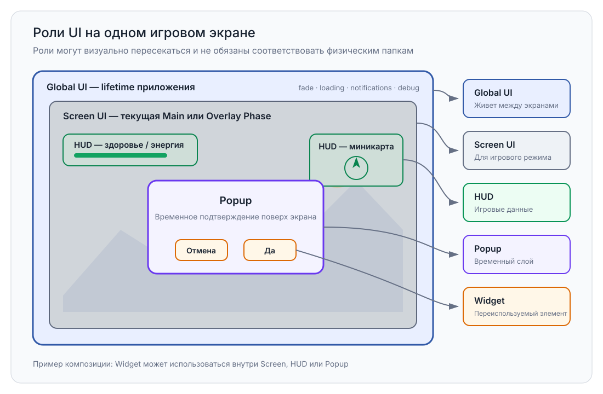
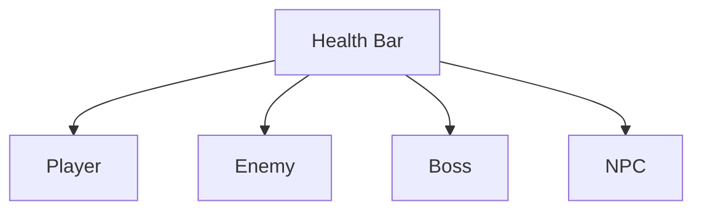

# UI

> Version: 1.1
> Last Updated: 16-07-2026

---

# Purpose

UI (User Interface) отвечает за отображение информации игроку и получение пользовательского ввода.

UI является отдельным архитектурным слоем проекта и не содержит игровой бизнес-логики.

Основная задача UI — отображать состояние игры и передавать действия пользователя в игровые системы.

---

# Responsibilities

UI отвечает за:

- отображение игровых данных;
- отображение игровых экранов;
- отображение HUD;
- отображение меню;
- получение пользовательского ввода;
- передачу действий пользователя в игровую логику.

UI не отвечает за:

- игровые правила;
- выполнение сохранений и чтение файлов;
- управление сценами;
- управление игровыми фазами;
- расчеты игровых механик.

---

# High-Level Overview



Стрелки показывают runtime-поток, а не обратные compile-time зависимости. UI является пассивной границей между игроком и Application presenter/coordinator. UI не зависит от конкретной реализации Game Feature, а Game не зависит от Coordinator.

---

# UI Layers

Интерфейс разделяется на несколько логических ролей. Не каждая роль обязана иметь отдельную физическую папку.



---

## Global UI

Существует на протяжении всей работы приложения.

Планируемое содержимое:

- Fade Screen;
- Loading Screen;
- Notifications;
- Global Popup;
- Debug UI.

Global UI размещается в Persistent Scene.

---

## Screen UI

Интерфейс конкретного игрового режима.

Например:

```
Main Menu

Inventory

Battle

Settings
```

Каждый экран принадлежит своей Main Phase или Overlay Phase.

---

## HUD

Постоянно отображаемая игровая информация.

Например:

- здоровье;
- энергия;
- миникарта;
- текущая задача;
- горячие клавиши.

---

## Popup

Временные окна поверх текущего интерфейса.

Например:

- подтверждение действия;
- сообщение;
- предупреждение;
- получение предмета.

---

## Widget

Минимальная независимая часть интерфейса.

Например:

- HP Bar;
- Inventory Slot;
- Dialogue Option;
- Skill Icon.

Widget должен быть максимально переиспользуемым.

---

# General Structure

Текущая физическая структура UI организована по системам.

```text
UI/

├── MainMenu/
├── PauseMenu/
├── CheckpointSave/
├── Common/
├── Services/
```

HUD, Popups и Widgets могут добавляться как новые UI-системы. Общий элемент помещается в `Common` только тогда, когда используется несколькими UI-системами.

---

# Design Principles

## UI Is Passive

UI не принимает игровых решений.

Он отображает информацию и отправляет события пользователя. Решение о том, что делать после события, принимает presenter/coordinator или игровая система.

---

## Separation of Responsibilities

UI не содержит игровых правил.

Любая игровая логика располагается в слое Game.

---

## Reusability

Элементы интерфейса должны быть переиспользуемыми.

Например:



---

## Data Driven

UI должен отображать данные, а не вычислять их.

---

## Independence

Каждый экран должен быть максимально независимым.

---

# Communication

Взаимодействие между UI и игровыми системами осуществляется через:

- Application presenter/coordinator;
- публичные presentation contracts;
- C# события View.

UI не должен напрямую изменять игровые объекты.

---

# Current And Planned UI Systems

В текущем проекте реализованы:

```
Main Menu

Dialogue UI

Battle UI

Pause Menu

Save Browser

Checkpoint Save Menu
```

Планируются:

```
HUD

Inventory UI

Settings

Loading Screen

Notification System
```

Крупные UI-системы могут получать собственную архитектурную документацию по мере развития.

---

# Common Mistakes

## ❌ Игровая логика внутри UI

UI не должен рассчитывать:

- урон;
- опыт;
- характеристики;
- выполнение квестов.

---

## ❌ Большие MonoBehaviour

UI рекомендуется разделять на небольшие независимые компоненты.

---

## ❌ Жесткие зависимости

UI не должен обращаться к внутренней реализации игровых Feature.

---

## ❌ Дублирование элементов

Переиспользуемые элементы следует оформлять как Widget.

---

# Future Evolution

После завершения разработки базовой архитектуры UI будут созданы отдельные документы:

```
HUDArchitecture.md

DialogueUI.md

BattleUI.md

InventoryUI.md

PopupSystem.md
```

Настоящий документ описывает только общую архитектуру UI.

---

# Related Documents

- 01_Architecture.md
- 02_ProjectStructure.md
- 03_DeveloperGuide.md
- 04_CodeRules.md
- 07_Features.md
