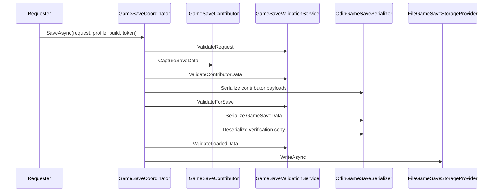
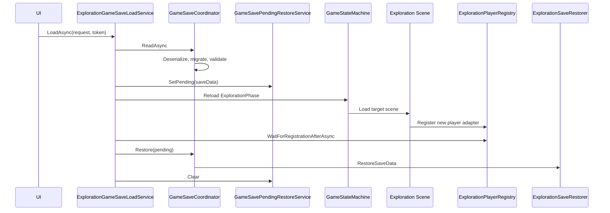

# Save System

> Version: 1.0
> Last Updated: 13-07-2026

---

# Purpose

Save System отвечает за создание, хранение, чтение, проверку, миграцию и восстановление снимков игрового состояния.

Система отделяет игровую модель от файлового формата и Unity API. Feature предоставляет только Save DTO через contributor и принимает DTO через restorer. Сериализация и работа с файлами остаются внутри Infrastructure.

---

# Responsibilities

Save System отвечает за:

- сбор данных от зарегистрированных contributors;
- создание metadata и общего снимка сохранения;
- проверку DTO и снимка;
- сериализацию через Odin Serializer;
- безопасную запись файлов;
- чтение списка слотов и metadata;
- миграцию старых версий;
- передачу загруженных DTO зарегистрированным restorers;
- координацию восстановления после смены exploration-сцены.

Save System не отвечает за:

- принятие игровых решений внутри Feature;
- хранение runtime-объектов Unity;
- прямое управление Canvas;
- прямую загрузку сцен из UI;
- выбор визуального представления списка сохранений.

---

# High-Level Overview

```mermaid
flowchart LR

RuntimeModel["Runtime Model"]
Contributor["IGameSaveContributor"]
SaveDTO["Save DTO"]
Coordinator["GameSaveCoordinator"]
Validation["Validation"]
Serializer["IGameSaveSerializer"]
Storage["IGameSaveStorageProvider"]
File[".save file"]

RuntimeModel --> Contributor
Contributor --> SaveDTO
SaveDTO --> Coordinator
Coordinator --> Validation
Validation --> Serializer
Serializer --> Storage
Storage --> File
```



Обязательное направление данных:

```text
Runtime Model

↓

Mapper / Contributor

↓

Save DTO

↓

Serializer

↓

Storage Provider
```

Runtime Model и сценовые объекты не сериализуются напрямую.

---

# Layers And Placement

| Layer | Location | Responsibility |
|------|----------|----------------|
| Game Shared | `Game/Shared/SaveSystem` | Общие контракты, metadata, запросы и корневые DTO |
| Game Feature | `Game/Features/Exploration/Scripts/Save` | Exploration DTO, contributor, restorer и абстракции игрока |
| Infrastructure | `Infrastructure/SaveSystem` | Coordinator, validation, migration, Odin и файловое хранилище |
| Application | `Application/Coordination` | Полные сценарии checkpoint save, catalog и load transition |
| Unity Adapters | `Application/Installers/FeatureAdapters/Exploration/Save` | Trigger и адаптер Rigidbody2D игрока |
| UI | `UI/PauseMenu` и `UI/CheckpointSave` | Пассивные представления списка и выбора слота |

Feature не знает путь к файлам. UI не знает ни путь, ни serializer, ни имя загружаемой сцены.

---

# Core Contracts

## IGameSaveContributor

Contributor преобразует текущее runtime-состояние Feature в Save DTO.

Он предоставляет:

- стабильный `ContributorId`;
- тип DTO через `SaveDataType`;
- снимок через `CaptureSaveData()`.

`ContributorId` является ключом данных внутри файла. После выпуска сохранений менять его без миграции нельзя.

---

## IGameSaveRestorer

Restorer получает DTO своего contributor и применяет его к новой runtime-модели.

`ContributorId` и `SaveDataType` contributor и restorer должны совпадать.

---

## IGameSaveSerializer

Контракт сериализации не зависит от конкретной библиотеки.

Текущая реализация:

```text
OdinGameSaveSerializer
```

Она использует Odin Serializer в бинарном формате. Благодаря отдельному интерфейсу serializer можно заменить без изменения coordinator, contributors и storage provider.

---

## IGameSaveStorageProvider

Storage Provider умеет:

- записывать слот;
- читать слот;
- перечислять слоты;
- проверять существование;
- удалять слот;
- читать metadata без восстановления игры.

Текущая реализация:

```text
FileGameSaveStorageProvider
```

---

## IGameSaveMigrationStep

Migration Step преобразует один формат `GameSaveData` в следующий.

Каждый шаг явно задаёт:

- `SourceVersion`;
- `TargetVersion`;
- функцию миграции.

Для каждой старой версии должен существовать ровно один следующий шаг.

---

# Save Data Model

## GameSaveRequest

Запрос содержит:

- `Kind`;
- `SlotId`;
- опциональный `CheckpointId`.

`CheckpointId` описывает место в мире. `SlotId` описывает файл. Эти идентификаторы нельзя использовать как взаимозаменяемые.

---

## GameSaveKind

Поддерживаются три вида записей:

```text
Checkpoint
Auto
Manual
```

Checkpoint используется в текущем игровом flow. Имена Auto и Manual уже поддерживаются моделью и storage provider для будущего расширения.

---

## GameSaveMetadata

Metadata содержит:

- версию формата;
- UTC timestamp;
- build number;
- profile ID;
- тип записи;
- ID слота.

Metadata создаётся централизованно перед сборкой снимка.

---

## GameSaveData

`GameSaveData` является корневым DTO файла.

Он содержит:

- `Metadata`;
- коллекцию `GameSaveEntry`.

Каждый `GameSaveEntry` хранит:

- стабильный contributor ID;
- сериализованный payload конкретного Feature.

Такая структура позволяет добавлять новые Feature без разрастания одного общего DTO.

---

# Save Flow



Перед записью coordinator выполняет round-trip проверку: сериализует корневой снимок, читает его обратно и повторно валидирует. Слот и тип получившегося снимка должны совпасть с запросом.

Параллельные checkpoint-записи блокируются `SemaphoreSlim` внутри `ExplorationCheckpointSaveService`.

---

# Checkpoint Flow

Checkpoint запускается через `ExplorationCheckpointTrigger`.

```text
Player Interaction

↓

ExplorationCheckpointTrigger

↓

CheckpointSaveRequestBroker

↓

CheckpointSaveMenuCoordinator

↓

ExplorationCheckpointSaveService

↓

GameSaveCoordinator
```

Trigger:

- хранит стабильный `checkpointId`;
- не знает формат файла;
- не знает полный путь;
- не обращается к serializer или storage provider;
- использует lifecycle `CancellationToken` Unity-объекта.

Текущий каталог содержит checkpoint-слоты `checkpoint_0` ... `checkpoint_9`.

Автоматическая ротация сначала использует пустой или повреждённый слот. Когда все слоты заняты, заменяется самый старый по UTC timestamp.

Экран явного выбора checkpoint-слота сохраняет фиксированный порядок slot ID. Общий каталог загрузки получает порядок storage provider: корректные записи от новых к старым, затем повреждённые.

---

# Load Flow

Загрузка exploration-сохранения выполняется только через `ExplorationGameSaveLoadService`.



Критически важный порядок:

1. Прочитать, мигрировать и проверить файл.
2. Сохранить снимок как pending restore.
3. Запомнить текущую версию регистрации игрока.
4. Переключить основную фазу и загрузить сохранённую exploration-сцену.
5. Дождаться регистрации нового игрока.
6. Применить DTO к новому игроку.
7. Очистить pending restore.

Позиция никогда не применяется к старому игроку перед выгрузкой сцены.

При ошибке или отмене pending restore также очищается.

---

# Exploration Save Data

Первая версия `ExplorationSaveData` содержит:

- стабильный ID exploration-сцены;
- checkpoint ID;
- позицию игрока по X;
- позицию игрока по Y.

`Transform`, `Rigidbody2D` и другие Unity-объекты в DTO отсутствуют.

`ExplorationSaveContributor` читает позицию через `IPlayerPositionProvider`.

`ExplorationSaveRestorer` применяет позицию через `IPlayerPositionRestorationTarget`.

`ExplorationPlayerStateAdapter` перед перемещением:

- сбрасывает dash state;
- сбрасывает movement state;
- очищает transient input;
- обнуляет linear и angular velocity;
- перемещает `Rigidbody2D`;
- синхронизирует Physics2D.

---

# Scene Resolution

В файл записывается стабильный `SceneId`, а не решение UI о конкретной сцене.

`ExplorationSceneResolver` проверяет ID и преобразует его в имя сцены. Persistent, Main Menu и Battle не могут быть загружены как exploration-сохранение.

Переход выполняется через:

```text
ExplorationSceneTransitionService

↓

GameStateMachine.ReloadMainAsync<ExplorationPhase>

↓

SceneLoader
```

UI не вызывает `SceneManager` и не знает имя сцены.

---

# File Storage

Файлы находятся в:

```text
Application.persistentDataPath/GameSaves
```

Полный путь формируется только внутри `FileGameSaveStorageProvider`.

Имя файла имеет вид:

```text
<SlotId>.save
```

Допускаются только буквы, цифры, `_` и `-`. Абсолютные пути, `..`, разделители пути и ID длиннее 64 символов отклоняются.

---

# Atomic Write

Запись выполняется безопасно:

1. Создаётся уникальный временный файл.
2. Данные записываются и принудительно сбрасываются на диск.
3. Новый файл атомарно заменяет основной.
4. При необходимости используется backup и rollback.
5. Временный и backup-файлы удаляются после успешной операции.

Если замена завершилась ошибкой, существующий основной файл восстанавливается из backup.

Все файловые операции сериализованы через внутренний `SemaphoreSlim` и выполняются вне main thread через UniTask.

---

# Validation

`GameSaveValidationService` проверяет:

- обязательные поля запроса;
- безопасный `SlotId`;
- наличие metadata;
- текущую версию формата;
- UTC timestamp;
- build number и profile ID;
- уникальность contributor IDs;
- наличие payload;
- соответствие DTO зарегистрированному типу;
- отсутствие `UnityEngine.Object` во всём графе DTO.

Повреждённый или пустой файл не восстанавливается. В каталоге он отображается как повреждённый и недоступный для загрузки.

---

# Versioning And Migration

Текущая версия задаётся в:

```csharp
GameSaveData.CurrentFormatVersion
```

Порядок чтения:

```text
Read bytes

↓

Deserialize

↓

Migrate

↓

Validate current version

↓

Restore
```

При изменении формата нельзя просто переписать старый DTO. Необходимо:

1. Увеличить `CurrentFormatVersion`.
2. Добавить реализацию `IGameSaveMigrationStep`.
3. Зарегистрировать migration step через installer.
4. Добавить тест загрузки предыдущей версии.

Сохранения с неизвестной будущей версией отклоняются.

---

# Catalog And UI

UI не читает директорию самостоятельно.

`ExplorationSaveCatalogService` преобразует storage slots в `GameSaveCatalogEntry`. Application coordinators передают готовые данные пассивным View.

```text
SaveBrowserView

↓ user request

PauseMenuCoordinator или MainMenuSaveBrowserCoordinator

↓

ExplorationSaveCatalogService

↓

IGameSaveStorageProvider + GameSaveCoordinator
```

Повторные клики блокируются coordinator-ом UI на время асинхронной операции. При ошибке меню остаётся открытым и показывает безопасное сообщение.

---

# Dependency Injection

Глобальные части Save System регистрируются в `ServiceInstaller`:

- serializer;
- storage provider;
- runtime metadata provider;
- validation;
- migration;
- coordinator;
- pending restore;
- checkpoint rotation.

Exploration-части регистрируются в `ExplorationInstaller`:

- player registry;
- save context;
- contributor;
- restorer;
- scene transition;
- checkpoint save service;
- load service;
- catalog service.

Unity adapters регистрируются соответствующими scene installers. Gameplay singleton не используется.

---

# Adding Save Data To A Feature

Для добавления новых данных необходимо:

1. Создать отдельный serializable Save DTO без Unity-ссылок.
2. Создать `IGameSaveContributor`, который преобразует runtime model в DTO.
3. Создать `IGameSaveRestorer`, если данные должны восстанавливаться.
4. Использовать одинаковый стабильный contributor ID с обеих сторон.
5. Зарегистрировать contributor и restorer через installer.
6. Добавить unit-тесты capture, serialization и restore.
7. Добавить миграцию, если меняется уже выпущенный формат.

Coordinator изменять не требуется.

---

# Error Handling And Cancellation

Save System использует типизированные исключения `GameSaveException`:

- validation;
- serialization;
- storage;
- corruption;
- unknown version;
- migration.

Application coordinator перехватывает ошибку на границе пользовательского сценария и передаёт её централизованному logger или View как безопасное сообщение.

Все долгие операции принимают `CancellationToken`. Trigger и UI связывают токен с жизненным циклом Unity-объекта. Отмена не должна оставлять pending restore или запускать восстановление в выгруженную сцену.

---

# Tests

Основная чистая логика покрывается EditMode-тестами:

- создание metadata;
- validation запросов и DTO;
- round-trip serializer;
- повреждённые данные;
- миграция старой версии;
- запись, чтение, перезапись и удаление файла;
- защита SlotId;
- сортировка и ротация слотов;
- contributor и restorer Exploration;
- checkpoint save service;
- catalog service.

При расширении scene load pipeline следует добавлять PlayMode-проверку только тогда, когда она не зависит от нестабильного порядка загрузки Editor.

---

# Common Mistakes

## ❌ Сериализация MonoBehaviour

Сохраняются только DTO. `MonoBehaviour`, `Transform`, `GameObject`, `Component` и другие `UnityEngine.Object` запрещены.

---

## ❌ Работа с файлами из Feature или UI

Feature предоставляет DTO. UI отправляет запрос. Путь и файловые операции принадлежат storage provider.

---

## ❌ PlayerPrefs для игровых сохранений

Файлы сохранений не хранятся в PlayerPrefs.

---

## ❌ Прямая загрузка сцены из SaveBrowser

Загрузка проходит через application load service, GameStateMachine и SceneLoader.

---

## ❌ Восстановление старого игрока

Restorer вызывается только после загрузки целевой сцены и регистрации нового player adapter.

---

## ❌ Изменение contributor ID

Contributor ID является частью формата файла. Его изменение требует миграции.

---

# Current Scope

Текущая версия сохраняет exploration-сцену, checkpoint ID и позицию игрока.

Модель уже поддерживает `Checkpoint`, `Auto` и `Manual`, но автоматическое создание Auto/Manual-сохранений пока не входит в текущий runtime flow.

---

# Related Documents

- 01_ApplicationLifecycle.md
- 04_GameStateMachine.md
- 05_SceneManagement.md
- 06_DependencyInjection.md
- 07_Features.md
- 08_UI.md
- 13_ArchitectureOverview.md

---

# Summary

Save System построена вокруг явной цепочки `Runtime Model → Contributor → Save DTO → Serializer → Storage Provider`.

`GameSaveCoordinator` централизует общий pipeline, Feature отвечает только за преобразование своих данных, Infrastructure изолирует Odin и файловую систему, а Application координирует смену сцены и восстановление нового runtime-объекта.
