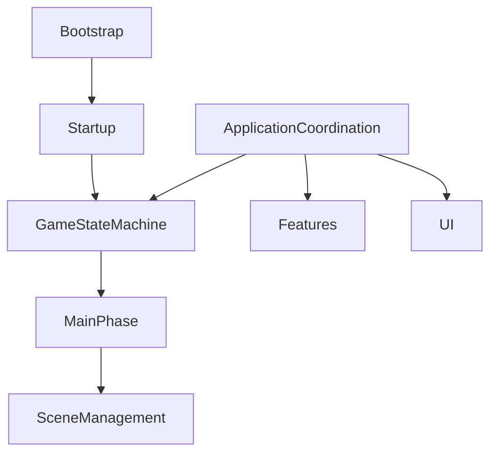
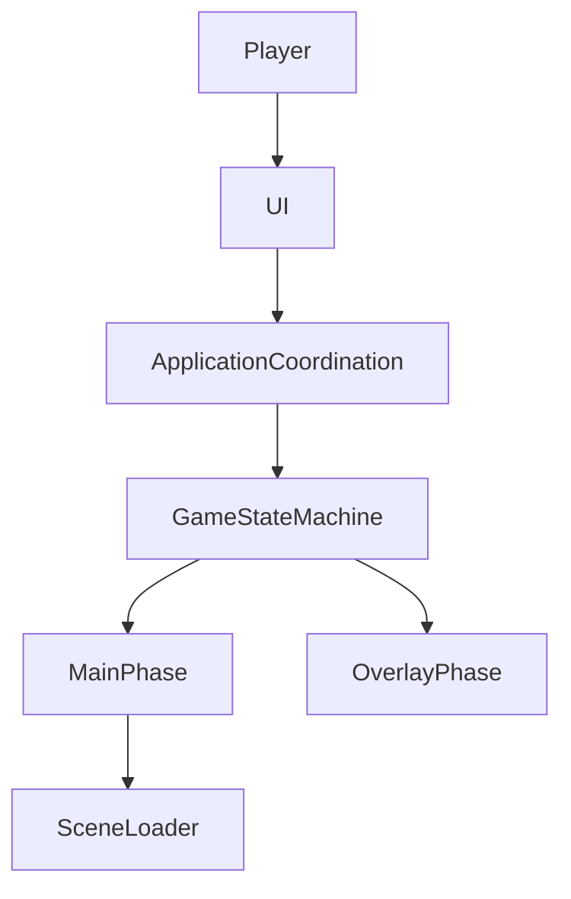
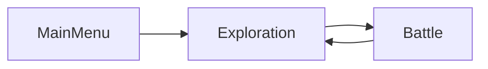
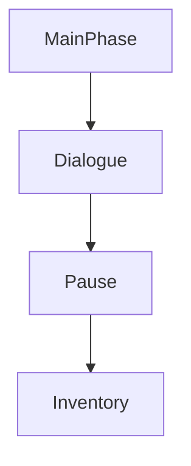
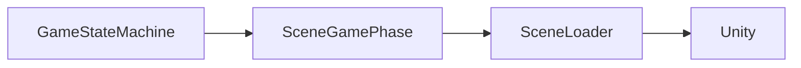
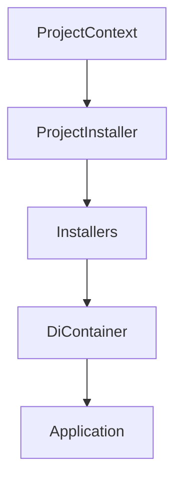
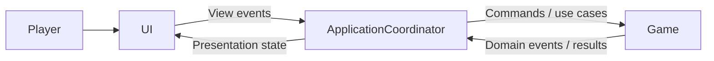
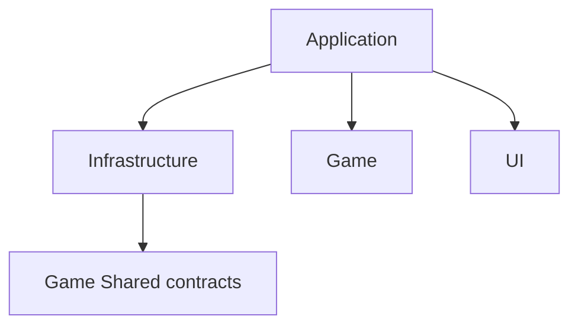

# Architecture Overview

> Version: 1.0
> Last Updated: 13-07-2026

---

# Purpose

Architecture Overview показывает, как основные подсистемы проекта взаимодействуют друг с другом.

Документ не описывает внутреннюю реализацию отдельных систем. Для этого используются соответствующие документы в **Architecture Atlas**.

---

# High-Level Architecture



---

# System Overview

Проект состоит из семи основных архитектурных подсистем.

| System | Responsibility |
|----------|----------------|
| Bootstrap | Запуск приложения |
| Startup | Определение стартовой игровой фазы |
| Game State Machine | Управление игровыми режимами |
| Scene Management | Загрузка и переключение игровых сцен |
| Features | Игровая логика |
| UI | Отображение информации игроку |
| Save System | Сохранение и восстановление игрового состояния |

Каждая подсистема имеет строго определённую область ответственности.

---

# Application Flow

После запуска приложения управление проходит через несколько последовательных этапов.

```text
Application Start

↓

Bootstrap

↓

Startup

↓

Game State Machine

↓

Main Phase

↓

Gameplay
```

После завершения Bootstrap управление полностью переходит Game State Machine.

---

# Runtime Flow

Во время работы игры управление выглядит следующим образом.



---

# Layered Architecture

Архитектура проекта разделена на четыре слоя с разными обязанностями.

```text
Application / Composition ──▶ Game
           │
           ├────────────────▶ Infrastructure ──▶ Game Shared contracts
           │
           └────────────────▶ UI
```

Game не зависит от остальных слоёв. Application и Composition связывают подсистемы. Infrastructure и UI не зависят от Application и не создают циклических asmdef-ссылок.

---

# Main Phase Lifecycle

В любой момент времени существует только одна активная Main Phase.



Переходы между игровыми режимами всегда выполняются через GameStateMachine.

---

# Overlay Lifecycle

Overlay Phase работают поверх Main Phase.



Overlay организованы в виде стека.

Последний открытый Overlay закрывается первым.

---

# Scene Lifecycle

Scene Management полностью скрывает работу Unity SceneManager.



Игровые системы никогда не используют SceneManager напрямую.

---

# Dependency Injection

Сервисы, phases и coordinators создаются контейнером Zenject. Unity scene objects создаются Unity и получают зависимости через injection.



Обычные C# классы получают зависимости через конструкторы. Unity-created MonoBehaviour используют method injection.

---

# Feature Architecture

Игровая логика организована по принципу **Feature First**.

```text
Game

├── Combat

├── Dialogue

├── Exploration

└── Minigames
```

Каждая Feature является независимой игровой подсистемой.

---

# UI Architecture

UI отделён от игровой логики.



UI отображает данные и передаёт действия пользователя.

Игровые решения принимаются только игровыми системами.

Стрелки показывают runtime-поток. На уровне compile-time Game не зависит от ApplicationCoordinator, а UI не зависит от конкретной реализации Game Feature.

---

# Dependency Direction

Compile-time зависимости направлены к стабильным контрактам.



Game не зависит от Application, Infrastructure, UI или Zenject. Архитектура не допускает циклических зависимостей между asmdef.

---

# Design Principles

Проект построен на следующих принципах:

- Single Responsibility Principle
- Separation of Concerns
- Dependency Injection
- Feature First
- Composition over Inheritance
- Explicit Lifecycle
- Explicit Dependencies
- Open/Closed Principle

Все новые системы должны соответствовать этим принципам.

---

# Architecture Atlas

Каждая подсистема подробно описана в отдельных документах.

| Document | Description |
|----------|-------------|
| 01_ApplicationLifecycle | Полный жизненный цикл приложения |
| 02_Bootstrap | Запуск приложения |
| 03_Startup | Определение стартовой фазы |
| 04_GameStateMachine | Управление игровыми режимами |
| 05_SceneManagement | Работа со сценами |
| 06_DependencyInjection | Dependency Injection |
| 07_Features | Архитектура игровых Feature |
| 08_UI | Архитектура пользовательского интерфейса |
| 09_SaveSystem | Сохранение и восстановление игрового состояния |

---

# Summary

Архитектура проекта построена вокруг небольших независимых подсистем.

Каждая подсистема имеет одну область ответственности, взаимодействует с другими через чётко определённые интерфейсы и может развиваться независимо.

Такой подход обеспечивает:

- низкую связанность компонентов;
- высокую расширяемость;
- простоту сопровождения;
- предсказуемый жизненный цикл приложения;
- возможность масштабирования проекта без существенного изменения существующей архитектуры.
