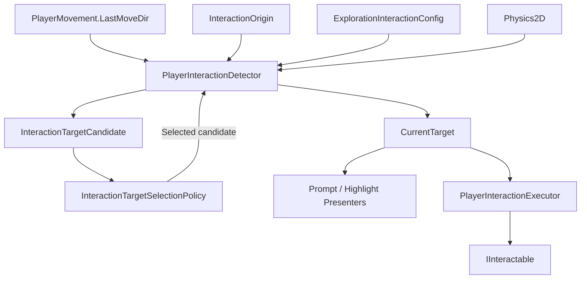
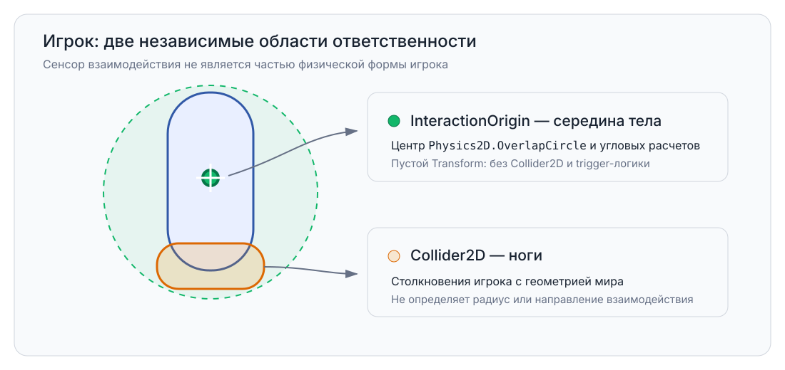
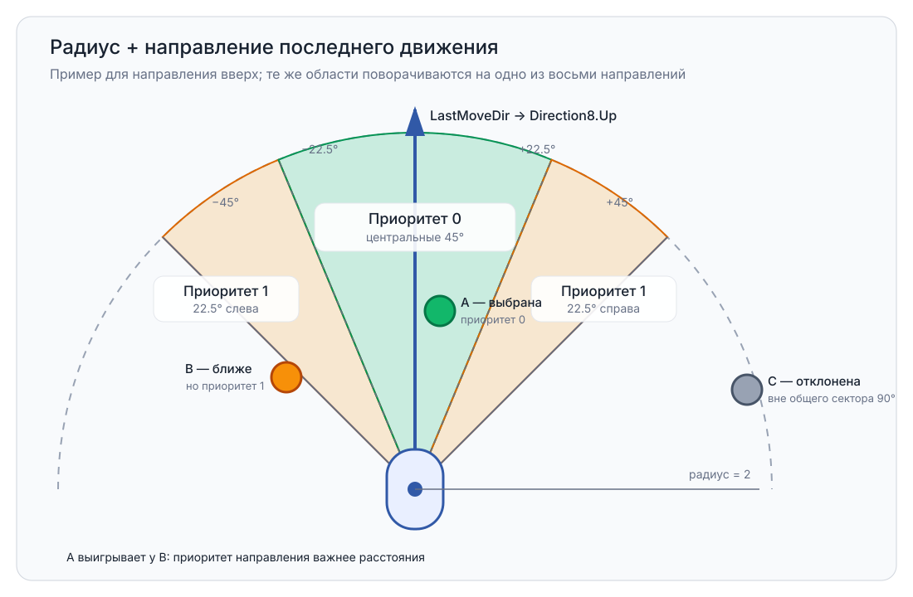
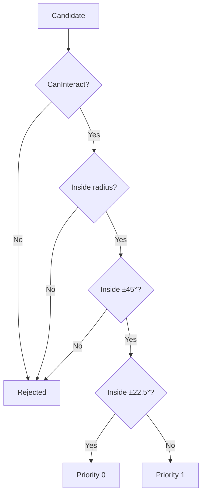
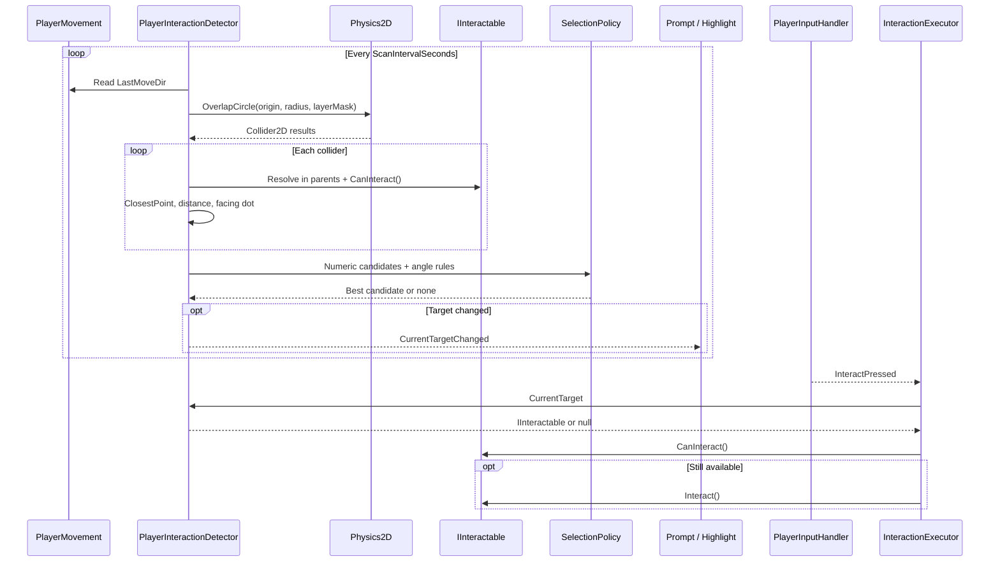
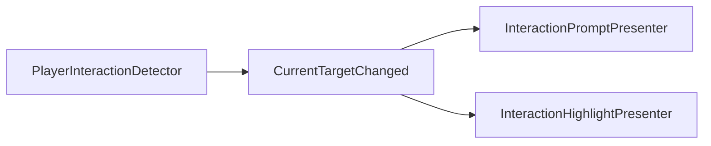

# Exploration Interaction

> Version: 1.1
> Last Updated: 16-07-2026

---

# Purpose

Exploration Interaction отвечает за обнаружение доступных целей рядом с игроком, выбор одной текущей цели и запуск её взаимодействия по вводу игрока.

Система сочетает:

- радиус вокруг центра тела игрока;
- последнее ненулевое направление движения, приведённое к одному из восьми направлений;
- два угловых приоритета внутри общего сектора `90°`.

Физический collider игрока не используется как сенсор взаимодействия.

---

# Responsibilities

Exploration Interaction отвечает за:

- поиск collider на interaction-layer;
- преобразование найденных collider в кандидатов;
- фильтрацию недоступных и находящихся вне сектора целей;
- детерминированное ранжирование кандидатов;
- хранение одной текущей цели;
- уведомление UI о смене цели;
- вызов `IInteractable.Interact()` по нажатию игрока.

Exploration Interaction не отвечает за:

- физические столкновения игрока с миром;
- решение конкретной цели о доступности взаимодействия;
- выполнение логики двери, NPC, сохранения или pickup;
- выбор текста и визуального оформления prompt;
- загрузку сцен, открытие диалогов или запись сохранения напрямую.

---

# High-Level Overview



`PlayerInteractionDetector` является Unity adapter. Он работает с Transform, Rigidbody2D, Collider2D и Physics2D.

`InteractionTargetSelectionPolicy` получает только числовые данные кандидатов. Он не зависит от Unity API, сцены, UI, Input System или DI-контейнера.

---

# Spatial Model

У игрока существуют две независимые области ответственности.



## InteractionOrigin

`InteractionOrigin` — пустой дочерний Transform в середине тела игрока.

Он задаёт:

- центр окружности поиска;
- начало вектора до цели;
- центр editor gizmo.

На `InteractionOrigin` нет Collider2D и trigger-логики. Он не создаёт физические контакты.

Мировая позиция origin вычисляется через физическую позицию `Rigidbody2D`. Благодаря этому область поиска не отстаёт от игрока при включённой Rigidbody2D interpolation.

## Player Collider

Физический `Collider2D` игрока остаётся у ног и отвечает только за столкновения с миром.

Он не задаёт:

- радиус взаимодействия;
- направление взаимодействия;
- список доступных целей.

---

# Direction Model

`PlayerMovement.LastMoveDir` хранит последнее ненулевое направление движения. До первого движения используется направление вверх.

Направление приводится к одному из восьми значений с шагом `45°`.

```text
                  Up
          UpLeft  ↑  UpRight
                ↖   ↗

          Left  ←  •  →  Right

                ↙   ↘
        DownLeft  ↓  DownRight
                 Down
```

К восьми направлениям приводится только направление игрока.

Направление до цели остаётся точным и вычисляется по вектору от `InteractionOrigin` до ближайшей точки collider. Оно не округляется до восьми направлений.

Если ближайшая точка совпадает с origin, detector использует центр bounds collider. Если совпадает и он, используется `LastMoveDir`.

---

# Selection Area

Текущая область взаимодействия имеет радиус `2` и общий угол `90°`.



Область поворачивается вместе с выбранным восьминаправленным `LastMoveDir`.

| Priority | Отклонение от направления | Область |
|----------|---------------------------|---------|
| `0` | от `-22.5°` до `+22.5°` | центральные `45°` |
| `1` | от `-45°` до `-22.5°` и от `+22.5°` до `+45°` | по `22.5°` слева и справа |
| Rejected | меньше `-45°` или больше `+45°` | вне общего сектора |

Границы `±22.5°` относятся к priority `0`. Границы `±45°` ещё входят в допустимую область.

---

# Candidate Requirements

Collider становится кандидатом, только если выполнены все условия:

1. Collider найден через `Physics2D.OverlapCircle` на разрешённом interaction-layer.
2. На collider или одном из его родителей найден компонент, реализующий `IInteractable`.
3. `IInteractable.CanInteract()` возвращает `true`.
4. Ближайшая точка collider находится внутри радиуса взаимодействия.
5. Угол до ближайшей точки collider не превышает максимальный полуугол `45°`.

Дополнительная проверка расстояния по `Collider2D.ClosestPoint()` не позволяет форме collider пройти фильтр только из-за грубого overlap-результата.

---

# Selection Rules

Кандидаты сравниваются в строго определённом порядке.



Порядок ранжирования допущенных кандидатов:

1. Меньший direction priority.
2. Меньшее квадратное расстояние до ближайшей точки collider.
3. Меньший instance ID collider при полном равенстве.

Priority важнее расстояния. Цель из центрального сектора всегда выигрывает у цели из боковой полосы, даже если боковая цель ближе.

Instance ID стабилен на протяжении жизни collider и не позволяет порядку результатов Physics2D менять результат текущего выбора.

---

# Runtime Flow

Detector пересчитывает цель с интервалом из config. В текущей конфигурации это происходит раз в `0.05` секунды.



Повторный вызов `CanInteract()` в executor защищает от изменения состояния цели между последним scan и нажатием игрока.

---

# Components And Responsibilities

| Component | Responsibility |
|-----------|----------------|
| `ExplorationInteractionConfig` | Радиус, scan interval, layer mask, углы и fallback prompt |
| `PlayerInteractionDetector` | Physics2D scan, построение кандидатов, хранение `CurrentTarget` |
| `InteractionTargetSelectionPolicy` | Чистое детерминированное ранжирование кандидатов |
| `Direction8Utility` | Преобразование вектора движения в одно из восьми направлений |
| `PlayerInteractionExecutor` | Чтение interaction input и вызов текущей цели |
| `InteractionPromptPresenter` | Показ prompt для уже выбранной цели |
| `InteractionHighlightPresenter` | Включение highlight для уже выбранной цели |
| `IInteractable` | Доступность, prompt и выполнение конкретного взаимодействия |

---

# Configuration

Текущие значения находятся в `SO_ExplorationInteractionConfig`.

| Field | Current Value | Meaning |
|-------|---------------|---------|
| `InteractionRadius` | `2` | Максимальное расстояние от origin до collider |
| `ScanIntervalSeconds` | `0.05` | Частота пересчёта текущей цели |
| `InteractionLayerMask` | `Interaction` | Physics-layer интерактивных collider |
| `DirectPriorityHalfAngleDegrees` | `22.5` | Полуугол priority `0` |
| `InteractionHalfAngleDegrees` | `45` | Максимальный допустимый полуугол |
| `DefaultPromptText` | `Press E to interact` | Fallback при пустом prompt цели |

Параметры не должны дублироваться в detector или presenter.

---

# Content Requirements

Для новой интерактивной цели необходимо:

1. Добавить `Collider2D` на physics-layer `Interaction`.
2. Разместить реализацию `IInteractable` на том же GameObject или на одном из родителей collider.
3. Реализовать `CanInteract()`, `GetInteractionPrompt()` и `Interact()`.
4. Убедиться, что layer входит в `ExplorationInteractionConfig.InteractionLayerMask`.

Detector ищет `IInteractable` вверх по иерархии от найденного collider. Конкретный тип цели ему неизвестен.

---

# Presentation Flow

`CurrentTargetChanged` публикуется только при изменении цели или её исходного collider.



Presenters не выполняют Physics2D-запросы и не ранжируют цели. UI отображает результат, но не принимает gameplay-решение.

`PlayerInteractionExecutor` не подписывается на `CurrentTargetChanged`. При нажатии он читает актуальный `CurrentTarget` непосредственно у detector.

---

# Debug Visualization

Постоянная визуализация collider и trigger отключена.

При выборе объекта игрока `PlayerInteractionDetector.OnDrawGizmosSelected()` показывает:

- окружность текущего радиуса;
- границы общего сектора на углах `-45°` и `+45°`.

Gizmo не является Collider2D или trigger и существует только для editor-отладки.

---

# Design Principles

## Separate Physics And Interaction

Collider у ног отвечает за физику. `InteractionOrigin` в центре тела отвечает за пространственную модель взаимодействия.

## Deterministic Selection

Результат определяется priority, distance и instance ID, а не порядком collider в Physics2D buffer.

## Pure Selection Policy

Angular filtering и ranking находятся в чистом policy. Unity adapter только собирает входные данные и применяет результат.

## Passive Presentation

Prompt и highlight подписываются на выбранную цель, но не ищут и не выбирают её.

## Contract-Based Extension

Новый тип цели реализует `IInteractable`. Detector, policy и executor не должны изменяться для двери, NPC, checkpoint или pickup.

---

# Testing

`InteractionTargetSelectionPolicy` покрывается EditMode-тестами без загрузки `SC_World`.

Тесты проверяют:

- преимущество priority `0` над более близким priority `1`;
- выбор ближайшей цели внутри одного priority;
- отклонение цели вне сектора `90°`;
- границы `22.5°` и `45°`;
- tie-break по instance ID;
- преобразование движения во все восемь направлений.

Состав и расположение конкретных объектов в `SC_World` тестами системы не фиксируются.

---

# Common Mistakes

## ❌ Использовать collider игрока как interaction trigger

Центром поиска является отдельный `InteractionOrigin`. Collider у ног остаётся частью физики.

## ❌ Округлять направление до цели до восьми секторов

Округляется только `LastMoveDir`. Угол до цели рассчитывается по точному вектору.

## ❌ Выбирать ближайшую цель до учёта direction priority

Сначала сравнивается priority, только затем distance.

## ❌ Искать цели со стороны UI

Prompt и highlight используют только `CurrentTargetChanged`.

## ❌ Добавлять специальную ветку detector для нового типа объекта

Новый объект должен реализовать `IInteractable` и выполнить content requirements.

---

# Related Documents

- `07_Features.md`
- `08_UI.md`
- `13_ArchitectureOverview.md`
- `../01_Architecture.md`
- `../04_CodeRules.md`
